# Code Architecture

**Audience:** Contributors, teaching assistants, and advanced users who want to understand how the generator works.  
**Purpose:** Explain the codebase from entrypoint to export using the current implementation.  
**What you will learn:** The orchestration flow, the role of each module, and where the next extension should plug in.

> **Implemented in current generator:** Config loading, shared generation context, schema registry, master data, BOMs, routings, work centers, budgets, monthly O2C/P2P/manufacturing/payroll generation, recurring manual journals, year-end close, posting, validations, anomaly injection, SQLite/Excel export, JSON reporting, and generation logging.

> **Planned future extension:** Time-clock detail, employee-shift scheduling, and richer labor-timing detail.

## Entrypoints

- `generate_dataset.py` is the simplest way to run the project from the repository root.
- `src/greenfield_dataset/main.py` contains the orchestration logic for the full build.
- [technical-guide.md](technical-guide.md) is the best system-level companion to this page.

## End-to-End Build Flow

```mermaid
flowchart LR
    S[Load Settings]
    C[Initialize GenerationContext]
    E[Create Empty Tables]
    M[Generate Master Data, BOMs, and Routings]
    B[Generate Opening Balances and Budgets]
    T[Generate Monthly O2C Demand]
    R[Generate Monthly P2P Demand]
    F[Generate Monthly Manufacturing Activity]
    L[Generate Monthly Payroll and Labor Activity]
    J[Generate Recurring Journals]
    S1[Generate Accrued-Service Settlements]
    A1[Generate Accrual Adjustments]
    P[Post to GLEntry]
    Y[Generate Year-End Close Journals]
    V[Run Validations]
    A[Inject Anomalies]
    X[Export SQLite, Excel, JSON, and Log]

    S --> C --> E --> M --> B --> T --> R --> F --> L --> J --> S1 --> A1 --> P --> Y --> V --> A --> X
```

## Core Runtime Objects

### `Settings`

Defined in `src/greenfield_dataset/settings.py`. This frozen dataclass stores:

- fiscal range
- dataset scale parameters
- export paths
- anomaly mode
- generation log path

### `GenerationContext`

Also defined in `settings.py`. This object carries:

- loaded settings
- the random number generator
- the fiscal calendar DataFrame
- all generated tables
- per-table ID counters
- the anomaly log
- validation results

## Module Responsibilities

| Module | Current role |
|---|---|
| `settings.py` | Loads YAML configuration and initializes the shared context |
| `calendar.py` | Builds the fiscal calendar used during generation |
| `schema.py` | Defines `TABLE_COLUMNS` and creates empty DataFrames |
| `master_data.py` | Loads accounts and generates cost centers, employees, warehouses, items, customers, and suppliers |
| `manufacturing.py` | Generates BOMs, work centers, routings, work orders, work-order operations, material issues, completions, work-order close, and manufacturing state helpers |
| `payroll.py` | Generates payroll periods, labor time, payroll registers, payroll payments, remittances, and operation-aware manufacturing labor allocations |
| `budgets.py` | Generates the opening balance journal and budget rows |
| `o2c.py` | Generates sales orders, shipments, sales invoices, cash receipts, applications, sales returns, credit memos, refunds, and O2C state maps |
| `p2p.py` | Generates requisitions, purchase orders, goods receipts, purchase invoices, disbursements, and P2P state maps |
| `journals.py` | Generates recurring journals, accrued-expense estimates, rare accrual adjustments, factory overhead, direct-labor reclasses, manufacturing-overhead reclasses, and year-end close journals |
| `posting_engine.py` | Converts operational and payroll events into balanced GL entries |
| `validations.py` | Runs schema, document, payroll, ledger, and manufacturing checks |
| `anomalies.py` | Applies configurable anomaly patterns and records them in `context.anomaly_log` |
| `exporters.py` | Writes SQLite, Excel, and JSON outputs |
| `utils.py` | Supports numbering, rounding, and helper logic used across modules |
| `main.py` | Orchestrates the end-to-end run and writes the generation log |

## Posting Design

The current posting model is event-based.

Operational posting events:

- shipments post COGS and inventory
- sales invoices post AR, revenue, and sales tax
- cash receipts post cash and customer deposits / unapplied cash
- cash receipt applications clear AR from customer deposits / unapplied cash
- sales returns reverse COGS and restore inventory
- credit memos reverse revenue and tax while reducing AR or creating customer credit
- customer refunds clear customer credit and cash
- goods receipts post inventory and GRNI
- purchase invoices either post matched GRNI clearing or clear prior accrued expenses, then post AP
- disbursements post AP and cash
- material issues post WIP and materials inventory
- production completions post finished goods, WIP, and manufacturing clearing
- work-order close posts manufacturing variance
- payroll registers post wage expense plus payroll liabilities
- payroll payments clear accrued payroll
- payroll liability remittances clear payroll tax and deduction liabilities

Journal-sourced posting events:

- opening
- rent
- utilities
- factory overhead
- direct labor reclass
- manufacturing overhead reclass
- depreciation
- accrual and rare accrual adjustment
- year-end close

## Validation and Logging

The generator validates the dataset in phases and stores results in `context.validation_results`.

Current validations include:

- schema consistency
- header-to-line totals
- orphan row detection
- O2C controls
- P2P controls
- manufacturing controls
- payroll controls
- routing controls
- voucher balance
- trial balance equality
- account roll-forwards
- journal-entry controls

The full run also writes `generation.log`, which records:

- configuration values
- timed step boundaries
- monthly O2C checkpoints
- monthly P2P checkpoints
- monthly manufacturing checkpoints
- monthly payroll checkpoints
- row-count checkpoints
- validation summaries
- export locations

## Outputs

The current generator exports:

- SQLite database
- Excel workbook with table sheets plus anomaly and validation summary sheets
- JSON validation report
- text log file

## Next Extension Point

The next clean extension point is time clocks and shift labor on top of the routing and capacity foundation.

That work should extend the current work-center, routing, capacity, payroll, and manufacturing model without rewriting the O2C, P2P, or payroll subledger layers.
