# Code Architecture

**Audience:** Contributors, teaching assistants, and advanced users who want to understand how the generator works.  
**Purpose:** Explain the generator from entrypoint to export using the current implementation, not the historical blueprint.  
**What you will learn:** The orchestration flow, the role of each module, and where future extensions such as manufacturing would fit.

> **Implemented in current generator:** Config loading, shared generation context, schema registry, master data, budgets, monthly O2C and P2P generation, recurring manual journals, year-end close, posting, validations, anomaly injection, SQLite/Excel export, JSON reporting, and generation logging.

> **Planned future extension:** Manufacturing modules that would extend schema, transaction generation, posting, validation, and documentation.

## Entrypoints

- `generate_dataset.py` is the simplest way to run the project from the repository root.
- `src/greenfield_dataset/main.py` contains the orchestration logic for the full build.

The full build path uses `build_full_dataset()` and `main()`.

## End-to-End Build Flow

```mermaid
flowchart LR
    S[Load Settings]
    C[Initialize GenerationContext]
    E[Create Empty Tables]
    M[Generate Master Data]
    B[Generate Opening Balances and Budgets]
    T[Generate Monthly O2C and P2P Transactions]
    J[Generate Recurring Manual Journals]
    P[Post to GLEntry]
    Y[Generate Year-End Close Journals]
    V[Run Validations]
    A[Inject Anomalies]
    X[Export SQLite, Excel, JSON, and Log]

    S --> C --> E --> M --> B --> T --> J --> P --> Y --> V --> A --> X
```

The current full run does the following in order:

1. load `config/settings.yaml`
2. initialize a shared `GenerationContext`
3. create empty DataFrames for all schema tables
4. generate master and organizational data
5. create the opening balance journal and budget rows
6. generate monthly O2C and P2P activity for each configured fiscal month
7. generate recurring manual journals directly into `JournalEntry` and `GLEntry`
8. post operational events into `GLEntry`
9. generate year-end close journals after operational posting is complete
10. validate the dataset
11. inject configured anomalies
12. revalidate and export outputs

## Core Runtime Objects

### `Settings`

Defined in `src/greenfield_dataset/settings.py`. This frozen dataclass stores the run configuration, including:

- fiscal range
- dataset scale parameters
- export paths
- anomaly mode
- generation log path

### `GenerationContext`

Also defined in `settings.py`. This object carries:

- the loaded settings
- the random number generator
- the fiscal calendar DataFrame
- all generated tables
- per-table ID counters
- the anomaly log
- validation results

This shared context is passed across generation, posting, validation, and export functions.

## Module Responsibilities

| Module | Current role |
|---|---|
| `settings.py` | Loads YAML configuration and initializes the shared context |
| `calendar.py` | Builds the fiscal calendar used during generation |
| `schema.py` | Defines `TABLE_COLUMNS` and creates empty DataFrames |
| `master_data.py` | Loads accounts and generates cost centers, employees, warehouses, items, customers, and suppliers |
| `budgets.py` | Generates the opening balance journal and budget rows |
| `o2c.py` | Generates sales orders, shipments, sales invoices, and cash receipts |
| `p2p.py` | Generates requisitions, batched purchase orders, open-line goods receipts, matched purchase invoices, disbursements, and shared P2P state maps |
| `journals.py` | Generates recurring manual journals, accrual reversals, and year-end close journals |
| `posting_engine.py` | Converts operational events into balanced GL entries |
| `validations.py` | Runs schema, document, ledger, and roll-forward checks |
| `anomalies.py` | Applies configurable anomaly patterns and records them in `context.anomaly_log` |
| `exporters.py` | Writes SQLite, Excel, and JSON outputs |
| `utils.py` | Supports numbering, rounding, and helper logic used across modules |
| `main.py` | Orchestrates the end-to-end run and writes the generation log |

## Posting Design

The current posting model is event-based:

- shipments post COGS and inventory
- sales invoices post AR, revenue, and sales tax
- cash receipts post cash and AR
- goods receipts post inventory and GRNI
- purchase invoices post matched GRNI clearing, AP, and purchase variance
- disbursements post AP and cash

The opening balance entry is created in `budgets.py`. Recurring manual journals and year-end close entries are created in `journals.py`. Those prebuilt `VoucherType = "JournalEntry"` rows are preserved when `post_all_transactions()` appends operational postings.

## Validation and Logging

The generator validates the dataset in phases and stores results in `context.validation_results`.

Current validations include:

- schema consistency
- header-to-line totals
- orphan line detection
- over-shipment and over-receipt checks
- over-invoicing and status-consistency checks for P2P receipt and payment flows
- overpayment checks
- voucher balance
- trial balance equality
- AR, AP, inventory, COGS, and GRNI roll-forwards
- journal header-to-GL agreement
- accrual reversal linkage and timing
- year-end close coverage and profit-and-loss closure by fiscal year

The full run also writes `outputs/generation.log`, which records:

- configuration values
- timed step boundaries
- monthly generation progress
- monthly P2P checkpoints for converted requisitions, receipt volume, invoiced quantity, payments, and open-state balances
- row-count checkpoints
- validation summaries
- export locations

## Outputs

The current generator exports:

- SQLite database
- Excel workbook with table sheets plus anomaly and validation summary sheets
- JSON validation report
- text log file

## Extension Roadmap

The cleanest way to add manufacturing later is to extend the same pattern already used for O2C and P2P:

1. add new schema tables for manufacturing master and transaction data
2. add a new generation module for production activity
3. extend posting logic for work-in-process, production completion, and variance accounting
4. extend validations for manufacturing-specific controls
5. update the process-flow and database docs so course users can understand the new cycle

Manufacturing is a roadmap item. The current generator does not yet implement it.

## Where to Go Next

- Read [reference/schema.md](reference/schema.md) for the current table structure.
- Read [reference/posting.md](reference/posting.md) for the detailed posting reference.
- Read [roadmap.md](roadmap.md) for the next planned implementation phases.
