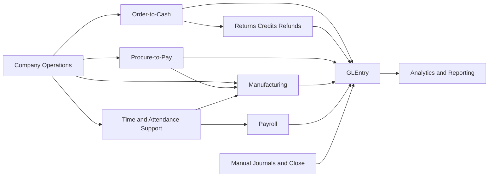
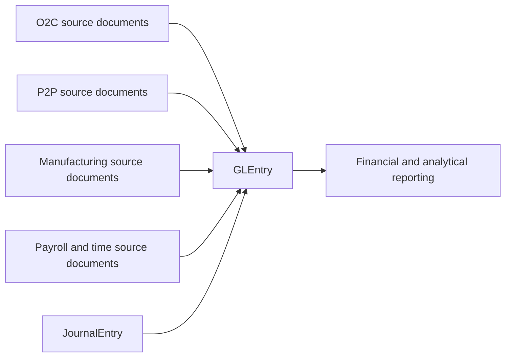

# Process Flows

Use this page after [Company Story](company-story.md). This is the bridge from business context into the detailed process guides. The goal is not to repeat every process page. It is to show how the major cycles relate to one another and how they eventually converge into `GLEntry`.

## How to Use This Section

Start with the process that matches your class question:

| Process | Why students use it |
|---|---|
| [O2C](../processes/o2c.md) | To follow a sale through order, shipment, invoice, cash receipt, application, and the main return or refund exception path |
| [P2P](../processes/p2p.md) | To trace internal demand through supplier ordering, receiving, invoicing, and payment |
| [Manufacturing](../processes/manufacturing.md) | To see how planning, materials, labor, and completion turn selected products into finished goods |
| [Payroll](../processes/payroll.md) | To follow time and attendance support, gross-to-net payroll, liabilities, payments, remittances, and labor reclass |
| [Manual Journals and Close](../processes/manual-journals-and-close.md) | To study recurring journals, accrual settlement, and boundary entries outside the day-to-day document cycles |

## Process Map

Read the map from left to right. Customer demand creates the O2C cycle. Supplier activity creates the P2P cycle. Manufacturing sits between demand and inventory availability, with P2P supporting materials and Payroll supporting labor. Manual journals and close sit beside the document-driven cycles and complete the accounting environment. All of those threads eventually reach `GLEntry`.

## Subledger-to-Ledger Traceability

This is the core design idea behind the dataset: many source processes exist, but posted accounting converges into `GLEntry`.

The most important traceability fields are:

- `VoucherType`
- `VoucherNumber`
- `SourceDocumentType`
- `SourceDocumentID`
- `SourceLineID`
- `FiscalYear`
- `FiscalPeriod`

## Recommended Reading Order

1. Read [Company Story](company-story.md) to understand the company identity and business model.
2. Read [O2C](../processes/o2c.md) and [P2P](../processes/p2p.md) to learn the customer and supplier cycles.
3. Use the return, credit, and refund section inside [O2C](../processes/o2c.md) for the main customer-side exception path.
4. Read [Manufacturing](../processes/manufacturing.md) to see how planning, execution, and costing connect.
5. Read [Payroll](../processes/payroll.md) for time and attendance support, the pay cycle, and related accounting.
6. Read [Manual Journals and Close](../processes/manual-journals-and-close.md) for recurring journals, accrual settlement, and close-cycle activity.
7. Read [Dataset Guide](../start-here/dataset-overview.md) when you are ready to work directly with tables and joins.

## Where to Go Next

- Read [Dataset Guide](../start-here/dataset-overview.md) for table families and navigation paths.
- Read [Schema Reference](../reference/schema.md) when you need table relationships and join cues.
- Read [GLEntry Posting Reference](../reference/posting.md) when you want the posting rules behind each process.
