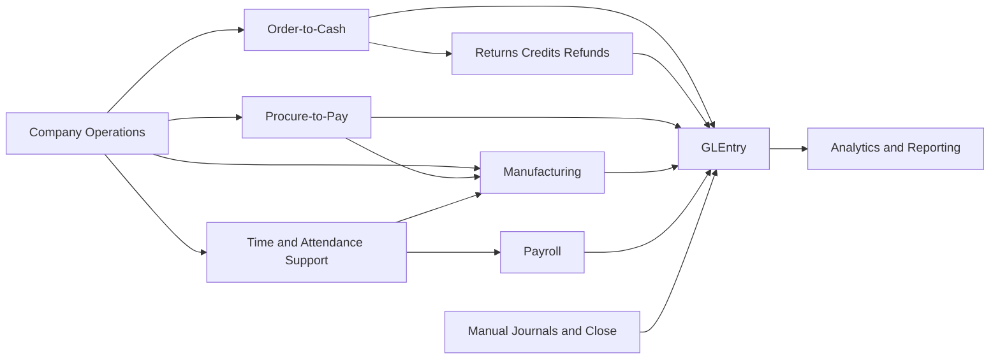
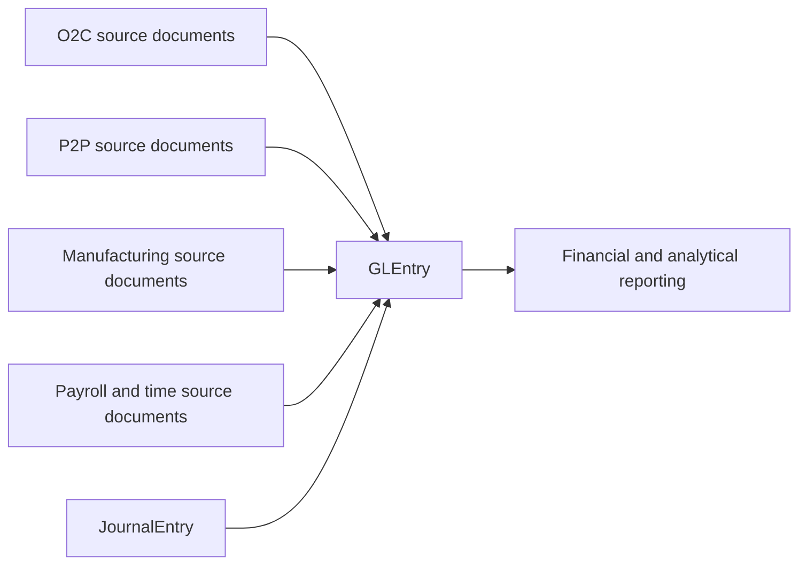

# Process Flows

Process Flows is the bridge from the company story into the operating cycles that actually create the dataset. Students should read these cycles as one connected business system: customer demand creates sales activity, purchasing supports inventory and operations, manufacturing transforms materials and labor, payroll supports the workforce and liabilities, and finance closes the resulting accounting picture.

The site is easiest to understand when analysis grows out of the business process. Reports, SQL, and cases make more sense after the reader understands where the process starts, what it changes, and how it finally reaches `GLEntry`.

## The Main Business Cycles

| Process | What it means inside the company |
|---|---|
| [O2C](../processes/o2c.md) | The customer-demand path from order through shipment, invoice, cash receipt, application, and the return or refund exception path |
| [P2P](../processes/p2p.md) | The supplier-side path from internal need through ordering, receiving, invoicing, payment, and accrual settlement |
| [Manufacturing](../processes/manufacturing.md) | The production path from planning and component support through execution, completion, and close |
| [Payroll](../processes/payroll.md) | The workforce and pay path from scheduled work and approved time into payroll posting, liabilities, payment, remittance, and labor reclass |
| [Manual Journals and Close](../processes/manual-journals-and-close.md) | The accounting layer that estimates, reclassifies, and closes activity around the operating cycles |

## Process Map

Read the map from left to right. The company story becomes process activity. Process activity becomes posted accounting. Posted accounting becomes reporting, analysis, and case-based interpretation.

## How Process Becomes Reporting and Analysis

The most important teaching bridge in the site is this one: business process first, accounting second, analysis third. That is why the reports, perspectives, SQL pages, and cases should be read as follow-through from the business cycle rather than as separate documentation tracks.

## Process to Analysis Bridges

| Process | Strongest perspective or report follow-through | Strongest case follow-through |
|---|---|---|
| [O2C](../processes/o2c.md) | [Commercial and Working Capital](../analytics/reports/commercial-and-working-capital.md), [Financial Reports](../analytics/reports/financial.md) | [O2C Trace Case](../analytics/cases/o2c-trace-case.md) |
| [P2P](../processes/p2p.md) | [Commercial and Working Capital](../analytics/reports/commercial-and-working-capital.md), [Financial Reports](../analytics/reports/financial.md) | [P2P Accrual Case](../analytics/cases/p2p-accrual-settlement-case.md) |
| [Manufacturing](../processes/manufacturing.md) | [Operations and Risk](../analytics/reports/operations-and-risk.md), [Managerial Reports](../analytics/reports/managerial.md) | [Manufacturing Labor Case](../analytics/cases/manufacturing-labor-cost-case.md) |
| [Payroll](../processes/payroll.md) | [Payroll and Workforce](../analytics/reports/payroll-perspective.md), [Audit Reports](../analytics/reports/audit.md) | [Workforce Cost and Org-Control Case](../analytics/cases/workforce-cost-and-org-control-case.md), [Attendance Control Audit Case](../analytics/cases/attendance-control-audit-case.md) |
| [Manual Journals and Close](../processes/manual-journals-and-close.md) | [Executive Overview](../analytics/reports/executive-overview.md), [Financial Reports](../analytics/reports/financial.md) | [Financial Statement Bridge Case](../analytics/cases/financial-statement-bridge-case.md) |

## Next Steps

1. Read the process page that matches the business cycle you want to follow first.
2. Then move into [Analytics Guides](../analytics/index.md) to see how that process becomes reports, SQL, and cases.
3. Use [Reports Hub](../analytics/reports/index.md) when you want a management-style view of the same business cycle.
4. Use [Analytics Cases](../analytics/cases/index.md) when you want a guided walkthrough that turns the process into interpretation.
