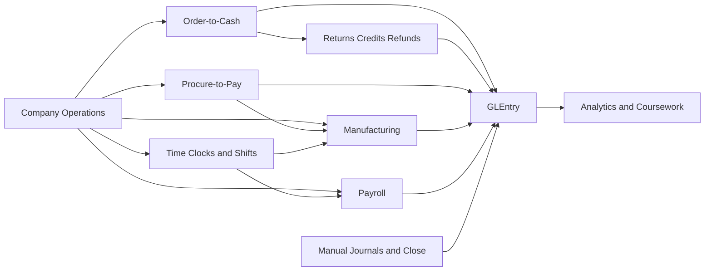
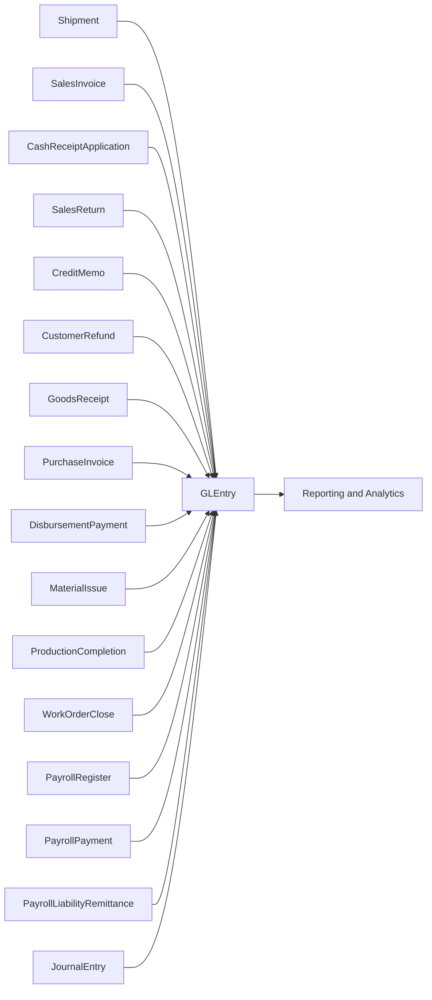

# Process Flows

Use this section after [Company Story](company-story.md). Each guide explains the business situation first, then the document flow, then the accounting effect. That sequence helps students connect what the company is doing with what the database records.

## How to Use This Section

Start with the process that matches your class question:

| Process area | Detailed guide | Why students use it |
|---|---|---|
| Core O2C | [O2C](../processes/o2c.md) | To follow a sale from customer order through shipment, invoice, cash receipt, and application |
| Returns and credits | [Returns, Credits, and Refunds](../processes/o2c-returns-credits-refunds.md) | To study the exception path when a billed sale is corrected |
| P2P | [P2P](../processes/p2p.md) | To trace internal demand through supplier ordering, receiving, invoicing, and payment |
| Manufacturing | [Manufacturing](../processes/manufacturing.md) | To see how Charles River turns materials, labor, and schedules into finished goods |
| Time clocks and shifts | [Time Clocks](../processes/time-clocks.md) | To understand attendance, shift expectations, labor support, and exception analysis |
| Payroll | [Payroll](../processes/payroll.md) | To follow gross-to-net payroll, liabilities, payments, remittances, and labor reclass |
| Journals and close | [Manual Journals and Close](../processes/manual-journals-and-close.md) | To study finance-controlled entries that sit outside the day-to-day document cycles |

## Charles River Process Map

Read the map from left to right. Customer and supplier activity create the external business cycles. Manufacturing turns demand and materials into finished goods. Time clocks document when hourly labor was worked and approved. Payroll converts that support into expense, liabilities, and employee pay. Finance journals complete the accounting picture. All of those threads eventually reach `GLEntry`.

## Subledger-to-Ledger Traceability

This is the core design idea behind the dataset: many operational tables exist, but posted accounting analysis converges into `GLEntry`.

The most important traceability fields are:

- `VoucherType`
- `VoucherNumber`
- `SourceDocumentType`
- `SourceDocumentID`
- `SourceLineID`
- `FiscalYear`
- `FiscalPeriod`

## Recommended Reading Order

1. Read [Company Story](company-story.md) to understand the business model.
2. Read [O2C](../processes/o2c.md) and [P2P](../processes/p2p.md) to learn the customer and supplier cycles.
3. Read [Returns, Credits, and Refunds](../processes/o2c-returns-credits-refunds.md) for the main customer-side exception path.
4. Read [Manufacturing](../processes/manufacturing.md) to see how Charles River produces selected goods internally.
5. Read [Time Clocks](../processes/time-clocks.md) to understand workforce scheduling, approved attendance, and labor support.
6. Read [Payroll](../processes/payroll.md) to follow the pay cycle and related accounting.
7. Read [Manual Journals and Close](../processes/manual-journals-and-close.md) for the finance-led activity outside the operational subledgers.
8. Read [Dataset Guide](../start-here/dataset-overview.md) when you are ready to work directly with tables and joins.

## Where to Go Next

- Read [Dataset Guide](../start-here/dataset-overview.md) for table families and join paths.
- Read [Schema Reference](../reference/schema.md) when you need field-level table detail.
- Read [GLEntry Posting Reference](../reference/posting.md) when you want the posting rules behind each process.
