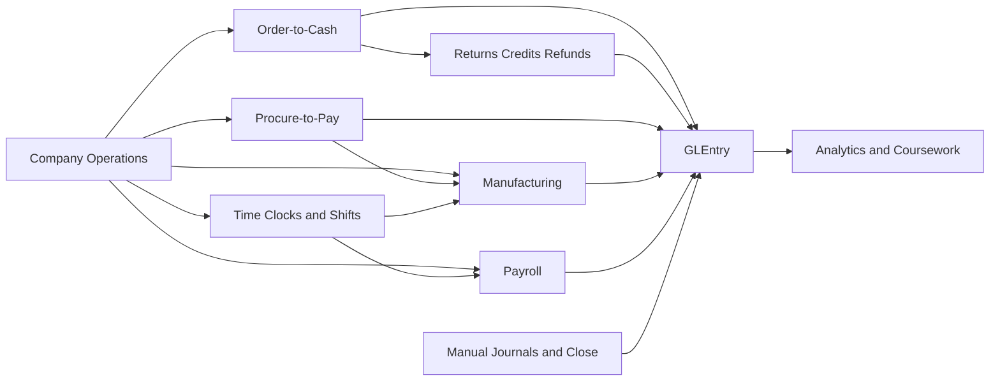
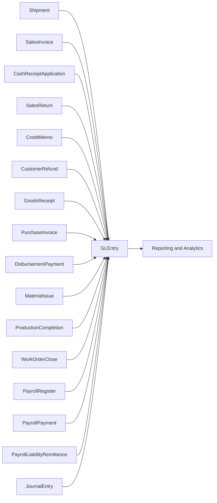

# Process Flows

**Audience:** Students, instructors, and analysts who need a plain-language explanation of how transactions move through the database.  
**Purpose:** Organize the business-process documentation and explain how operational events connect to accounting entries.  
**What you will learn:** Which process guides to read, how the major business cycles fit together, and how learners can trace source documents into `GLEntry`.

> **Implemented in current generator:** O2C, returns and credits, P2P, manufacturing, payroll, time clocks and shift labor, recurring journals, year-end close, and event-based posting into `GLEntry`.

> **Planned future extension:** Raw punch-event detail, rotating shift rosters, and shift-level planning beyond the current daily time-clock model.

## How to Use This Section

Use this page as the hub for the detailed process guides:

| Process area | Detailed guide | What it covers |
|---|---|---|
| Core O2C | [processes/o2c.md](processes/o2c.md) | Customer order through shipment, invoice, receipt, and cash application |
| Returns and credits | [processes/o2c-returns-credits-refunds.md](processes/o2c-returns-credits-refunds.md) | Returned goods, credit memos, customer credits, and refunds |
| P2P | [processes/p2p.md](processes/p2p.md) | Requisition through PO, goods receipt, supplier invoice, and payment |
| Manufacturing | [processes/manufacturing.md](processes/manufacturing.md) | BOMs, routings, work centers, work orders, material issues, completions, and work-order close |
| Payroll | [processes/payroll.md](processes/payroll.md) | Pay periods, labor time, payroll registers, payments, remittances, and operation-level labor integration |
| Time clocks and shifts | [processes/time-clocks.md](processes/time-clocks.md) | Shift definitions, employee assignments, approved time clocks, attendance exceptions, and payroll-hour sourcing |
| Journals and close | [processes/manual-journals-and-close.md](processes/manual-journals-and-close.md) | Recurring journals, accrued-expense estimates and adjustments, reclasses, and year-end close |

## Greenfield Process Map

At Greenfield, students can think of the database as one business with six accounting-relevant threads:

- selling and collecting from customers
- correcting customer-side exceptions through returns and credits
- buying inventory and materials from suppliers
- manufacturing selected finished goods internally
- assigning shifts, recording hourly attendance, paying employees, and tracing labor into product cost
- recording recurring finance activity and year-end close

Each of those threads eventually reaches `GLEntry`.

## Subledger-to-Ledger Traceability

This is the core design idea behind the dataset: many operational tables exist, but posted accounting analysis converges into `GLEntry`.

The most important traceability fields are:

- `VoucherType`
- `VoucherNumber`
- `SourceDocumentType`
- `SourceDocumentID`
- `SourceLineID`
- `FiscalYear`
- `FiscalPeriod`

## Recommended Reading Order

1. Read [company-story.md](company-story.md) to understand the business.
2. Read [processes/o2c.md](processes/o2c.md) and [processes/p2p.md](processes/p2p.md).
3. Read [processes/o2c-returns-credits-refunds.md](processes/o2c-returns-credits-refunds.md) for the sales-side exception path.
4. Read [processes/manufacturing.md](processes/manufacturing.md) for the production flow.
5. Read [processes/time-clocks.md](processes/time-clocks.md) for shift and attendance flow.
6. Read [processes/payroll.md](processes/payroll.md) for payroll and labor-cost flow.
7. Read [processes/manual-journals-and-close.md](processes/manual-journals-and-close.md) for finance-team activity outside the operational cycles.
8. Read [database-guide.md](database-guide.md) once you are ready to navigate tables and joins.

## Where to Go Next

- Read [database-guide.md](database-guide.md) for joins and table families.
- Read [reference/posting.md](reference/posting.md) for the technical posting rules.
