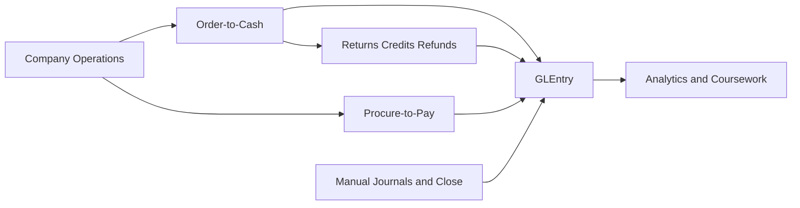
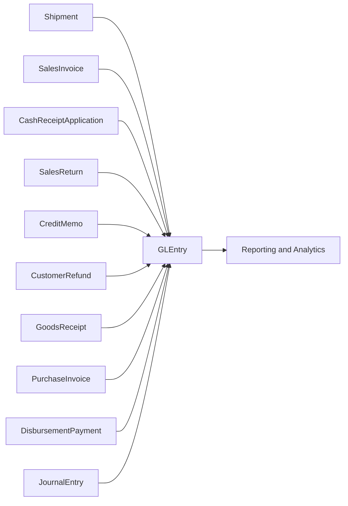

# Process Flows

**Audience:** Students, instructors, and analysts who need a plain-language explanation of how transactions move through the database.  
**Purpose:** Organize the business-process documentation and explain how operational events connect to accounting entries.  
**What you will learn:** Which process documents to read, how the major business cycles fit together, and how learners can trace source documents into `GLEntry`.

> **Implemented in current generator:** O2C and P2P operational flows, customer deposits and cash applications, returns and credit memos, recurring manual journals, year-end close, and event-based postings into `GLEntry`.

> **Planned future extension:** Manufacturing process flows.

## How to Use This Section

Use this page as the hub for the detailed process guides:

| Process area | Detailed guide | What it covers |
|---|---|---|
| Core O2C | [processes/o2c.md](processes/o2c.md) | Customer order through shipment, invoice, receipt, and cash application |
| Returns and credits | [processes/o2c-returns-credits-refunds.md](processes/o2c-returns-credits-refunds.md) | Returned goods, credit memos, customer credits, and refunds |
| P2P | [processes/p2p.md](processes/p2p.md) | Requisition through PO, goods receipt, supplier invoice, and payment |
| Journals and close | [processes/manual-journals-and-close.md](processes/manual-journals-and-close.md) | Recurring journals, accrual reversals, and year-end close |

## Greenfield Process Map

At Greenfield, students can think of the database as one business story with four accounting-relevant threads:

- selling goods to customers
- correcting some of those sales through returns and credits
- buying inventory from suppliers
- recording recurring finance activity and year-end close

Each of those threads eventually reaches `GLEntry`, which becomes the common reporting layer for analytics work.

## Subledger-to-Ledger Traceability

This is the key idea behind the dataset: many operational tables exist, but posted accounting analysis converges into `GLEntry`.

The most important traceability fields are:

- `VoucherType`
- `VoucherNumber`
- `SourceDocumentType`
- `SourceDocumentID`
- `SourceLineID`
- `FiscalYear`
- `FiscalPeriod`

That lets a student start from a ledger line and ask:

- Which shipment, invoice, application, or refund created this posting?
- Which customer, supplier, item, or cost center was involved?
- In which fiscal period did the event affect reporting?

## Recommended Reading Order

1. Read [company-story.md](company-story.md) to understand the business.
2. Read [processes/o2c.md](processes/o2c.md) and [processes/p2p.md](processes/p2p.md) for the two main operating cycles.
3. Read [processes/o2c-returns-credits-refunds.md](processes/o2c-returns-credits-refunds.md) for the exception path on the sales side.
4. Read [processes/manual-journals-and-close.md](processes/manual-journals-and-close.md) for the finance-team activity that sits beside the operating flows.
5. Read [database-guide.md](database-guide.md) once you are ready to navigate tables and joins.

## Where to Go Next

- Read [database-guide.md](database-guide.md) for the main joins and table families.
- Read [reference/posting.md](reference/posting.md) for the technical posting rules.
