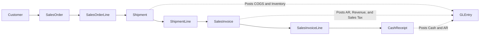
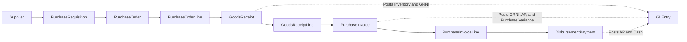
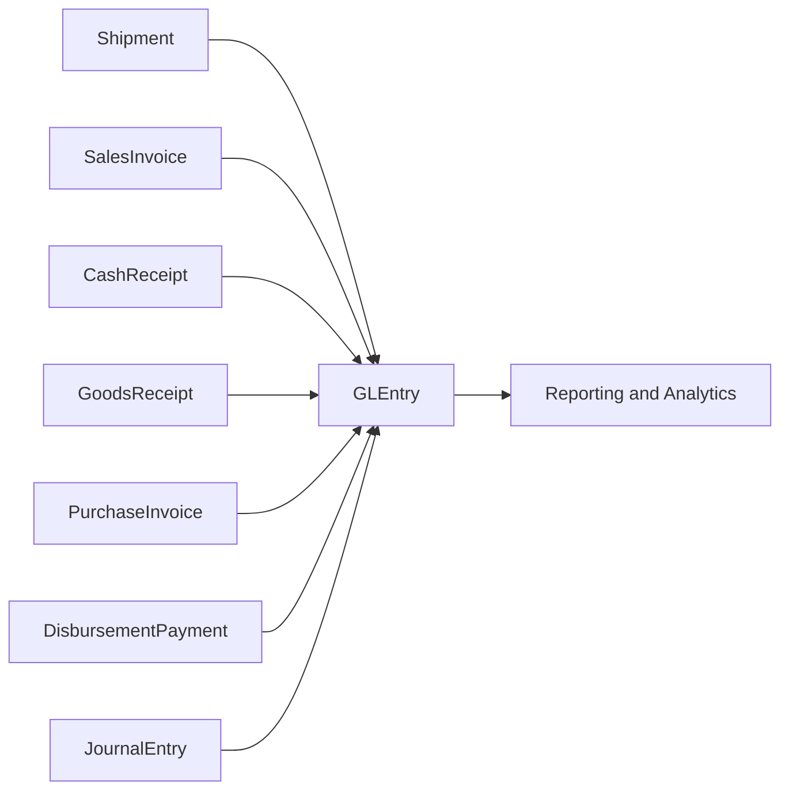

# Process Flows

**Audience:** Students, instructors, and analysts who need a plain-language explanation of how transactions move through the database.  
**Purpose:** Show the O2C flow, the P2P flow, and the bridge from source documents to the general ledger.  
**What you will learn:** Which tables represent each business step, when accounting happens, and how learners can trace transactions across the database.

> **Implemented in current generator:** O2C and P2P operational flows, opening balances, recurring manual journals, year-end close, and event-based postings into `GLEntry`.

> **Planned future extension:** Manufacturing process flows.

## Order-to-Cash Flow

In the current generator, a customer places a sales order, the company ships goods, the company bills the customer, and later collects cash. Not every document posts to accounting. The accounting events happen at shipment, invoicing, and cash receipt.

| Business event | Main tables | When accounting happens | Typical student questions |
|---|---|---|---|
| Customer setup | `Customer` | No posting | Which customers drive the most revenue? |
| Order capture | `SalesOrder`, `SalesOrderLine` | No posting | Which products and sales reps drive demand? |
| Goods shipped | `Shipment`, `ShipmentLine` | Shipment posts COGS and inventory relief | Were orders shipped on time? What cost left inventory? |
| Customer billed | `SalesInvoice`, `SalesInvoiceLine` | Invoice posts AR, revenue, and sales tax | What was billed, when, and at what margin? |
| Cash collected | `CashReceipt` | Receipt posts cash and AR | Which invoices remain open? How fast do customers pay? |

## Procure-to-Pay Flow

In the current generator, purchasing starts with a requisition, then a purchase order, then one or more goods receipts, then one or more supplier invoices, and finally one or more payments. Purchase orders can batch multiple requisitions. Supplier invoices match specific receipt lines through `PurchaseInvoiceLine.GoodsReceiptLineID`. The accounting events happen when inventory is received, when the supplier invoice is approved, and when payment is made.

| Business event | Main tables | When accounting happens | Typical student questions |
|---|---|---|---|
| Supplier setup | `Supplier` | No posting | Which suppliers are most important or risky? |
| Internal request | `PurchaseRequisition` | No posting | Who requested the item and was it approved properly? |
| Order placed | `PurchaseOrder`, `PurchaseOrderLine` | No posting | Which requisitions were batched into one PO? What was ordered, from whom, and at what expected cost? |
| Goods received | `GoodsReceipt`, `GoodsReceiptLine` | Receipt posts inventory and GRNI | Was receipt timing appropriate? Was quantity partially received across dates or months? |
| Supplier billed | `PurchaseInvoice`, `PurchaseInvoiceLine` | Invoice posts GRNI, AP, and purchase variance | Which receipt lines were matched? Did invoice cost differ from receipt cost? |
| Supplier paid | `DisbursementPayment` | Payment posts AP and cash | Which invoices are still unpaid or only partially paid? Are there duplicate payment references? |

## Subledger-to-Ledger Traceability

`GLEntry` is the common reporting layer. Each posted row carries source-trace fields that let a learner move from ledger detail back to the source document:

- `VoucherType`
- `VoucherNumber`
- `SourceDocumentType`
- `SourceDocumentID`
- `SourceLineID`
- `FiscalYear`
- `FiscalPeriod`

This means a student can start from a ledger line and ask:

- Which shipment, invoice, or payment created this posting?
- Which cost center did it affect?
- In which fiscal period did it hit the ledger?

## Manual Journal and Close Cycle Scope

`JournalEntry` is fully used in the current generator. The default build includes:

- opening balance
- monthly payroll accruals by cost center
- monthly payroll settlements
- monthly office and warehouse rent journals
- monthly utilities journals
- monthly depreciation journals by asset class
- month-end accrued expense journals with next-month reversals
- year-end close entries to `8010` Income Summary and `3030` Retained Earnings

That matters for teaching because students can now work with operational postings and recurring manual ledger activity in the same database.

For multi-year income statement analysis, tell students to exclude the two year-end close entry types when they want raw annual revenue and expense activity.

## How to Trace One Transaction

### O2C example

1. Start with a `SalesInvoice`.
2. Use `SalesOrderID` to find the related `SalesOrder`.
3. Use `SalesInvoiceLine.SalesOrderLineID` to connect billed lines to the original order lines.
4. Use `CashReceipt.SalesInvoiceID` to see collections.
5. Use `GLEntry.SourceDocumentType = "SalesInvoice"` or `"CashReceipt"` to see the accounting effect.

### P2P example

1. Start with a `PurchaseInvoice`.
2. Use `PurchaseOrderID` to find the related `PurchaseOrder`.
3. Use `PurchaseInvoiceLine.GoodsReceiptLineID` to connect invoice lines to the exact receipt lines when the clean match is available.
4. Use `GoodsReceiptLine.POLineID` and `PurchaseOrderLine.RequisitionID` to move back to the originating purchase-order line and requisition.
5. Use `DisbursementPayment.PurchaseInvoiceID` to see one or more payments applied to the invoice.
6. Use `GLEntry.SourceDocumentType = "GoodsReceipt"`, `"PurchaseInvoice"`, or `"DisbursementPayment"` to see the accounting effect.

## Where to Go Next

- Read [database-guide.md](database-guide.md) for the main joins and table families.
- Read [reference/posting.md](reference/posting.md) for the technical posting rules.
