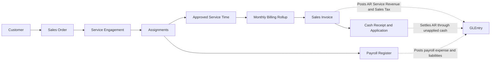
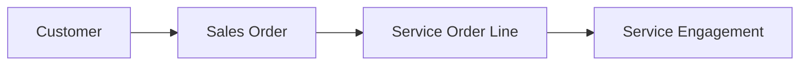
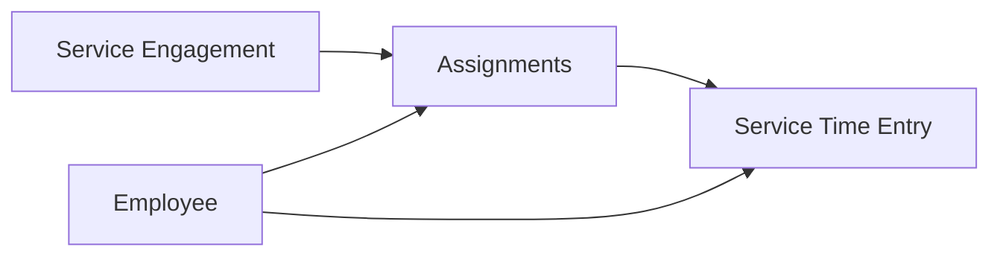
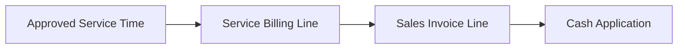

# Design Services Process

## What Students Should Learn

- Distinguish customer demand, staffing, approved service hours, monthly billing, payroll expense, and cash settlement in the design-services line.
- Trace a design-service engagement from `SalesOrderLine` into `ServiceEngagement`, `ServiceTimeEntry`, `ServiceBillingLine`, `SalesInvoiceLine`, and `GLEntry`.
- Recognize how multiple employees can support one engagement while billing still rolls up at the customer-engagement level.
- Separate service margin analysis from manufacturing costing and inventory movement.

## Business Storyline

<CompanyName /> now earns revenue from two customer-facing lines: physical goods and hourly design services. The design-services line is intentionally operational, not decorative. Customers can hire the company for consultation, planning, specification work, and project coordination even when the engagement is not tied to a shipment of finished goods.

The process starts with the same commercial promise as the rest of O2C. Sales records a service order line, operations opens a customer engagement, managers staff that engagement with one or more employees, approved service time accumulates through the month, and accounting bills the approved billable hours at the agreed hourly rate. Treasury and accounting then settle the invoice through the normal cash-receipt and cash-application path.

That distinction matters. An engagement is not revenue. Approved time is not revenue. Revenue appears only when the approved billable hours are invoiced. Payroll expense also remains a normal period expense. Students can see the customer billing side and the labor-cost side together without turning the dataset into project-based actual costing.

## Normal Process Overview

Read the main diagram as commercial promise, staffing, approved hours, monthly billing, settlement, and payroll support. The service line shares the customer-side invoice and cash path with the rest of O2C, but it does not require shipment, return, or inventory activity.

## Core Tables and What They Represent

| Process stage | Main tables | Grain or event represented | Why students use them |
|---|---|---|---|
| Customer demand | `SalesOrder`, `SalesOrderLine` | One customer order and ordered service line | Shows the original commercial promise, hourly rate, and planned service hours |
| Engagement setup | `ServiceEngagement` | One customer service job tied to one service order line | Anchors customer, service item, lead employee, planned hours, and engagement dates |
| Staffing | `ServiceEngagementAssignment` | One employee assignment on one engagement | Shows how many employees supported the same engagement and how hours were assigned |
| Approved service delivery | `ServiceTimeEntry` | One approved service-work day for one employee and engagement | Measures billable versus non-billable hours and snapshots labor cost for margin analysis |
| Monthly billing trace | `ServiceBillingLine` | One invoiced billing slice for approved hours | Connects approved hours to the exact `SalesInvoiceLine` used to bill the customer |
| Customer billing and settlement | `SalesInvoice`, `SalesInvoiceLine`, `CashReceipt`, `CashReceiptApplication` | Invoice, receipt, and settlement events | Completes the AR and cash path using the normal O2C backbone |
| Payroll support | `PayrollRegister`, `PayrollRegisterLine` | Gross-to-net payroll for the service staff | Keeps payroll expense and liability activity visible beside the customer-billing flow |

## When Accounting Happens

| Event | Business meaning | Accounting effect |
|---|---|---|
| Service order and engagement setup | Customer demand is accepted and staffed | No direct posting |
| Approved service time | Managers approve billable and non-billable hours worked on the engagement | No direct posting |
| Monthly service invoice | Accounting bills approved billable hours for the period | Debit accounts receivable and credit `4080` Sales Revenue - Design Services plus sales tax payable |
| Cash receipt and application | Treasury receives customer cash and later settles the invoice | Same customer-deposit and AR-clearing pattern used in O2C |
| Payroll register | Payroll records the wages and burden for service employees | Debits `6280` Salaries Expense - Design Services and related payroll expense pools, then credits accrued payroll and payroll liabilities |

## Key Traceability and Data Notes

- `ServiceEngagement.SalesOrderLineID` is the bridge from customer demand into service delivery.
- `ServiceEngagementAssignment` lets several employees work on the same engagement while preserving assigned-role detail.
- `ServiceTimeEntry` stores both `BillableHours` and `NonBillableHours`, plus `CostRateUsed` and `ExtendedCost` for labor-margin analysis.
- `ServiceBillingLine` is the authoritative hours-to-invoice bridge for services. Use it instead of trying to infer service billing from `SalesInvoiceLine` alone.
- Service invoice lines stay in `SalesInvoiceLine`, but `ShipmentLineID` remains null for those rows because nothing shipped physically.
- Payroll supports the same employees, but service labor is analyzed through `ServiceTimeEntry` rather than capitalized into manufacturing inventory.

## Analytical Subsections

### 1. Customer Demand to Engagement Setup

The process begins on the customer side. A service line is created on the sales order, then the operating team opens an engagement that carries planned hours, the lead employee, and the expected delivery window.

**Starter analytical question:** Which customers create the most planned design-service hours, and how concentrated is that workload?

### 2. Staffing and Approved Time

Once the engagement is active, the company assigns one or more employees to it. Approved daily service time then accumulates by employee and date. This layer is where students can compare planned hours, assigned hours, billable hours, non-billable hours, and cost snapshots.

**Starter analytical question:** Which engagements rely most on senior-designer time versus designer time, and where do non-billable hours accumulate?

### 3. Monthly Billing and Settlement

Billing does not happen every time an employee works. The dataset bills approved billable hours monthly. `ServiceBillingLine` stores the rolled-up hours for that invoice line, which makes it the main student bridge between approved service delivery and posted customer revenue.

**Starter analytical question:** Which customers show the biggest difference between approved service hours and billed service hours at month-end?

### 4. Payroll and Service Margin Interpretation

The same service staff still pass through the normal payroll cycle. That means students should read service profitability in two layers. Billing and receivables live in the customer process. Labor cost and payroll liabilities live in payroll. `ServiceTimeEntry.ExtendedCost` gives the analytical bridge that lets students compare billed revenue to labor cost without converting the service line into manufacturing cost accounting.

**Starter analytical question:** Which engagements show the strongest labor margin after comparing billed revenue to the approved time-cost snapshot?

## Common Student Questions

- Which customers buy only goods, which buy design services, and which buy both?
- How many employees typically support one design-service engagement?
- Which service hours were billable versus non-billable?
- Which approved hours remain unbilled at the end of the month?
- How do service invoices differ from shipment-based goods invoices?
- Where does payroll expense sit for design staff, and why does that not create manufacturing cost?

## Next Steps

- Read [O2C](o2c.md) when you want the broader customer-demand and settlement cycle around invoices, cash, returns, and working capital.
- Read [Payroll](payroll.md) when you want the payroll posting, liability, and cash-settlement side of the same service staff.
- Read [Commercial and Working Capital](../analytics/reports/commercial-and-working-capital.md) or [Managerial Reports](../analytics/reports/managerial.md) when you want the service activity summarized as management reporting.
- Read [Schema Reference](../reference/schema.md) and [GLEntry Posting Reference](../reference/posting.md) when you need the exact joins and posting rules.
