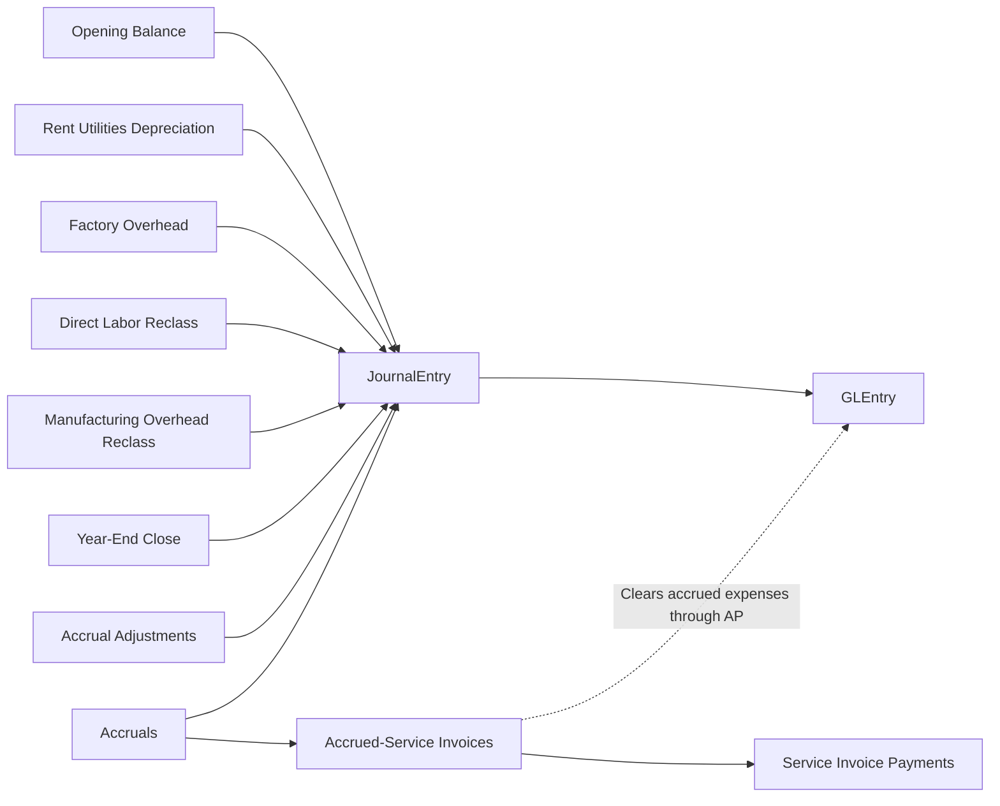

# Manual Journals and Close Cycle

**Audience:** Students, instructors, and analysts who need the finance-team activity explained alongside the operational cycles.  
**Purpose:** Show how recurring journals, accrued-expense estimates, manufacturing reclasses, and year-end close work in the current dataset.  
**What you will learn:** The journal storyline, the journal categories, when entries occur, and how those entries affect analysis.

> **Implemented in current generator:** Opening balance, recurring monthly operating journals, factory-overhead journals, direct-labor reclass journals, manufacturing-overhead reclass journals, month-end accruals, rare accrual adjustments, and year-end close entries.

> **Planned future extension:** More advanced journal sources that may come from future planning or scheduling layers.

## Business Storyline

Greenfield is not just an operational database. The finance team also records recurring activity that students expect in a real accounting system:

- rent
- utilities
- depreciation
- month-end accruals
- rare accrual adjustments
- factory overhead
- manufacturing labor and overhead reclasses
- year-end close

This matters because it lets students work with both:

- operational postings from business events
- finance-controlled postings outside the document cycles

## Process Diagram

Unlike O2C, P2P, manufacturing, and payroll, this process starts directly in `JournalEntry`. The linked `GLEntry` rows carry the posted accounting detail.

## Step-by-Step Walkthrough

1. The dataset begins with an opening balance journal.
2. Each month, the generator creates recurring operating journals such as rent, utilities, depreciation, and month-end accruals.
3. Most accrued expenses are later cleared through normal supplier invoices and disbursement payments rather than automatic reversals.
4. Rare `Accrual Adjustment` journals partially reduce residual estimates when an accrual is overstated or remains stale.
5. Manufacturing-related journals record factory overhead and payroll-driven labor and overhead reclasses.
6. At year end, closing journals move profit-and-loss activity into `8010` Income Summary and then into `3030` Retained Earnings.

## Main Tables in This Process

| Business step | Main tables | Why they matter |
|---|---|---|
| Journal header | `JournalEntry` | Shows posting date, entry type, creator, approver, and reversal linkage |
| Posted detail | `GLEntry` | Shows debit, credit, account, cost center, and voucher traceability |
| Chart of accounts | `Account` | Defines which balances are being affected |
| Organization | `CostCenter`, `Employee` | Support journal ownership, approvals, and analysis |

## When Accounting Happens

In this process, the journal itself is the accounting event. There is no earlier operational table that later posts.

Current recurring categories:

- opening balance
- rent
- utilities
- factory overhead
- direct labor reclass
- manufacturing overhead reclass
- depreciation
- accrual
- accrual adjustment
- year-end close

## Common Student Questions

- Which journal types recur each month?
- Which accrued expenses later clear through AP rather than through automatic reversal?
- Which entries support manufacturing cost accounting even though they are journal-based?
- How much manual journal activity exists beside operational postings?
- How should year-end close entries be treated in multi-year income-statement analysis?

## Current Implementation Notes

- Manual journal detail is represented through `JournalEntry` headers plus linked `GLEntry` rows. There is no separate journal-line table.
- `ReversesJournalEntryID` is used for rare accrual adjustments that point back to the original accrual.
- Most accrued expenses are cleared operationally through direct service `PurchaseInvoice` and `DisbursementPayment` activity.
- Clean-build payroll is now operationally modeled through payroll tables, so payroll accrual and payroll settlement journals are no longer part of the clean recurring-journal set.
- For raw multi-year income-statement analysis, exclude the two year-end close entry types.

## Where to Go Next

- Read [payroll.md](payroll.md) for the operational payroll process.
- Read [../reference/posting.md](../reference/posting.md) for the detailed posting logic.
- Read [../analytics/financial.md](../analytics/financial.md) for journal and close-cycle analysis examples.
