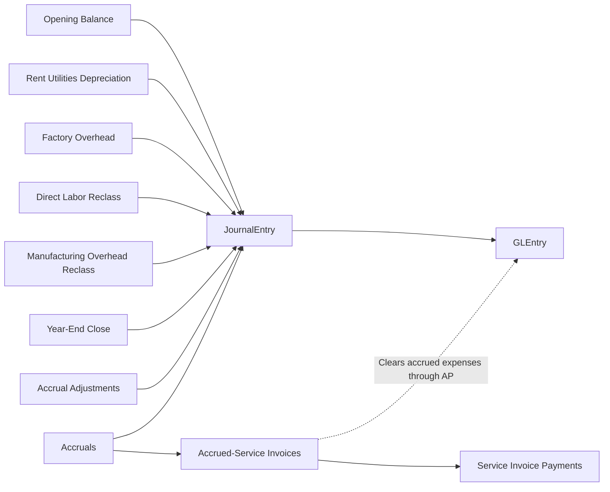
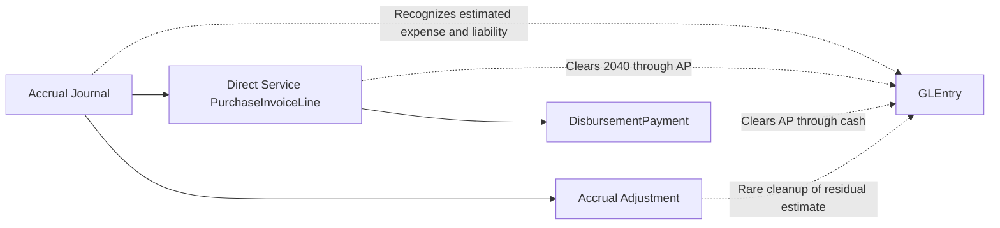

# Manual Journals and Close Cycle

## Business Storyline

Greenfield includes both operational activity and finance-controlled journal activity. The finance team also records the recurring and period-end activity that students expect in a real accounting system. That includes rent, utilities, depreciation, month-end accruals, rare accrual adjustments, factory-overhead journals, manufacturing labor and overhead reclasses, and year-end close.

This page matters because it shows what happens outside the normal document chains. Students can compare operational postings from shipments, receipts, payroll, and purchasing with finance-controlled entries that start directly in the journal process.

## Process Diagram

Unlike O2C, P2P, manufacturing, and payroll, this process starts directly in `JournalEntry`. Students should read the diagram as a finance calendar: record recurring entries, estimate expenses when needed, clear those estimates later through AP, and close the year when the reporting cycle ends.

## Step-by-Step Walkthrough

1. The accounting history begins with an opening balance journal that establishes the starting financial position.
2. Each month, finance records recurring entries such as rent, utilities, depreciation, factory overhead, and accrued expenses in `JournalEntry`.
3. Most accrued expenses are not reversed automatically. Instead, they are cleared later when AP records the related supplier invoice and payment.
4. If an estimate remains overstated or stale, finance may record a targeted `Accrual Adjustment` journal to reduce the remaining balance.
5. Manufacturing-related journals move factory overhead, direct labor reclass, and manufacturing overhead reclass activity into the cost-accounting flow.
6. At year end, closing journals move profit-and-loss activity into `8010` Income Summary and then into `3030` Retained Earnings.

## Main Tables in This Process

| Business step | Main tables | Why they matter |
|---|---|---|
| Journal header | `JournalEntry` | Shows posting date, entry type, creator, approver, and reversal linkage |
| Posted detail | `GLEntry` | Shows debit, credit, account, cost center, and voucher traceability |
| Chart of accounts | `Account` | Defines which balances are being affected |
| Organization | `CostCenter`, `Employee` | Support journal ownership, approvals, and analysis |

## When Accounting Happens

In this process, the journal itself is the accounting event. There is no earlier operational table that later posts.

Current recurring categories:

- opening balance
- rent
- utilities
- factory overhead
- direct labor reclass
- manufacturing overhead reclass
- depreciation
- accrual
- accrual adjustment
- year-end close

## Common Student Questions

- Which journal types recur each month?
- Which accrued expenses later clear through AP through supplier invoicing and payment?
- Which entries support manufacturing cost accounting even though they are journal-based?
- How much manual journal activity exists beside operational postings?
- How should year-end close entries be treated in multi-year income-statement analysis?

## What to Notice in the Data

- Manual journal detail is represented through `JournalEntry` headers plus linked `GLEntry` rows. There is no separate journal-line table.
- `ReversesJournalEntryID` is used for rare accrual adjustments that point back to the original accrual.
- Most accrued expenses are cleared operationally through direct service `PurchaseInvoice` and `DisbursementPayment` activity.
- Payroll is operationally modeled through payroll tables, so payroll accrual and payroll settlement journals are not part of the recurring-journal set.
- For raw multi-year income-statement analysis, exclude the two year-end close entry types.

## Subprocess Spotlight: Accrual Estimate to Settlement to Adjustment

The teaching point is that accrued expenses are expected to survive into later operational settlement. They are not blanket-reversed every month. That makes year-end expense totals and liability roll-forwards much more realistic for students.

## Where to Go Next

- Read [Payroll](payroll.md) for the operational payroll process.
- Read [P2P](p2p.md) for the supplier-invoice and disbursement flow that clears many accrued expenses.
- Read [GLEntry Posting Reference](../reference/posting.md) for the detailed posting logic.
- Read [Financial Analytics](../analytics/financial.md) for journal and close-cycle analysis examples.
