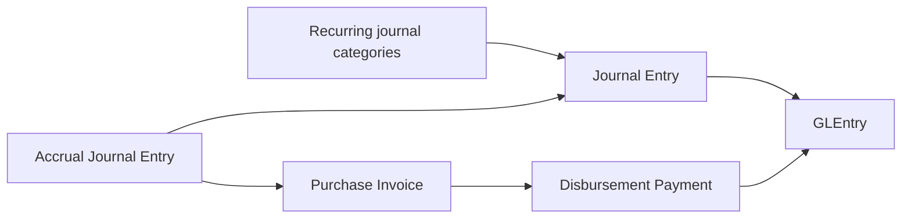
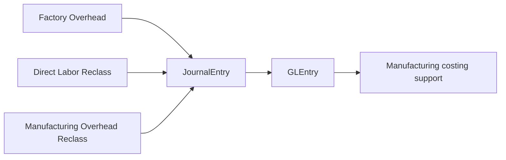
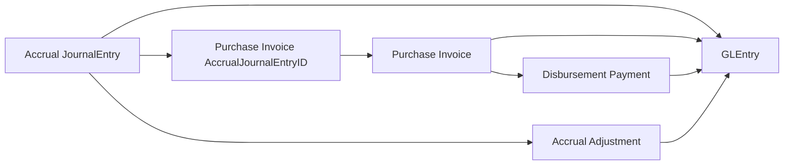
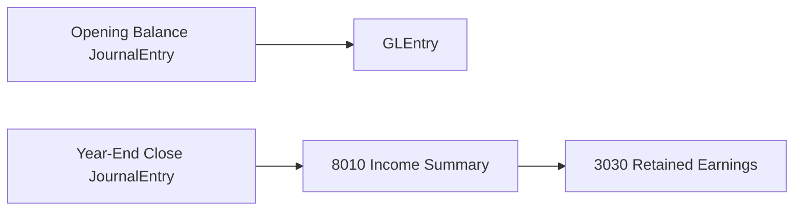

# Manual Journals and Close Cycle

## What Students Should Learn

- Distinguish recurring finance-controlled journals, accrued-expense settlement, and boundary entries such as opening balance and year-end close.
- Trace a manual or finance-controlled posting from `JournalEntry` into `GLEntry` and, when relevant, into later AP settlement.
- Identify the core tables used for recurring journals, manufacturing reclass support, accrual cleanup, and close-cycle analysis.
- Recognize which journal families belong in recurring monthly analysis and which should be filtered from raw multi-year P&L review.

## Business Storyline

The dataset includes both operational activity and finance-controlled journal activity. Finance records the recurring and period-end entries that students expect in a real accounting system: rent, utilities, depreciation, month-end accruals, accrual adjustments, factory-overhead journals, manufacturing labor and overhead reclasses, and year-end close.

This process shows what happens outside the normal document chains. Students can compare operational postings from shipments, receipts, payroll, and purchasing with finance-controlled entries that start directly in the journal process. The most important cross-process bridge is accrued-expense settlement, where a finance estimate is later cleared operationally through AP.

That distinction matters. A recurring journal is not an operational source document. An accrual is not the same thing as the later supplier invoice that clears it. A year-end close is not just another monthly recurring journal. Students can see those stages separately in the data and use that separation for financial-accounting, working-capital, and audit questions.

## Normal Process Overview



Read the main diagram as a finance calendar. Most of the page is about recurring monthly journals that start directly in `JournalEntry` and post into `GLEntry`. The main bridge back into an operational process is accrued-expense settlement, where a prior estimate is later cleared through AP.

## How to Read This Process in the Data

This page is organized around business flow first and data navigation second. The main diagram shows the recurring finance-controlled path. The smaller diagrams below show one analytical task at a time, such as recurring operating journals, manufacturing-support reclasses, or accrual settlement. The fuller relationship map belongs on [Schema Reference](../reference/schema.md), not on this process page.

:::tip
Read this page in three passes: first recurring journals, then the accrual-settlement bridge, then the boundary entries for opening balance and year-end close.
:::

## Core Tables and What They Represent

| Process stage | Main tables | Grain or event represented | Why students use them |
|---|---|---|---|
| Recurring finance journals | `JournalEntry`, `GLEntry`, `Account`, `CostCenter`, `Employee` | One finance-controlled journal header with posted ledger detail | Review recurring expenses, approvals, and posted accounting effect |
| Manufacturing-support journals | `JournalEntry`, `GLEntry`, `Account` | Factory overhead, direct labor reclass, and manufacturing overhead reclass | Connect finance-controlled journals to manufacturing costing support |
| Accrual settlement bridge | `JournalEntry`, `PurchaseInvoice`, `PurchaseInvoiceLine`, `DisbursementPayment` | Prior expense estimate and later AP settlement path | Analyze accrued-expense roll-forward and later supplier settlement |
| Boundary entries | `JournalEntry`, `GLEntry`, `Account` | Opening balance and year-end close journal activity | Understand the start and end boundaries of the reporting cycle |

## When Accounting Happens

| Event | Business meaning | Accounting effect |
|---|---|---|
| Recurring operating journal | Finance records a monthly expense or estimate directly in the journal cycle | Debit expense or clearing accounts and credit cash, accrued expenses, or other offset accounts depending on entry type |
| Manufacturing-support journal | Finance records factory overhead or reclass support for manufacturing costing | Debit manufacturing clearing or expense accounts and credit the supporting expense pools or cash |
| Accrual adjustment | Finance reverses the residual from an accrual after a linked supplier invoice or partially cleans up a stale uninvoiced estimate | Debit `2040` Accrued Expenses and credit the original accrued expense account |
| Direct service supplier invoice | AP clears a prior accrual through a later service invoice | Debit `2040` up to the estimate, expense any excess above estimate, and credit AP |
| Disbursement payment | Treasury clears the AP created by the service invoice | Debit AP and credit cash |
| Opening balance journal | Finance establishes the starting financial position | Seeds the beginning asset, liability, equity, and retained-earnings balances |
| Year-end close | Finance closes annual P&L activity into income summary and retained earnings | Moves annual revenue and expense balances through `8010` Income Summary into `3030` Retained Earnings |

## Key Traceability and Data Notes

- `JournalEntry` is the journal header anchor for finance-controlled activity. There is no separate journal-line table in the current model.
- `GLEntry` is the posted detail layer and the main bridge into financial reporting and control-account analysis.
- `PurchaseInvoiceLine.AccrualJournalEntryID` is the authoritative link from a direct service invoice line back to the original accrual.
- `PurchaseInvoiceLine.GoodsReceiptLineID` belongs to receipt-matched inventory or material invoicing and should not be confused with accrued-service settlement.
- `ReversesJournalEntryID` is used on `Accrual Adjustment` cleanup activity that points back to the original accrual.
- Payroll is operationally modeled through payroll tables, so payroll accrual and settlement journals are not part of this recurring-journal set.
- For raw multi-year income-statement analysis, filter out the year-end close entry types.

## Analytical Subsections

### Recurring Operating Journals

Most manual journal activity in the dataset follows a recurring finance calendar. Students should use this subsection for rent, utilities, depreciation, and month-end accruals that start directly in `JournalEntry` without an earlier operational source document.


**Tables involved**

| Table | Role in the flow |
|---|---|
| `JournalEntry` | Shows posting date, entry type, approval support, and reversal linkage |
| `GLEntry` | Shows posted debit and credit detail |
| `Account` | Shows which balances the journal affected |
| `CostCenter`, `Employee` | Support ownership, approvals, and recurring journal analysis |

**Starter analytical question:** Which recurring journal families appear each month, and how stable are they by amount and cost center?

```sql
-- Teaching objective: Compare recurring journal families across months and cost centers.
-- Main join path: JournalEntry -> GLEntry -> Account, with CostCenter when available.
-- Suggested analysis: Group by EntryType, month, account, or cost center.
```

### Manufacturing Reclass and Factory Overhead Journals

Some finance-controlled journals support manufacturing costing even though they do not start in the manufacturing subledger. Students should read these entries as accounting support for the factory-cost story, not as replacements for the operational manufacturing documents.



**Tables involved**

| Table | Role in the flow |
|---|---|
| `JournalEntry` | Stores the factory-overhead and reclass journal headers |
| `GLEntry` | Shows the posted effect on manufacturing clearing and expense accounts |
| `Account` | Helps separate factory-overhead expense, manufacturing clearing, and labor-support accounts |

**Starter analytical question:** How much manufacturing-support journal activity exists beside the operational manufacturing postings in each month?

```sql
-- Teaching objective: Isolate finance-controlled manufacturing support journals from operational manufacturing postings.
-- Main join path: JournalEntry -> GLEntry -> Account.
-- Suggested analysis: Filter EntryType to Factory Overhead, Direct Labor Reclass, and Manufacturing Overhead Reclass.
```

### Accrual Estimate to AP Settlement

This is the most important subprocess on the page. Students should learn that accrued expenses are usually cleared later through AP rather than blanket-reversed at month end. Finance records the estimate first, AP later clears it through a direct service invoice, treasury pays it later, and any under-accrual residual is reversed through a linked `Accrual Adjustment`. Only stale uninvoiced accruals keep the rare partial-cleanup pattern.



**Tables involved**

| Table | Role in the flow |
|---|---|
| `JournalEntry` | Stores the original accrual estimate and any later adjustment |
| `PurchaseInvoiceLine` | Stores the direct service settlement link back to the accrual |
| `PurchaseInvoice` | Stores the supplier invoice that clears the estimate through AP |
| `DisbursementPayment` | Shows when the later AP balance was actually paid |
| `GLEntry` | Shows the liability roll-forward and later settlement effect |

:::warning
Use `PurchaseInvoiceLine.AccrualJournalEntryID` for accrued-service settlement. Do not substitute `PurchaseInvoiceLine.GoodsReceiptLineID`, because that field belongs to receipt-matched inventory or material invoicing.
:::

**Key joins**

- `PurchaseInvoiceLine.AccrualJournalEntryID -> JournalEntry.JournalEntryID`
- `PurchaseInvoiceLine.PurchaseInvoiceID -> PurchaseInvoice.PurchaseInvoiceID`
- `DisbursementPayment.PurchaseInvoiceID -> PurchaseInvoice.PurchaseInvoiceID`
- `JournalEntry.ReversesJournalEntryID` for linked `Accrual Adjustment` cleanup review

```sql
-- Teaching objective: Trace an accrued expense from the original estimate into later AP settlement and linked cleanup activity.
-- Main join path: JournalEntry -> PurchaseInvoiceLine -> PurchaseInvoice -> DisbursementPayment.
-- Suggested analysis: Compare accrual date, invoice approval date, payment date, and any later accrual adjustment.
```

## Opening Balance and Year-End Close

Opening balance and year-end close are boundary entries, not recurring monthly process steps. Opening balance establishes the starting financial position for the dataset. Year-end close is the reporting-boundary mechanism that closes annual P&L activity through income summary and retained earnings.



| Boundary event | Main tables | Why students use them |
|---|---|---|
| Opening balance | `JournalEntry`, `GLEntry`, `Account` | Understand the seeded starting financial position |
| Year-end close | `JournalEntry`, `GLEntry`, `Account` | Understand how annual P&L balances are closed out of raw multi-year reporting |

| Event | Business meaning | Accounting effect |
|---|---|---|
| Opening balance journal | Seeds the starting position at the beginning of the dataset horizon | Posts the initial asset, liability, equity, and retained-earnings balances |
| Year-end close: P&L to income summary | Closes annual revenue and expense accounts | Moves annual P&L balances into `8010` Income Summary |
| Year-end close: income summary to retained earnings | Clears income summary into retained earnings | Moves the annual result into `3030` Retained Earnings |

**Traceability notes**

- `JournalEntry` remains the journal header anchor for both opening balance and year-end close.
- `GLEntry` remains the posted detail layer students should use for financial-statement analysis.
- Year-end close entries should be filtered from raw multi-year P&L analysis when students want underlying operating activity instead of formal close mechanics.

## Common Student Questions

- Which journal types recur each month?
- Which recurring journal categories are cash-based versus accrued?
- Which accrued expenses later clear through AP through supplier invoicing and payment?
- Which entries support manufacturing cost accounting even though they are journal-based?
- How much finance-controlled journal activity exists beside operational postings?
- How should year-end close entries be treated in multi-year income-statement analysis?

## Next Steps

- Read [P2P](p2p.md) for the supplier-invoice and disbursement flow that clears many accrued expenses.
- Read [Payroll](payroll.md) for the operational payroll cycle that sits outside this finance-controlled journal family.
- Read [GLEntry Posting Reference](../reference/posting.md) for the detailed posting logic behind recurring journals, accruals, and close.
- Read [Financial Analytics](../analytics/financial.md) for journal, accrual, and close-cycle analysis examples.
- Read [Schema Reference for full table relationships](../reference/schema.md) when you need the broader process-level table map.
