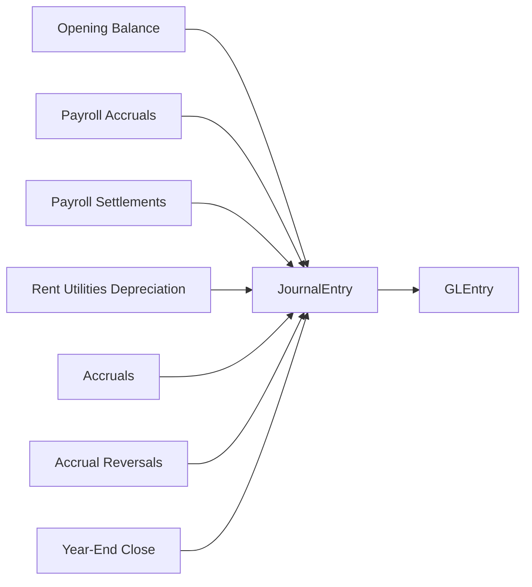

# Manual Journals and Close Cycle

**Audience:** Students, instructors, and analysts who need the finance-team activity explained alongside the operational cycles.  
**Purpose:** Show how recurring journals, reversals, and year-end close work in the current dataset.  
**What you will learn:** The journal storyline, the journal categories, when entries occur, and how those entries affect analysis.

> **Implemented in current generator:** Opening balance, recurring monthly operating journals, accrual reversals, and year-end close entries.

> **Planned future extension:** Manufacturing-related close activity once production accounting is added.

## Business Storyline

Greenfield is not just a sales and purchasing database. The finance team also records the recurring activity that students expect in a real accounting system: payroll accruals, payroll settlement, rent, utilities, depreciation, accruals, reversals, and year-end close.

This matters because it lets students work with both:

- operational postings from business events
- non-operational postings from finance processes

## Process Diagram

Unlike O2C and P2P, this process starts directly in `JournalEntry`. The linked `GLEntry` rows carry the posted accounting detail.

## Step-by-Step Walkthrough

1. The dataset begins with an opening balance journal.
2. Each month, the generator creates payroll accruals by cost center.
3. The following month, payroll settlement journals clear the payroll accrual.
4. Rent, utilities, and depreciation journals are created each month.
5. Month-end accrual journals record certain operating expenses before cash settlement.
6. The next month, accrual reversal journals unwind those temporary balances.
7. At year end, closing journals move profit-and-loss activity into `8010` Income Summary and then into `3030` Retained Earnings.

## Main Tables in This Process

| Business step | Main tables | Why they matter |
|---|---|---|
| Journal header | `JournalEntry` | Shows posting date, entry type, creator, approver, and reversal linkage |
| Posted detail | `GLEntry` | Shows debit, credit, account, cost center, and voucher traceability |
| Chart of accounts | `Account` | Defines which balances are being affected |
| Organization | `CostCenter`, `Employee` | Support journal ownership, approvals, and analysis |

## When Accounting Happens

In this process, the journal itself is the accounting event. There is no earlier operational table that later posts.

Current recurring categories:

- opening balance
- payroll accrual
- payroll settlement
- rent
- utilities
- depreciation
- accrual
- accrual reversal
- year-end close

## Common Student Questions

- Which journal types recur each month?
- Which entries reverse in the next period?
- Which cost centers carry the largest payroll accruals?
- How much manual journal activity exists beside operational postings?
- How should year-end close entries be treated in multi-year income-statement analysis?

## Current Implementation Notes

- Manual journal detail is represented through `JournalEntry` headers plus linked `GLEntry` rows. There is no separate journal-line table.
- `ReversesJournalEntryID` is used for accrual reversals.
- For raw multi-year income-statement analysis, exclude the two year-end close entry types.

## Where to Go Next

- Read [../reference/posting.md](../reference/posting.md) for the detailed posting logic.
- Read [../analytics/financial.md](../analytics/financial.md) for journal and close-cycle analysis examples.
