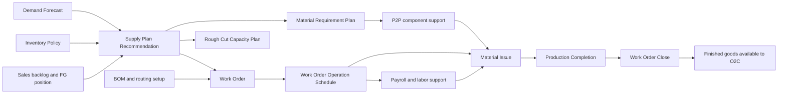
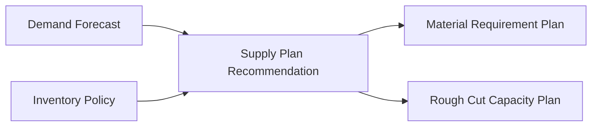
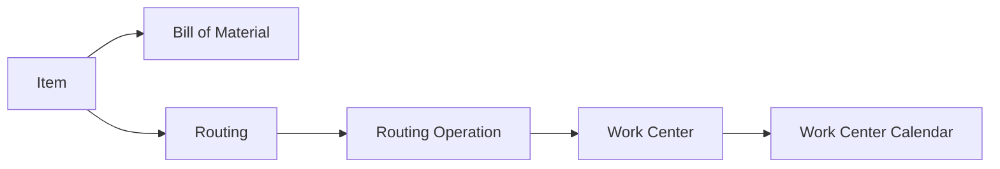
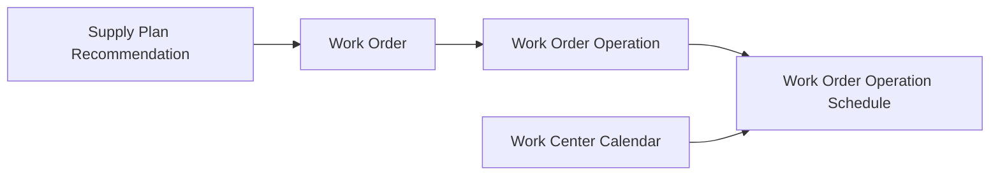
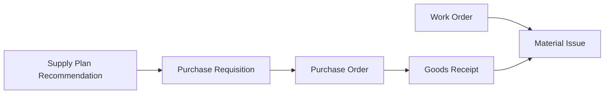
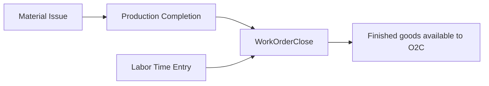

# Manufacturing Process

## What Students Should Learn

- Distinguish planning, execution, and costing or close as separate layers inside the manufacturing story.
- Trace a manufactured item from weekly replenishment planning into work-order execution and then into `GLEntry`.
- Identify the core tables used for MRP, rough-cut capacity, work-order scheduling, material issue, labor support, completion, and close.
- Recognize timing differences that matter for capacity analysis, open work-order review, product costing, and manufacturing audit work.

## Business Storyline

This company both buys finished goods and manufactures selected products in-house. That hybrid model is one of the most useful teaching features in the dataset because students can compare purchased inventory with manufactured inventory inside the same business.

In this dataset, the manufacturing story starts with planning, not with a work order. Weekly forecasts, inventory policies, open finished-goods demand, and current supply pressure create replenishment signals. Manufactured signals move into work orders, components may need help from the purchasing cycle, warehouse staff issue material into production, approved labor support flows into cost traceability, finished goods are completed back into inventory, and accounting closes the order when standard and actual amounts are resolved.

That distinction matters. A planning recommendation is not a work order. A rough-cut capacity row is not the same thing as an operation schedule. A completion is not the same thing as a close. Students can see those stages separately in the data and use that separation for managerial, financial, and audit questions.

## Normal Process Overview



Read the main diagram as planning, execution, and costing or close. Planning starts the story. BOMs and routings explain how the item can be built. Work-order execution shows what actually happened on the floor. Close and reclass activity explain the accounting effect after production activity is finished.

## How to Read This Process in the Data

This page is organized around business flow first and data navigation second. The main diagram shows the normal manufacturing path. The smaller diagrams below show one analytical task at a time, such as planning pressure, routing design, work-order scheduling, component support, labor traceability, or work-order close. The fuller relationship map belongs on [Schema Reference](../reference/schema.md), not on this process page.

:::tip
Read this page in three passes: first `planning`, then `execution`, then `costing and close`. That sequence keeps students from mixing weekly planning signals with daily execution rows or accounting-close events.
:::

## Core Tables and What They Represent

| Process stage | Main tables | Grain or event represented | Why students use them |
|---|---|---|---|
| Planning and replenishment pressure | `DemandForecast`, `InventoryPolicy`, `SupplyPlanRecommendation`, `MaterialRequirementPlan`, `RoughCutCapacityPlan` | Weekly forecast, policy, replenishment signal, exploded component demand, and weekly load-versus-capacity tieout | Explain why manufacturing demand existed before any work order was released |
| Standard manufacturing design | `Item`, `BillOfMaterial`, `BillOfMaterialLine`, `Routing`, `RoutingOperation`, `WorkCenter`, `WorkCenterCalendar` | Product recipe, operation sequence, and available work-center capacity | Understand how an item is supposed to be built |
| Work-order release and schedule | `WorkOrder`, `WorkOrderOperation`, `WorkOrderOperationSchedule` | One production order, its operation sequence, and its daily scheduled hours | Review finite scheduling, execution timing, and open production activity |
| Component support and issue | `PurchaseRequisition`, `PurchaseOrder`, `GoodsReceipt`, `MaterialIssue`, `MaterialIssueLine` | Purchased support for missing components and the physical issue of material into WIP | Trace whether materials were available and when they were consumed |
| Labor support and cost traceability | `EmployeeShiftRoster`, `TimeClockEntry`, `LaborTimeEntry`, `PayrollRegister`, `JournalEntry` | Approved attendance, labor allocation, payroll support, and later reclass activity | Connect factory labor support to work-order cost analysis |
| Completion and close | `ProductionCompletion`, `ProductionCompletionLine`, `WorkOrderClose` | Finished-goods completion event and final variance close | Separate physical completion from accounting close and variance analysis |

## When Accounting Happens

| Event | Business meaning | Accounting effect |
|---|---|---|
| Material issue | Components are moved from stock into work in process | Debit `1046` Inventory - Work in Process and credit `1045` Inventory - Materials and Packaging |
| Production completion | Finished goods are completed from WIP at standard manufacturing cost | Debit `1040` Inventory - Finished Goods, credit `1046` Inventory - Work in Process, and credit `1090` Manufacturing Cost Clearing |
| Work-order close | Accounting clears residual WIP and clearing balances and recognizes manufacturing variance | Debit or credit `5080` Manufacturing Variance with the offset to unresolved WIP or clearing balances |
| Direct labor and overhead reclass support | Payroll-supported manufacturing labor and burden are moved into manufacturing costing flows | Journal-driven reclass from payroll expense pools into direct labor or manufacturing overhead paths |

## Key Traceability and Data Notes

- `SupplyPlanRecommendation` is the planning bridge into both `WorkOrder` and purchased replenishment support.
- `MaterialRequirementPlan` is the component-demand explosion tied back to one manufacturing recommendation.
- `RoughCutCapacityPlan` is a weekly planning tieout and should not be used as the daily execution schedule.
- `WorkOrderOperationSchedule` is the daily schedule students should use for operation-timing and capacity-use questions.
- `LaborTimeEntry` is the bridge from approved time into manufacturing cost traceability, especially when linked to `WorkOrderOperationID`.
- `WorkOrderClose` is the accounting close event, not the physical production event.
- Manufacturing stays standard-cost based even though payroll and time provide operational labor support beneath that costing layer.

## Analytical Subsections

### Planning, MRP, and Rough-Cut Capacity

This is the upstream manufacturing layer in the dataset. Weekly planning determines whether manufactured demand should be created at all, whether components will be needed, and whether work-center load looks tight before detailed execution begins. Students should start here when the question is "why did this work order exist?"



**Tables involved**

| Table | Role in the flow |
|---|---|
| `DemandForecast` | Shows the weekly demand signal behind planned replenishment |
| `InventoryPolicy` | Shows safety stock, reorder logic, and lead-time assumptions |
| `SupplyPlanRecommendation` | Shows the planned manufacture signal by week, item, and warehouse |
| `MaterialRequirementPlan` | Shows exploded component demand created from the planned manufacture signal |
| `RoughCutCapacityPlan` | Shows weekly planned load versus available work-center hours |

:::warning
`RoughCutCapacityPlan` is a weekly planning tieout, not the same thing as `WorkOrderOperationSchedule`. Use rough-cut rows for planning pressure and `WorkOrderOperationSchedule` for daily execution timing.
:::

**Starter analytical question:** Which manufactured recommendations created both component pressure and rough-cut capacity pressure before execution began?

```sql
-- Teaching objective: Link manufactured recommendations to component demand and weekly capacity pressure.
-- Main join path: SupplyPlanRecommendation -> MaterialRequirementPlan and RoughCutCapacityPlan.
-- Suggested analysis: Group by item, work center, warehouse, or bucket week.
```

### Standard Recipe, Routing, and Work Centers

Before a work order can be released, the item needs a standard recipe and a standard path through the factory. Students should read this subsection as the design layer that explains what components are required, which operations should occur, and where those operations are expected to happen.



**Tables involved**

| Table | Role in the flow |
|---|---|
| `Item` | Identifies which products are manufactured and stores standard cost components |
| `BillOfMaterial`, `BillOfMaterialLine` | Define the component recipe for the finished good |
| `Routing`, `RoutingOperation` | Define the ordered operation path through the factory |
| `WorkCenter`, `WorkCenterCalendar` | Define where the work happens and how much daily time is available |

**Starter analytical question:** Which manufactured item groups use the most complex routing or the heaviest component structure?

```sql
-- Teaching objective: Compare recipe complexity and routing complexity across manufactured items.
-- Main join path: Item -> BillOfMaterial -> BillOfMaterialLine and Item -> Routing -> RoutingOperation.
-- Suggested analysis: Group by item group, collection, or work center.
```

### Work Order Release and Operation Scheduling

This is the start of detailed execution. Once a recommendation is released, the dataset creates the work order, lays out the operation sequence, and schedules daily hours against finite work-center capacity. Students should use this section for open work-order review, schedule timing, and operation-sequence analysis.



**Tables involved**

| Table | Role in the flow |
|---|---|
| `SupplyPlanRecommendation` | Shows the planning row that supported the work-order release |
| `WorkOrder` | Shows the released production order |
| `WorkOrderOperation` | Shows the operation-level execution plan and actual progression |
| `WorkOrderOperationSchedule` | Shows the daily scheduled hours for each operation |
| `WorkCenterCalendar` | Shows the daily capacity that the schedule was placed against |

**Key joins**

- `WorkOrder.SupplyPlanRecommendationID -> SupplyPlanRecommendation.SupplyPlanRecommendationID`
- `WorkOrderOperation.WorkOrderID -> WorkOrder.WorkOrderID`
- `WorkOrderOperationSchedule.WorkOrderOperationID -> WorkOrderOperation.WorkOrderOperationID`
- `WorkOrderOperationSchedule.WorkCenterID -> WorkCenterCalendar.WorkCenterID`

```sql
-- Teaching objective: Trace one released work order from planning support into operation-level daily schedule rows.
-- Main join path: SupplyPlanRecommendation -> WorkOrder -> WorkOrderOperation -> WorkOrderOperationSchedule.
-- Suggested analysis: Compare release date, due date, schedule date, and actual operation timing.
```

### Purchased Component Support and Material Issue

Manufacturing is not isolated from purchasing. When planned or released work orders need more raw materials or packaging than current stock can support, the demand flows into the normal P2P process and then returns to manufacturing through material issue. Students should use this subsection to separate purchased support from the actual issue of components into WIP.



**Tables involved**

| Table | Role in the flow |
|---|---|
| `PurchaseRequisition`, `PurchaseOrder`, `GoodsReceipt` | Show how P2P supports missing materials and packaging |
| `WorkOrder` | Anchors the production order that consumes the components |
| `MaterialIssue`, `MaterialIssueLine` | Show when material actually moved into WIP |

**Starter analytical question:** Which work orders depended on purchased component support before material could be issued into production?

```sql
-- Teaching objective: Compare upstream purchased support to the later physical issue of components into WIP.
-- Main join path: SupplyPlanRecommendation -> PurchaseRequisition and WorkOrder -> MaterialIssue -> MaterialIssueLine.
-- Suggested analysis: Compare receipt timing, issue timing, and work-order release timing.
```

### Labor Capture, Payroll Bridge, and Manufacturing Cost

Material is only part of the manufacturing story. Approved time supports hourly labor, `LaborTimeEntry` allocates that support into costing, and payroll later provides the accounting support for direct-labor and overhead reclass activity. Students should treat payroll as the pay-cycle source and `LaborTimeEntry` as the manufacturing cost bridge.


**Tables involved**

| Table | Role in the flow |
|---|---|
| `EmployeeShiftRoster`, `TimeClockEntry` | Show planned and approved labor support beneath payroll |
| `LaborTimeEntry` | Shows the costing bridge from approved time into production analysis |
| `WorkOrderOperation` | Shows which operation consumed the direct labor support |
| `PayrollRegister` | Shows the payroll-side source behind later reclass activity |
| `JournalEntry` | Shows direct-labor and manufacturing-overhead reclass support |

**Starter analytical question:** Which work centers or work orders show the highest approved labor support relative to planned operation timing?

```sql
-- Teaching objective: Connect approved factory time to work-order operations and payroll-supported reclass activity.
-- Main join path: TimeClockEntry -> LaborTimeEntry -> WorkOrderOperation, plus PayrollRegister and JournalEntry.
-- Suggested analysis: Group by work center, work order, payroll period, or labor type.
```

### Production Completion, Close, and Finished-Goods Availability

This is the costing and inventory handoff layer. `ProductionCompletion` moves finished goods back into inventory at standard cost. `WorkOrderClose` then resolves the remaining manufacturing variance and clears residual balances. Students should keep those two events separate: completed production is not the same as a closed work order.



**Tables involved**

| Table | Role in the flow |
|---|---|
| `MaterialIssue` | Shows material already consumed into WIP before completion |
| `LaborTimeEntry` | Shows labor support that contributes to cost traceability |
| `ProductionCompletion`, `ProductionCompletionLine` | Show the physical completion event and standard finished-goods cost detail |
| `WorkOrderClose` | Shows the final close and manufacturing variance event |

**Starter analytical question:** Which work orders were physically completed in one period but not closed until a later period?

```sql
-- Teaching objective: Separate physical completion from accounting close and finished-goods availability.
-- Main join path: WorkOrder -> ProductionCompletion -> ProductionCompletionLine -> WorkOrderClose.
-- Suggested analysis: Compare completion date, close date, quantity completed, and variance amount by month.
```

## Common Student Questions

- Which products are manufactured and which are purchased?
- Which manufactured recommendations created the most component demand or rough-cut capacity pressure?
- Which items use the most complex BOM or routing structure?
- Which work centers look busiest by week or month?
- Which work orders remained open at period end?
- Which work orders had schedule pressure before actual execution began?
- Which work orders depended on purchased component support before material issue?
- How much direct labor is tied to each work order and operation?
- Which work orders were completed but not yet closed?
- How much manufacturing variance was posted by month, work center, or item group?

## Next Steps

- Read [Operations and Risk](../analytics/reports/operations-and-risk.md) when you want the business perspective built around planning pressure, supply reliability, capacity, workforce context, and controls.
- Read [Managerial Reports](../analytics/reports/managerial.md) when you want the broader report layer behind utilization, planning, workforce context, and supply risk.
- Read [Manufacturing Labor Case](../analytics/cases/manufacturing-labor-cost-case.md) when you want a guided walkthrough from production support into costing and close.
- Read [P2P](p2p.md) to see how raw materials and packaging are replenished when manufacturing needs purchased support.
- Read [Payroll](payroll.md#time-attendance-and-approved-hours) for approved attendance support and [Payroll](payroll.md#direct-labor-and-manufacturing-reclass) for the labor and reclass side of the same production story.
- Read [GLEntry Posting Reference](../reference/posting.md) and [Schema Reference](../reference/schema.md) when you need the detailed posting or join logic.
