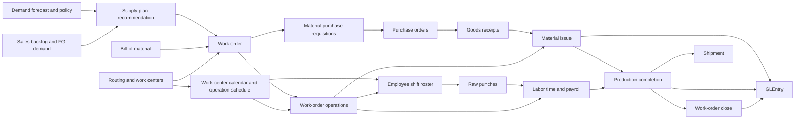
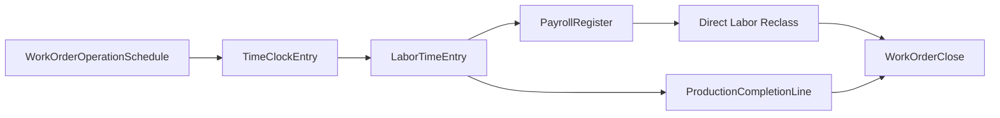

# Manufacturing Process

## Business Storyline

Greenfield does not manufacture every product it sells. It buys some finished goods ready-made, but it also produces a selected subset of furniture, lighting, and textile items in-house. That hybrid model is one of the most useful teaching features in the dataset because students can compare purchased inventory with manufactured inventory inside the same company.

The manufacturing story begins when weekly planning sees that demand and inventory levels are moving out of balance. Demand forecasts, inventory policies, and open backlog create replenishment signals. Manufactured signals convert into work orders, purchasing helps replenish any missing materials, warehouse staff issue components into production, supervisors and workers move the order through scheduled operations, payroll-supported labor is traced into the job, and accounting closes the order when standard and actual amounts are resolved.

## Process Diagram

Read the diagram as demand, planning, scheduling, material support, labor support, completion, and close. Students should notice that manufacturing is not isolated: it depends on sales demand, purchasing, warehouse activity, time clocks, payroll, and the general ledger.

## Step-by-Step Walkthrough

### 1. Define the standard recipe

Before production begins, Greenfield needs a standard recipe for each manufactured item. That recipe is stored as one active bill of material for the finished good, with the required raw materials, packaging components, quantities, and scrap assumptions.

Main tables:

- `BillOfMaterial`
- `BillOfMaterialLine`
- `Item`

### 2. Define the routing and work centers

Greenfield also defines how the work should happen. Each manufactured item has one active routing that breaks production into `2` to `4` ordered operations and assigns those operations to work centers such as cutting, assembly, finishing, packing, or selected quality checks.

Main tables:

- `WorkCenter`
- `Routing`
- `RoutingOperation`

### 3. Plan and release a work order

The planning team first creates a weekly manufacturing recommendation when projected demand is going to exceed available finished-goods supply. In the current model, that decision considers:

- weekly forecast
- open sales backlog
- available finished-goods inventory
- scheduled open completions
- a target finished-goods buffer

That recommendation is recorded in:

- `SupplyPlanRecommendation`

If the recommendation is eligible for release inside the current month, it converts into a `WorkOrder` with `SupplyPlanRecommendationID` populated.

The work order itself is recorded in:

- `WorkOrder`

At release time, the system also lays out the operation sequence and daily schedule that the order is expected to follow. That schedule uses the assigned work center's calendar and available hours.

Main linked tables:

- `WorkOrderOperation`
- `WorkOrderOperationSchedule`
- `WorkCenterCalendar`
- `RoughCutCapacityPlan`

### 4. Replenish components through P2P

If the work order needs more materials than current stock can support, manufacturing demand flows into the normal purchasing process. That replenishment appears through `PurchaseRequisition`, then continues through purchase orders and goods receipts.

Main linked tables:

- `PurchaseRequisition`
- `PurchaseOrder`
- `GoodsReceipt`

### 5. Issue components to production

When production begins, warehouse staff issue raw materials and packaging from inventory into work in process. In the dataset, issue dates are aligned with the start of the scheduled operation window.

Main tables:

- `MaterialIssue`
- `MaterialIssueLine`

Accounting event:

- debit `1046` Inventory - Work in Process
- credit `1045` Inventory - Materials and Packaging

### 6. Capture time clocks, labor, and overhead inputs

Manufacturing does not stop at materials. Direct workers are assigned to shifts, their approved daily attendance flows into labor support, and direct labor can be tied to the specific work-order operation where it was consumed. Payroll later turns that support into direct-labor and manufacturing-overhead reclass journals.

Main linked tables:

- `EmployeeShiftRoster`
- `TimeClockPunch`
- `TimeClockEntry`
- `ShiftDefinition`
- `EmployeeShiftAssignment`
- `LaborTimeEntry`
- `PayrollRegister`
- `WorkOrderOperation`
- `JournalEntry`

### 7. Complete finished goods

When the production team completes the order, finished goods move into inventory at standard material, standard direct labor, and standard variable and fixed overhead. Completion dates are kept on or after the final operation's actual end date.

Main tables:

- `ProductionCompletion`
- `ProductionCompletionLine`

Accounting event:

- debit `1040` Inventory - Finished Goods
- credit `1046` Inventory - Work in Process
- credit `1090` Manufacturing Cost Clearing

### 8. Close the work order

Once the order is complete, accounting closes it. Residual material, direct-labor, and overhead differences are pushed into manufacturing variance so the order no longer carries unresolved balances.

Main table:

- `WorkOrderClose`

Accounting event:

- residual WIP and clearing balances move to `5080` Manufacturing Variance

### 9. Ship the completed goods

Once finished goods are back in inventory, the normal O2C shipment process can consume them to satisfy customer demand.

## Main Tables in This Process

| Table | Role |
|---|---|
| `Item` | Identifies which sellable items are purchased versus manufactured and stores standard cost components |
| `BillOfMaterial` | BOM header for manufactured items |
| `BillOfMaterialLine` | BOM component detail |
| `DemandForecast` | Weekly demand-planning input that anchors replenishment volume |
| `InventoryPolicy` | Weekly replenishment policy used for safety stock, reorder point, and lead-time logic |
| `SupplyPlanRecommendation` | Weekly replenishment signal that becomes a work order or requisition |
| `MaterialRequirementPlan` | Component-demand explosion tied to manufactured recommendations |
| `RoughCutCapacityPlan` | Weekly capacity tieout between planned load and available hours |
| `WorkCenter` | Manufacturing resource group where an operation is performed |
| `WorkCenterCalendar` | Daily work-center availability, including weekends, holidays, maintenance, and reduced-capacity days |
| `Routing` | Active operation plan for a manufactured item |
| `RoutingOperation` | Ordered routing step with standard setup, run, and queue assumptions |
| `WorkOrder` | Production order for a manufactured item |
| `WorkOrderOperation` | Operation-level execution plan and actual start/end progression for a work order |
| `WorkOrderOperationSchedule` | Daily scheduled hours for each work-order operation |
| `ShiftDefinition` | Standard shift template used by hourly manufacturing labor |
| `EmployeeShiftAssignment` | Primary shift assignment for hourly employees |
| `EmployeeShiftRoster` | Daily planned manufacturing or support shift row |
| `TimeClockPunch` | Raw attendance event tied to the planned roster |
| `TimeClockEntry` | Approved daily time and attendance row for hourly labor |
| `MaterialIssue` | Header for component issue to production |
| `MaterialIssueLine` | Component issue detail |
| `ProductionCompletion` | Header for finished-goods completion |
| `ProductionCompletionLine` | Finished-goods completion detail with cost components |
| `WorkOrderClose` | Variance close and work-order closure record |
| `LaborTimeEntry` | Direct and indirect labor detail that feeds manufacturing actuals |

## When Accounting Happens

Manufacturing creates both operational and journal-driven accounting:

- `MaterialIssue` posts WIP and materials inventory
- `ProductionCompletion` posts finished goods, WIP, and manufacturing clearing
- `WorkOrderClose` posts manufacturing variance
- recurring journals also include:
  - `Factory Overhead`
  - `Direct Labor Reclass`
  - `Manufacturing Overhead Reclass`

## Common Student Questions

- Which products are manufactured and which are purchased?
- What materials go into a manufactured item?
- Which operations and work centers are used for each manufactured item?
- How much direct labor is tied to each work order and operation?
- Which work centers look busiest by month?
- Which work centers generate the most overtime?
- Which operation schedules and direct time clocks do not line up cleanly?
- Which work centers are capacity constrained or fully booked?
- Which work orders spilled into later months because schedule capacity was tight?
- Which work orders stayed open at period end?
- How much material was issued compared with standard requirement?
- How much manufacturing variance was posted by month or item group?
- How do production activity and payroll affect finished-goods availability and margin analysis?

## What to Notice in the Data

- Manufactured demand is tied to sales backlog and finished-goods availability.
- Phase 22 makes that link explicit through `DemandForecast`, `InventoryPolicy`, and `SupplyPlanRecommendation`.
- Raw-material replenishment uses the existing P2P flow.
- The current manufacturing model uses single-level BOMs.
- Direct labor is assigned at the operation level, and operations are scheduled against finite daily work-center capacity.
- Manufacturing remains standard-cost based even though payroll now provides actual labor detail.

## Subprocess Spotlight: Operation Schedule to Time Clock to Payroll to Cost

This mini-flow is the bridge students need for product-cost teaching:

- scheduling explains when work should happen
- the roster shows who was planned against that schedule
- raw punches show what attendance actually occurred
- time clocks show the approved worked summary
- labor entries allocate that approved time to production
- payroll turns labor into pay and later manufacturing reclass activity
- completion and work-order close tie those pieces back into product cost and variance

That is how the dataset supports direct-labor and overhead analysis without switching inventory to full actual costing.

## Where to Go Next

- Read [P2P](p2p.md) to see how materials and packaging are replenished.
- Read [Time Clocks](time-clocks.md) and [Payroll](payroll.md) for the labor side of the same production story.
- Read [GLEntry Posting Reference](../reference/posting.md) for the detailed posting rules behind issues, completions, and close.
