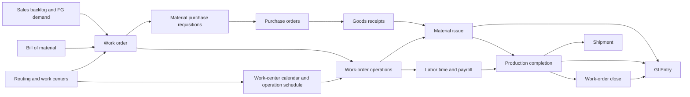
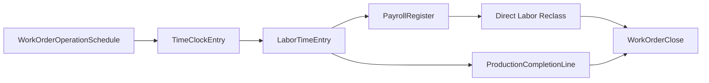

# Manufacturing Process

## Business Storyline

Greenfield does not manufacture every product it sells.

Instead, it produces a selected subset of furniture, lighting, and some textile items in-house. When customer demand and finished-goods buffers indicate a shortage, the manufacturing team releases work orders. Raw materials and packaging are issued to production, direct labor is traced from payroll time entries, completed finished goods move into inventory, and accounting closes the work order when actual and standard costs are fully resolved.

## Process Diagram

In plain language:

- customer demand helps determine when new production is needed
- BOMs define which components are required
- purchasing replenishes raw materials and packaging
- production issues components into WIP
- payroll and labor time provide actual labor input
- completed goods move into finished-goods inventory at standard cost
- work-order close pushes remaining material, labor, and overhead differences into manufacturing variance

## Step-by-Step Walkthrough

### 1. Define the standard recipe

Each manufactured finished good has one active BOM. The BOM lists raw-material and packaging components plus standard component quantities and scrap factors.

Main tables:

- `BillOfMaterial`
- `BillOfMaterialLine`
- `Item`

### 2. Define the routing and work centers

Each manufactured item also has one active routing. The routing breaks production into `2` to `4` ordered operations and assigns each operation to a work center such as cutting, assembly, finishing, packing, or selected quality checks.

Main tables:

- `WorkCenter`
- `Routing`
- `RoutingOperation`

### 3. Release a work order and schedule it

Work orders are created for manufactured items when projected shortage exists after considering:

- open sales backlog
- available finished-goods inventory
- scheduled open completions
- a target finished-goods buffer

Main table:

- `WorkOrder`

At release time the generator also creates work-order operation rows for the routing sequence that item uses. The current generator also creates a capacity-aware daily schedule for each operation, based on the assigned work center's calendar and available hours.

Main linked table:

- `WorkOrderOperation`
- `WorkOrderOperationSchedule`
- `WorkCenterCalendar`

### 4. Replenish components through P2P

If the planned work order needs more materials than current stock supports, the generator creates purchasing demand through `PurchaseRequisition`. Those requisitions move through the normal P2P process into purchase orders and goods receipts.

Main linked tables:

- `PurchaseRequisition`
- `PurchaseOrder`
- `GoodsReceipt`

### 5. Issue components to production

When the first scheduled operation window begins, raw materials and packaging are issued from warehouse inventory into WIP. Issues are not dated before the work order's first scheduled operation date.

Main tables:

- `MaterialIssue`
- `MaterialIssueLine`

Accounting event:

- debit `1046` Inventory - Work in Process
- credit `1045` Inventory - Materials and Packaging

### 6. Capture time clocks, labor, and overhead inputs

Manufacturing direct workers are assigned to shifts and record approved daily `TimeClockEntry` rows. Those approved clock rows then feed `LaborTimeEntry` records tied to both the work order and the specific work-order operation where labor was consumed. Payroll later turns those labor records into direct-labor and manufacturing-overhead reclass journals.

Main linked tables:

- `TimeClockEntry`
- `ShiftDefinition`
- `EmployeeShiftAssignment`
- `LaborTimeEntry`
- `PayrollRegister`
- `WorkOrderOperation`
- `JournalEntry`

### 7. Complete finished goods

Completed production moves finished goods into inventory at standard material plus standard direct labor plus standard variable and fixed overhead. Completion dates are kept on or after the final operation's actual end date.

Main tables:

- `ProductionCompletion`
- `ProductionCompletionLine`

Accounting event:

- debit `1040` Inventory - Finished Goods
- credit `1046` Inventory - Work in Process
- credit `1090` Manufacturing Cost Clearing

### 8. Close the work order

When the generator determines the work order is ready to close, residual material, direct-labor, and overhead differences are closed to manufacturing variance.

Main table:

- `WorkOrderClose`

Accounting event:

- residual WIP and clearing balances move to `5080` Manufacturing Variance

### 9. Ship the completed goods

Once finished goods are in inventory, normal O2C shipments can consume them.

## Main Tables Involved

| Table | Role |
|---|---|
| `Item` | Identifies which sellable items are purchased versus manufactured and stores standard cost components |
| `BillOfMaterial` | BOM header for manufactured items |
| `BillOfMaterialLine` | BOM component detail |
| `WorkCenter` | Manufacturing resource group where an operation is performed |
| `WorkCenterCalendar` | Daily work-center availability, including weekends, holidays, maintenance, and reduced-capacity days |
| `Routing` | Active operation plan for a manufactured item |
| `RoutingOperation` | Ordered routing step with standard setup, run, and queue assumptions |
| `WorkOrder` | Production order for a manufactured item |
| `WorkOrderOperation` | Operation-level execution plan and actual start/end progression for a work order |
| `WorkOrderOperationSchedule` | Daily scheduled hours for each work-order operation |
| `ShiftDefinition` | Standard shift template used by hourly manufacturing labor |
| `EmployeeShiftAssignment` | Primary shift assignment for hourly employees |
| `TimeClockEntry` | Approved daily time and attendance row for hourly labor |
| `MaterialIssue` | Header for component issue to production |
| `MaterialIssueLine` | Component issue detail |
| `ProductionCompletion` | Header for finished-goods completion |
| `ProductionCompletionLine` | Finished-goods completion detail with cost components |
| `WorkOrderClose` | Variance close and work-order closure record |
| `LaborTimeEntry` | Direct and indirect labor detail that feeds manufacturing actuals |

## When Accounting Happens

Manufacturing creates both operational and journal-driven accounting:

- `MaterialIssue` posts WIP and materials inventory
- `ProductionCompletion` posts finished goods, WIP, and manufacturing clearing
- `WorkOrderClose` posts manufacturing variance
- recurring journals also include:
  - `Factory Overhead`
  - `Direct Labor Reclass`
  - `Manufacturing Overhead Reclass`

## Common Student Questions

- Which products are manufactured and which are purchased?
- What materials go into a manufactured item?
- Which operations and work centers are used for each manufactured item?
- How much direct labor is tied to each work order and operation?
- Which work centers look busiest by month?
- Which work centers generate the most overtime?
- Which operation schedules and direct time clocks do not line up cleanly?
- Which work centers are capacity constrained or fully booked?
- Which work orders spilled into later months because schedule capacity was tight?
- Which work orders stayed open at period end?
- How much material was issued compared with standard requirement?
- How much manufacturing variance was posted by month or item group?
- How do production activity and payroll affect finished-goods availability and margin analysis?

## Current Implementation Notes

- The current model is intentionally a foundation:
  - single-level BOMs only
  - no multi-level BOMs or subassemblies
  - no raw punch-event table or shift-level capacity calendar
- Phase 15 introduced work-center-level capacity calendars and daily operation schedules.
- Phase 16 introduced shift assignments and approved daily time clocks for hourly employees.
- Manufacturing demand is linked to sales backlog and finished-goods inventory logic.
- Raw-material replenishment uses the existing P2P flow instead of a separate procurement subsystem.
- Manufacturing remains standard-cost based even though payroll now provides actual labor detail, direct labor is assigned at the operation level, hourly attendance is captured, and operations are scheduled against finite daily work-center hours.

## Subprocess Spotlight: Operation Schedule to Time Clock to Payroll to Cost

This mini-flow is the bridge students need for product-cost teaching:

- scheduling explains when work should happen
- time clocks show when hourly labor was approved
- labor entries allocate that approved time to production
- payroll turns labor into pay and later manufacturing reclass activity
- completion and work-order close tie those pieces back into product cost and variance

That is how the dataset supports DL + overhead analysis without switching inventory to full actual costing.

## Where to Go Next

- Read [Payroll](payroll.md) to see how labor enters the manufacturing flow.
- Read [Time Clocks](time-clocks.md) to see how hourly attendance supports payroll and operation-level labor analysis.
- Read [P2P](p2p.md) to see how materials enter inventory.
- Read [O2C](o2c.md) to see how finished goods leave inventory.
- Read [GLEntry Posting Reference](../reference/posting.md) for the detailed accounting rules.
