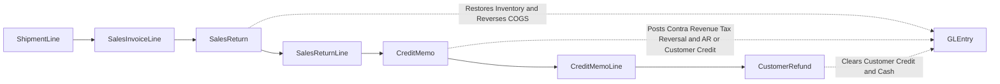
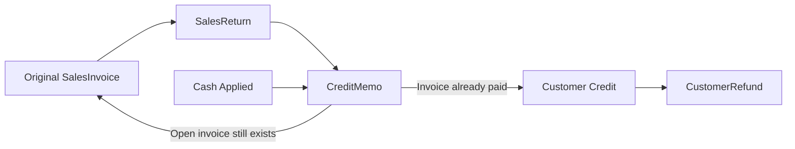

# Returns and Refunds

## Business Storyline

Some sales do not end with the original invoice. A customer may return goods because the order was damaged, incorrect, or no longer needed. Warehouse staff receive the goods back, accounting issues the financial correction, and treasury may later return cash if the customer had already paid.

This is one of the most useful student exception paths in the dataset because it shows that correcting revenue is both an operational process and an accounting process. Charles River keeps it as a minority path so students can compare normal sales with exception handling.

## Process Diagram

Read the diagram as a correction path, not as a new sale. The return starts from something that was already shipped and billed, then moves through physical return, financial correction, and sometimes cash refund.

## Step-by-Step Walkthrough

1. The starting point is a sale that was already shipped and invoiced.
2. The customer sends back some or all of that quantity.
3. Warehouse staff receive the goods and record the return in `SalesReturn` and `SalesReturnLine`.
4. Accounting issues the related financial correction in `CreditMemo` and `CreditMemoLine`.
5. If the original invoice is still open, the credit memo reduces accounts receivable.
6. If the customer already paid, the credit memo creates customer credit instead.
7. Treasury may later clear that credit in cash through `CustomerRefund`.

## Main Tables in This Process

| Business step | Main tables | Why they matter |
|---|---|---|
| Original shipped sale | `ShipmentLine`, `SalesInvoiceLine` | Identify what was shipped and billed |
| Physical return | `SalesReturn`, `SalesReturnLine` | Show returned quantity and reason path |
| Financial correction | `CreditMemo`, `CreditMemoLine` | Show the customer-facing credit issued from the return |
| Cash resolution | `CustomerRefund` | Show when customer credit was paid back in cash |

## When Accounting Happens

| Event | Accounting effect |
|---|---|
| Sales return | Debit inventory, credit COGS |
| Credit memo | Debit sales returns and allowances and tax reversal, credit AR or customer credit |
| Customer refund | Debit customer credit, credit cash |

## Common Student Questions

- Which shipment lines were later returned?
- Which returns reduced open AR versus created customer credit?
- Which customers had refunds in addition to a credit memo?
- How much contra revenue came from returns by month or customer?
- How do returns affect margin and inventory movement?

## What to Notice in the Data

- Returns only occur against previously shipped and previously invoiced lines.
- `SalesReturnLine.ShipmentLineID` is the core operational trace field.
- `CreditMemo.OriginalSalesInvoiceID` ties the credit back to the earlier invoice.
- `CreditMemoLine` now preserves the original pricing lineage through `BaseListPrice`, `PriceListLineID`, `PromotionID`, `PriceOverrideApprovalID`, `PricingMethod`, and `Discount`.
- Refunds are generated only for paid-return scenarios that leave customer credit to be cleared in cash.

## Subprocess Spotlight: Returned Invoice to Credit to Refund

This view separates two outcomes that students often mix together:

- a credit memo can reduce open receivables
- or it can create customer credit that is later refunded in cash

That distinction matters for AR analysis, cash analysis, and audit testing.

## Where to Go Next

- Read [O2C](o2c.md) for the main revenue cycle.
- Read [Dataset Guide](../start-here/dataset-overview.md) for the joins that connect shipment, invoice, return, and refund records.
- Read [GLEntry Posting Reference](../reference/posting.md) for the detailed posting reference.
