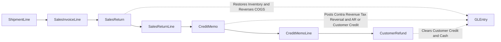
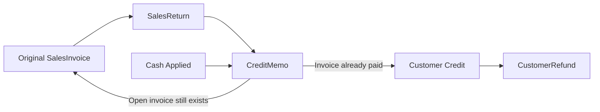

# Returns, Credit Memos, and Refunds

## Business Storyline

Some customer sales do not end with the original invoice. Goods may come back because they were damaged, incorrect, or no longer needed. Warehouse staff receive the goods back. Accounting issues a credit memo. If the invoice is still open, the credit reduces receivables. If the customer already paid, the credit can become customer credit and may later be refunded in cash.

This is a valuable teaching path because it shows that revenue correction is both an operational and an accounting process. In the clean base dataset, this is intentionally a minority exception path, not a dominant share of revenue activity.

## Process Diagram

This process starts from something that was already shipped and billed. It does not create a brand-new sale-side document chain. It corrects an earlier one.

## Step-by-Step Walkthrough

1. A shipment line was previously sent to the customer and billed on a sales invoice.
2. The customer sends back some or all of that quantity.
3. Warehouse operations receive the returned goods, which creates `SalesReturn` and `SalesReturnLine`.
4. Accounting creates a `CreditMemo` and `CreditMemoLine` from the returned line.
5. If the original invoice was still open, the credit memo reduces AR.
6. If the original invoice was already paid, the credit memo creates customer credit.
7. Treasury may later issue `CustomerRefund` to clear that credit in cash.

## Main Tables in This Process

| Business step | Main tables | Why they matter |
|---|---|---|
| Original shipped sale | `ShipmentLine`, `SalesInvoiceLine` | Identify what was shipped and billed |
| Physical return | `SalesReturn`, `SalesReturnLine` | Show returned quantity and reason path |
| Financial correction | `CreditMemo`, `CreditMemoLine` | Show the customer-facing credit issued from the return |
| Cash resolution | `CustomerRefund` | Show when customer credit was paid back in cash |

## When Accounting Happens

| Event | Accounting effect |
|---|---|
| Sales return | Debit inventory, credit COGS |
| Credit memo | Debit sales returns and allowances and tax reversal, credit AR or customer credit |
| Customer refund | Debit customer credit, credit cash |

## Common Student Questions

- Which shipment lines were later returned?
- Which returns reduced open AR versus created customer credit?
- Which customers had refunds instead of only a credit memo?
- How much contra revenue came from returns by month or customer?
- How do returns affect margin and inventory movement?

## Current Implementation Notes

- Returns only occur against previously shipped and previously invoiced lines.
- `SalesReturnLine.ShipmentLineID` is the core operational trace field.
- `CreditMemo.OriginalSalesInvoiceID` ties the credit back to the earlier invoice.
- Refunds are generated only for paid-return scenarios that leave customer credit to be cleared in cash.

## Subprocess Spotlight: Returned Invoice to Credit to Refund

This view separates two outcomes that students often mix together:

- a credit memo can reduce open receivables
- or it can create customer credit that is later refunded in cash

That distinction matters for AR analysis, cash analysis, and audit testing.

## Where to Go Next

- Read [O2C](o2c.md) for the main revenue cycle.
- Read [Posting Reference](../reference/posting.md) for the detailed posting reference.
