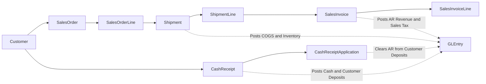

# Order-to-Cash Process

**Audience:** Students, instructors, and analysts who want the revenue cycle explained in business language.  
**Purpose:** Show how a sale moves from customer order to shipment, billing, and cash application.  
**What you will learn:** The business storyline, the key tables, when accounting happens, and what questions the O2C data can answer.

> **Implemented in current generator:** Customer orders, inventory-constrained shipments, backorders, sales invoices from shipment lines, customer-level cash receipts, and receipt applications.

> **Planned future extension:** Additional O2C behaviors such as broader service or manufacturing-linked fulfillment scenarios.

## Business Storyline

A customer places an order with Greenfield. Sales records the demand. Warehouse operations ship the goods when inventory is available. Accounting bills the customer from the shipped lines, not from the original order alone. Treasury records the cash receipt, and accounting applies that cash to one or more invoices.

That means students can see the difference between:

- demand
- fulfillment
- billing
- cash collection

## Process Diagram

The diagram shows the basic revenue cycle. Orders do not post to the GL. Shipping, billing, cash movement, and receipt application do.

## Step-by-Step Walkthrough

1. A customer places an order, which creates `SalesOrder` and `SalesOrderLine`.
2. The warehouse tries to fulfill the order from available stock. If stock is short, some quantity stays open or backordered.
3. A shipment is recorded in `Shipment` and `ShipmentLine`.
4. Accounting creates a `SalesInvoice` from the shipped lines. The invoice lines point back to the exact `ShipmentLineID`.
5. Treasury records a `CashReceipt` when money arrives from the customer.
6. Accounting uses `CashReceiptApplication` to apply that receipt against one or more open invoices.
7. Posted activity lands in `GLEntry`, where students can analyze revenue, receivables, and cash timing.

## Main Tables in This Process

| Business step | Main tables | Why they matter |
|---|---|---|
| Order capture | `SalesOrder`, `SalesOrderLine` | Show customer demand and requested items |
| Fulfillment | `Shipment`, `ShipmentLine` | Show what actually shipped and when |
| Billing | `SalesInvoice`, `SalesInvoiceLine` | Show what was billed from the shipped lines |
| Cash movement | `CashReceipt` | Shows when customer money arrived |
| Cash settlement | `CashReceiptApplication` | Shows which invoices the cash actually settled |

## When Accounting Happens

| Event | Accounting effect |
|---|---|
| Shipment | Debit COGS, credit inventory |
| Sales invoice | Debit AR, credit revenue and sales tax payable |
| Cash receipt | Debit cash, credit customer deposits and unapplied cash |
| Cash receipt application | Debit customer deposits and unapplied cash, credit AR |

## Common Student Questions

- Which orders shipped immediately and which became backorders?
- Which shipment lines were billed later than shipment date?
- Which invoices remain open after cash applications?
- Which customers pay one invoice at a time versus several at once?
- How do revenue, receivables, and cash collection timing differ by period?

## Current Implementation Notes

- `SalesInvoiceLine.ShipmentLineID` is the core shipment-to-invoice traceability field.
- `CashReceiptApplication` is the authoritative settlement table in O2C.
- `CashReceipt.SalesInvoiceID` is compatibility metadata only and should not be treated as the main settlement link.
- Some receipts remain temporarily unapplied, which supports customer-deposit and cash-application analysis.

## Where to Go Next

- Read [o2c-returns-credits-refunds.md](o2c-returns-credits-refunds.md) for the return and refund path.
- Read [../database-guide.md](../database-guide.md) for the main joins used in analysis.
