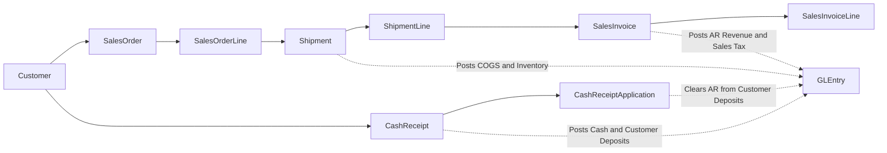
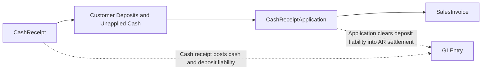
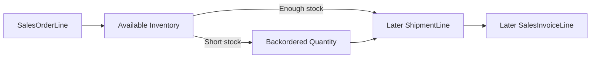

# Order-to-Cash Process

## Business Storyline

At Greenfield, the order-to-cash cycle starts when the sales team promises goods to a customer and ends only when that sale is settled in cash. Several teams touch the process along the way. Sales captures demand, warehouse staff ship what is available, accounting bills what actually left the warehouse, and treasury records the money when the customer pays.

That sequence matters because a customer order is not the same thing as revenue, and an invoice is not the same thing as cash. Students can see those stages separately in the data instead of treating the sale as one instant event.

Most sales end with shipment, billing, and settlement. Returns are handled on a separate page because Greenfield models them as an exception path, not as the normal outcome of most invoices.

## Process Diagram

Read the diagram as promise, fulfillment, billing, cash, and settlement. Orders show customer demand, but the accounting entries happen later when goods ship, invoices post, cash is received, and receipts are applied.

## Step-by-Step Walkthrough

1. Before the order is priced, Greenfield resolves the commercial rules for that customer and item. Segment or customer price lists provide the base commercial price, one promotion may apply, and rare below-floor exceptions require an explicit override approval.
2. Sales records the customer order. In the data, that promise appears in `SalesOrder` and `SalesOrderLine`.
3. Warehouse staff fulfill what is available. If inventory is short, some quantity stays open or backordered until stock is available.
4. When goods leave the warehouse, the shipment is recorded in `Shipment` and `ShipmentLine`. This is the first point where the physical movement of inventory is visible.
5. Accounting bills from what shipped, not only from what was ordered. The billing records appear in `SalesInvoice` and `SalesInvoiceLine`, and each billed line points back to the exact `ShipmentLineID`.
6. Treasury records the incoming customer payment in `CashReceipt`.
7. Accounting applies that payment against one or more open invoices through `CashReceiptApplication`.
8. Students can then move into `GLEntry` to analyze revenue recognition, receivables, deposits or unapplied cash, and collection timing.

## Main Tables in This Process

| Business step | Main tables | Why they matter |
|---|---|---|
| Commercial pricing | `PriceList`, `PriceListLine`, `PromotionProgram`, `PriceOverrideApproval` | Show how line-level selling price, promotion discount, and override approvals were determined |
| Order capture | `SalesOrder`, `SalesOrderLine` | Show customer demand and requested items |
| Fulfillment | `Shipment`, `ShipmentLine` | Show what actually shipped and when |
| Billing | `SalesInvoice`, `SalesInvoiceLine` | Show what was billed from the shipped lines |
| Cash movement | `CashReceipt` | Shows when customer money arrived |
| Cash settlement | `CashReceiptApplication` | Shows which invoices the cash actually settled |

## When Accounting Happens

| Event | Accounting effect |
|---|---|
| Shipment | Debit COGS, credit inventory |
| Sales invoice | Debit AR, credit revenue and sales tax payable |
| Cash receipt | Debit cash, credit customer deposits and unapplied cash |
| Cash receipt application | Debit customer deposits and unapplied cash, credit AR |

## Common Student Questions

- Which orders shipped immediately and which turned into backorders?
- Which shipment lines were invoiced later than the shipment date?
- Which invoices remain open after cash applications?
- Which customers pay one invoice at a time versus several at once?
- How do revenue, receivables, and cash collection timing differ by period?

## What to Notice in the Data

- `SalesInvoiceLine.ShipmentLineID` is the core shipment-to-invoice traceability field.
- `SalesOrderLine` now carries explicit pricing lineage through `BaseListPrice`, `PriceListLineID`, `PromotionID`, `PriceOverrideApprovalID`, and `PricingMethod`.
- `CashReceiptApplication` is the authoritative settlement table in O2C.
- `CashReceipt.SalesInvoiceID` is compatibility metadata only and should not be treated as the main settlement link.
- Some receipts remain temporarily unapplied, which supports customer-deposit and cash-application analysis.

## Subprocess Spotlight: Cash Application and Customer Deposits

The key teaching idea is that customer money can arrive before accounting applies it to one or more invoices. That makes `CashReceipt` the cash event and `CashReceiptApplication` the true settlement event.

## Subprocess Spotlight: Backorder to Shipment Lag

This mini-flow helps students see why order date, shipment date, and invoice date do not always match. Inventory availability drives fulfillment timing, and later shipments create later billing.

## Where to Go Next

- Read [Returns, Credits, and Refunds](o2c-returns-credits-refunds.md) for the return and refund path.
- Read [Dataset Guide](../start-here/dataset-overview.md) for the main joins used in analysis.
- Read [GLEntry Posting Reference](../reference/posting.md) when you want the detailed posting rules.
