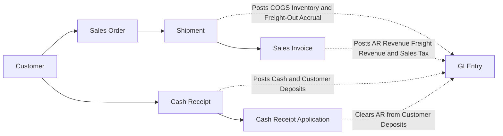
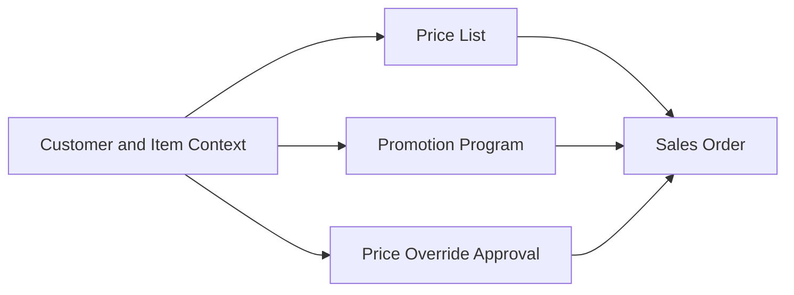
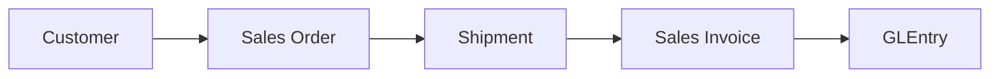
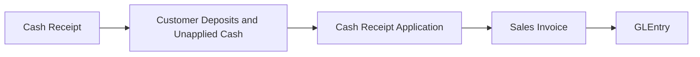
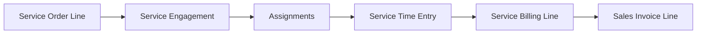
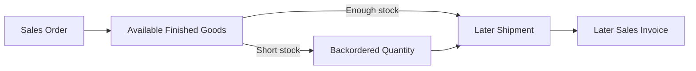
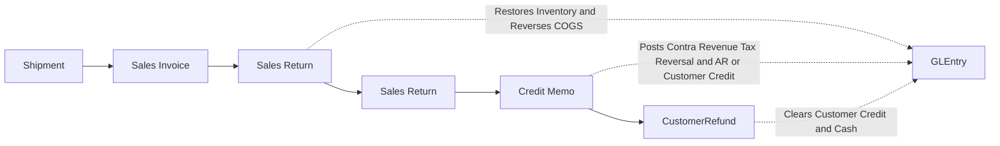
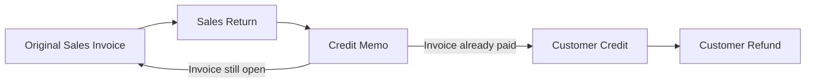

# Order-to-Cash Process

## What Students Should Learn

- Distinguish the order, shipment, invoice, cash receipt, settlement, and return-correction stages in one customer sale.
- Trace an O2C transaction from operational documents into `GLEntry`.
- Identify the core tables used for revenue, receivables, fulfillment, cash, and customer-side exceptions.
- Recognize timing differences that matter for cut-off, completeness, open-AR, working-capital, and return analysis.

## Business Storyline

In this dataset, the order-to-cash cycle starts when the sales team records customer demand and ends only when that sale is settled in cash. Several teams touch the process along the way. Sales captures the order and freight terms, warehouse staff ship what is available, accounting bills what actually left the warehouse and any billable freight, treasury records the money when it arrives, and accounting applies that cash against open invoices.

That distinction matters. A customer order is not revenue. A shipment is not the same thing as an invoice. A cash receipt is not the same thing as settlement. Students can see those stages separately in the data and use that separation to answer both accounting and audit questions.

Most sales follow the normal path of order, shipment, invoice, cash, and settlement. Some sales later move into the customer-side exception path of return, credit, and sometimes refund. That exception path is part of O2C, not a separate business cycle.

The company now also uses O2C for hourly design services. Those sales still start from `SalesOrder` and `SalesOrderLine`, but they move into `ServiceEngagement`, `ServiceTimeEntry`, and monthly billing instead of shipment. Students should read that as a second customer-fulfillment path inside O2C, not as a separate receivables system.

## Normal Process Overview



Read the main diagram as promise, fulfillment, billing, cash, and settlement. Orders show demand. Shipments show physical movement. Invoices create receivables and revenue. Cash receipts record the arrival of money. Cash applications show which invoices were actually settled.

## How to Read This Process in the Data

This page is organized around business flow first and data navigation second. The main diagram shows the normal O2C path. The smaller diagrams below show local lineage for one analytical task at a time. The fuller relationship map belongs on [Schema Reference](../reference/schema.md), not on this process page.

:::tip
Start with the business flow, then move into the subsection diagrams and tables when you need the exact trace for one analytical question.
:::

## Core Tables and What They Represent

| Process stage | Main tables | Grain or event represented | Why students use them |
|---|---|---|---|
| Pricing and commercial setup | `PriceList`, `PriceListLine`, `PromotionProgram`, `PriceOverrideApproval` | Pricing rules, promotions, and rare override approvals behind a sales line | Review commercial terms, pricing controls, and margin drivers |
| Order capture | `SalesOrder`, `SalesOrderLine` | Customer order header and ordered line | See promised demand, ordered quantity, and freight terms before fulfillment |
| Service delivery and staffing | `ServiceEngagement`, `ServiceEngagementAssignment`, `ServiceTimeEntry` | One customer engagement, the employees assigned to it, and approved daily service hours | Review service staffing, approved billable versus non-billable time, and labor-cost snapshots |
| Service billing trace | `ServiceBillingLine` | Monthly billed-hours rollup tied to one invoice line | Trace approved service hours into billed revenue without using shipment logic |
| Fulfillment | `Shipment`, `ShipmentLine` | Physical shipment event and shipped line | Measure what actually left the warehouse, carrier choice, and shipment-level freight accrual |
| Billing | `SalesInvoice`, `SalesInvoiceLine` | Invoice header and billed line | Trace receivable creation, merchandise revenue, and billed freight back to shipment |
| Cash receipt | `CashReceipt` | Cash arrival from the customer | Review collection timing, unapplied cash, and deposit behavior |
| Settlement | `CashReceiptApplication` | Application of received cash to one or more invoices | Measure true invoice settlement and open-AR reduction |

## When Accounting Happens

| Event | Business meaning | Accounting effect |
|---|---|---|
| Shipment | Goods physically leave inventory and customer fulfillment occurs | Debit COGS and freight-out expense, and credit inventory plus accrued expenses for outbound freight |
| Sales invoice | Accounting bills shipped quantity and creates the customer receivable | Debit AR and credit merchandise revenue, freight revenue, and sales tax payable |
| Service invoice | Accounting bills approved design-service hours for the month | Debit AR and credit `4080` Sales Revenue - Design Services plus sales tax payable, with no shipment-driven inventory or COGS entry |
| Cash receipt | Customer money arrives, even if it is not yet matched to a specific invoice | Debit cash and credit customer deposits or unapplied cash |
| Cash application | Accounting settles one or more open invoices with previously received cash | Debit customer deposits or unapplied cash and credit AR |

## Key Traceability and Data Notes

- `SalesInvoiceLine.ShipmentLineID` is the main shipment-to-invoice traceability field in the normal O2C path.
- Service invoice lines stay in `SalesInvoiceLine`, but `ShipmentLineID` stays null for those rows because no physical shipment occurred.
- `SalesOrder.FreightTerms`, `Shipment.FreightCost`, `Shipment.BillableFreightAmount`, and `SalesInvoice.FreightAmount` show how outbound freight moves from commercial policy into operational cost and customer billing.
- `CashReceiptApplication` is the true settlement table because it shows which invoices the cash actually cleared.
- `CashReceipt.SalesInvoiceID` is compatibility metadata only and should not be treated as the authoritative settlement link.
- `SalesOrderLine` carries pricing lineage through `BaseListPrice`, `PriceListLineID`, `PromotionID`, `PriceOverrideApprovalID`, and `PricingMethod`.
- `ServiceBillingLine` is the authoritative hours-to-invoice bridge for design services, and `ServiceTimeEntry` is the approved-hours source behind that billing.
- Some receipts remain unapplied for a period of time, which is useful for open-AR, unapplied-cash, and settlement-timing analysis.

## Analytical Subsections

### 1. Pricing and Commercial Terms

Before warehouse activity or billing begins, the dataset resolves the commercial terms for the order line. Students should read this step as the pricing decision layer: what was the base price, did a promotion apply, was an override approved, and how did the final pricing method affect margin and pricing-control review. For the full process-level entity relationships, see the [Schema Reference](../reference/schema.md).



**Tables involved**

| Table | Role in the flow |
|---|---|
| `PriceList`, `PriceListLine` | Provide the base commercial price by customer or segment scope |
| `PromotionProgram` | Adds the promotion-based discount when one valid promotion applies |
| `PriceOverrideApproval` | Captures rare below-floor approval support |
| `SalesOrderLine` | Stores the final pricing lineage on the ordered line |

**Starter analytical question:** Which sales lines used standard price-list logic versus promotion pricing versus approved override logic?

```sql
-- Teaching objective: Compare pricing method, promotion use, and override approvals.
-- Main join path: SalesOrderLine -> PriceListLine -> PriceList, plus PromotionProgram and PriceOverrideApproval.
-- Suggested analysis: Group by PricingMethod, customer segment, item group, or sales rep.
```

### 2. Shipment to Invoice Traceability

This view teaches students how billed revenue ties back to physical fulfillment. Treat this as a traceability diagram, not as a full ER diagram. For the full process-level entity relationships, see the [Schema Reference](../reference/schema.md). This subsection is especially useful for cutoff, completeness, and occurrence testing.



**Tables involved**

| Table | Role in the flow |
|---|---|
| `SalesOrder`, `SalesOrderLine` | Show the original customer promise, ordered quantity, and freight terms |
| `Shipment`, `ShipmentLine` | Show what actually shipped, when it shipped, and the shipment-level freight accrual |
| `SalesInvoice`, `SalesInvoiceLine` | Show what was billed from the shipped quantity and whether freight was billed to the customer |
| `GLEntry` | Shows the posted receivable, revenue, COGS, and freight effects |

**Key joins**

- `ShipmentLine.SalesOrderLineID -> SalesOrderLine.SalesOrderLineID`
- `SalesInvoiceLine.ShipmentLineID -> ShipmentLine.ShipmentLineID`
- `GLEntry.SourceDocumentType` plus `SourceDocumentID` or `SourceLineID` for posting trace

```sql
-- Teaching objective: Trace billed revenue back to the shipped line that supported it.
-- Main join path: SalesOrderLine -> ShipmentLine -> SalesInvoiceLine.
-- Suggested analysis: Filter invoice and shipment dates by month-end to test cutoff timing.
```

### 3. Cash Receipt, Application, and Settlement

This is the section students often need most. The cash receipt is the cash event. The cash application is the settlement event. Those are related, but they are not the same accounting moment. This distinction drives open-AR analysis, unapplied-cash review, and receivables testing.



**Tables involved**

| Table | Role in the flow |
|---|---|
| `CashReceipt` | Records when customer cash arrived |
| `CashReceiptApplication` | Records which invoices were actually settled |
| `SalesInvoice` | Provides the receivable being cleared |
| `GLEntry` | Shows cash, liability, and AR-clearing effects |

:::warning
Do not use `CashReceipt.SalesInvoiceID` as the main settlement link. The authoritative settlement path is `CashReceiptApplication`, because one receipt can settle multiple invoices and some cash can remain unapplied temporarily.
:::

```sql
-- Teaching objective: Separate cash arrival from invoice settlement.
-- Main join path: CashReceipt -> CashReceiptApplication -> SalesInvoice.
-- Suggested analysis: Compare receipt date, application date, and invoice due date for open-AR review.
```

### 4. Design Services and Monthly Hour Billing

The design-services branch shares the same customer, invoice, and cash backbone as the rest of O2C, but it does not use shipment. Instead, one service order line opens one engagement, multiple employees can be assigned to that engagement, approved service time accumulates through the month, and `ServiceBillingLine` ties the approved billed hours to the invoice line.



**Tables involved**

| Table | Role in the flow |
|---|---|
| `SalesOrderLine` | Carries the ordered service hours and fixed hourly rate |
| `ServiceEngagement` | Defines the customer job, lead employee, planned hours, and status |
| `ServiceEngagementAssignment` | Shows which employees worked on the engagement and how many hours were assigned |
| `ServiceTimeEntry` | Stores approved billable and non-billable service hours plus analytical labor cost |
| `ServiceBillingLine` | Stores the monthly billed-hours rollup tied to `SalesInvoiceLine` |
| `SalesInvoiceLine` | Stores the billed service quantity and billed amount with null shipment linkage |

**Starter analytical question:** Which customers or engagements show the biggest gap between approved service hours and billed service hours at month-end?

```sql
-- Teaching objective: Trace approved service hours into the monthly customer invoice.
-- Main join path: SalesOrderLine -> ServiceEngagement -> ServiceTimeEntry -> ServiceBillingLine -> SalesInvoiceLine.
-- Suggested analysis: Compare planned hours, approved billable hours, billed hours, and labor cost by customer or engagement.
```

### 5. Backorder to Shipment Lag

Not every order ships immediately. This subsection helps students see why order date, shipment date, and invoice date can diverge when inventory is short. It is useful for fulfillment-lag analysis, billing-lag review, and period timing differences around month-end.



**Tables involved**

| Table | Role in the flow |
|---|---|
| `SalesOrderLine` | Shows the original promised quantity |
| `ShipmentLine` | Shows what quantity left inventory and when |
| `SalesInvoiceLine` | Shows when the delayed shipment was billed |

**Starter analytical question:** Which customers or item groups show the longest lag between order capture, shipment, and billing?

```sql
-- Teaching objective: Measure fulfillment lag from ordered quantity to shipped quantity and billed quantity.
-- Main join path: SalesOrderLine -> ShipmentLine -> SalesInvoiceLine.
-- Suggested analysis: Compare order date, shipment date, and invoice date by customer, item group, or month.
```

## Returns, Credits, and Refunds

Some sales do not end with the original invoice. In this dataset, returns are the main customer-side exception path inside O2C, not a separate business cycle. The exception starts from something that was already shipped and billed, then moves through physical return, financial correction, and sometimes cash refund if the customer had already paid.



| Exception stage | Main tables | Why students use them |
|---|---|---|
| Original billed shipment | `ShipmentLine`, `SalesInvoiceLine` | Identify the shipment and invoice that the correction started from |
| Physical return | `SalesReturn`, `SalesReturnLine` | Show returned quantity and the operational return event |
| Financial correction | `CreditMemo`, `CreditMemoLine` | Show the customer-facing credit and whether it reduced AR or created customer credit |
| Cash resolution | `CustomerRefund` | Show when customer credit was returned in cash |

| Event | Business meaning | Accounting effect |
|---|---|---|
| Sales return | Goods come back after a shipment and invoice already existed | Debit inventory and credit COGS |
| Credit memo | Accounting reverses part of the original sale | Debit sales returns and allowances, freight revenue when policy allows a freight credit, and tax reversal, then credit AR or customer credit |
| Customer refund | Treasury clears customer credit in cash | Debit customer credit and credit cash |

**Traceability notes**

- `SalesReturnLine.ShipmentLineID` is the core operational return trace field.
- `CreditMemo.OriginalSalesInvoiceID` ties the financial correction back to the earlier invoice.
- `CreditMemo.FreightCreditAmount` shows when part of the original billed freight was credited back because the return reason justified it.
- `CreditMemoLine` preserves the original pricing lineage through `BaseListPrice`, `PriceListLineID`, `PromotionID`, `PriceOverrideApprovalID`, `PricingMethod`, and `Discount`.
- `CustomerRefund` is used only when the return scenario leaves customer credit that is later cleared in cash.



This local lineage view separates two outcomes that students often mix together. A credit memo can reduce open AR when the original invoice is still unsettled, or it can create customer credit that treasury later clears through `CustomerRefund`.

## Common Student Questions

- Which orders shipped immediately and which became backorders?
- Which shipment lines were invoiced later than the shipment date?
- Which invoices remain open after cash applications?
- Which customers pay one invoice at a time versus several at once?
- Which pricing methods appear most often by customer segment or item family?
- Which shipment lines were later returned?
- Which returns reduced open AR versus created customer credit?
- How do revenue, receivables, unapplied cash, collections timing, and return corrections differ by period?

## Next Steps

- Read [Commercial and Working Capital](../analytics/reports/commercial-and-working-capital.md) when you want the business perspective built around pricing, collections, receivables, payables, and settlement timing.
- Read [Financial Reports](../analytics/reports/financial.md) when you want the broader reporting layer behind revenue, AR, working capital, and cash conversion.
- Read [Design Services](design-services.md) when you want the full staffing, approved-hours, and monthly service-billing branch that now sits inside customer revenue.
- Read [O2C Trace Case](../analytics/cases/o2c-trace-case.md) when you want a guided walkthrough from order through posting and settlement.
- Jump to [Returns, Credits, and Refunds](#returns-credits-and-refunds) when you want the main O2C exception path.
- Read [GLEntry Posting Reference](../reference/posting.md) and [Schema Reference](../reference/schema.md) when you need the detailed posting or join logic.
