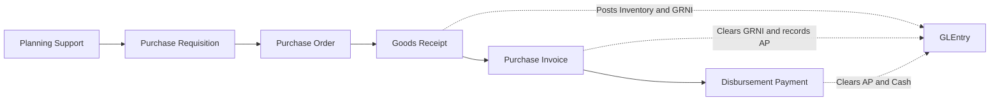
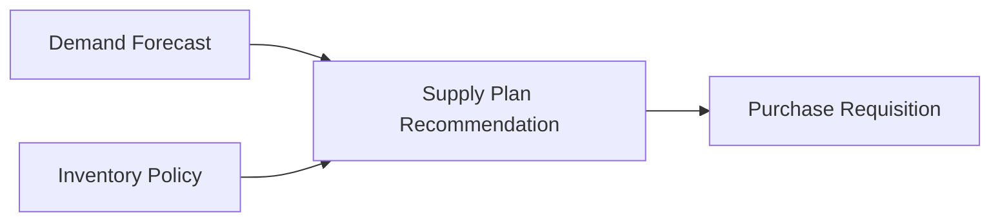
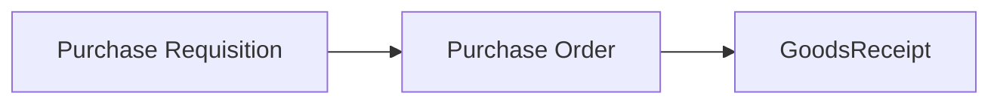

# Procure-to-Pay Process

## What Students Should Learn

- Distinguish planning support, requisition, purchase order, receipt, supplier invoice, and payment as separate P2P stages.
- Trace a purchased item or expense from operational documents into `GLEntry`.
- Identify the core tables used for three-way match, open AP, and planning-supported replenishment analysis.
- Recognize the control difference between receipt-matched inventory invoicing and direct accrued-service settlement.

## Business Storyline

The company does not buy inventory or services at random. A department or planning signal identifies a need, purchasing turns that need into supplier orders, warehouse staff receive the goods when they arrive, accounts payable records the supplier invoice, and treasury pays it when approved. Some purchasing demand is routine replenishment, and some supports manufacturing's need for raw materials and packaging.

That distinction matters. A requisition is not the same thing as a purchase order. A receipt is not the same thing as a supplier invoice. A supplier invoice is not the same thing as payment. Students can see each stage separately in the data and use that separation to answer both accounting and audit questions.

Most P2P activity follows the normal inventory and materials path: plan, requisition, order, receive, invoice, pay. A secondary AP path also exists for certain operating expenses. Finance may estimate the expense first through an accrual, then AP later clears that estimate through a direct service invoice that has no goods receipt behind it.

Capital purchases now follow the same front-end P2P approvals and supplier-document path. The difference shows up after invoicing: a CAPEX item creates a `FixedAsset` and `FixedAssetEvent` trail, cash purchases settle through the normal disbursement path, and note-financed purchases are later reclassed from AP into notes payable instead of being paid immediately in cash.

## Normal Process Overview



Read the main diagram as planning support, internal demand, supplier commitment, physical receipt, supplier billing, and payment. Requisitions and purchase orders are operational commitments; receiving, invoicing, and payment are the stages that reach the ledger.

## How to Read This Process in the Data

This page is organized around business flow first and data navigation second. The main diagram shows the normal inventory and materials path. The smaller diagrams below show one analytical task at a time, such as planning support, PO-to-receipt traceability, three-way match, or payment timing. The fuller relationship map belongs on [Schema Reference](../reference/schema.md), not on this process page.

:::tip
Start with why the purchase was needed, then move into supplier commitment, receiving, invoicing, and payment so the operational chain and the accounting chain stay distinct.
:::

## Core Tables and What They Represent

| Process stage | Main tables | Grain or event represented | Why students use them |
|---|---|---|---|
| Planning support | `DemandForecast`, `InventoryPolicy`, `SupplyPlanRecommendation` | Weekly planning signal behind normal purchased replenishment | Explain why purchased demand existed before requisitions were created |
| Internal demand | `PurchaseRequisition` | One internal request for an item, quantity, and cost center | Trace who requested the item and why |
| Supplier commitment | `PurchaseOrder`, `PurchaseOrderLine` | Supplier order header and ordered line | Review ordering, batching, and supplier commitment |
| Physical receipt | `GoodsReceipt`, `GoodsReceiptLine` | What physically arrived and when it arrived | Measure receipt timing, partial receipts, and inventory posting support |
| Supplier billing | `PurchaseInvoice`, `PurchaseInvoiceLine` | What the supplier billed and whether the line matched a receipt or accrual | Review three-way match, AP creation, and accrued-service settlement |
| Payment | `DisbursementPayment` | AP settlement event | Analyze payment timing and open payable behavior |

## When Accounting Happens

| Event | Business meaning | Accounting effect |
|---|---|---|
| Goods receipt | Goods physically arrive and inventory is recognized before the supplier bill is posted | Debit inventory and credit `2020` GRNI |
| Purchase invoice | AP records the supplier bill | For receipt-matched inventory lines: clear GRNI, record any purchase variance, and credit AP. For accrued-service lines: clear `2040` up to the estimate, book any excess to expense, and let any shortfall be reversed later through a linked accrual adjustment |
| Disbursement payment | Treasury or AP settles the supplier liability | Debit AP and credit cash |

## Key Traceability and Data Notes

- `PurchaseRequisition.SupplyPlanRecommendationID` is the authoritative planning-support link for normal replenishment demand.
- `PurchaseOrderLine.RequisitionID` is the authoritative requisition link when one purchase order batches several requisitions.
- `GoodsReceiptLine.POLineID` is the operational bridge from ordered line to received line.
- `PurchaseInvoiceLine.GoodsReceiptLineID` is the authoritative receipt-match link for inventory and material invoicing.
- `PurchaseInvoiceLine.AccrualJournalEntryID` is the authoritative link for direct accrued-service settlement.
- `FixedAssetEvent.PurchaseInvoiceID`, `PurchaseInvoiceLineID`, and `DisbursementID` extend that same trace when the purchased item is capitalized instead of expensed or stocked.
- P2P is multi-period in the current generator. Receipt, invoicing, and payment do not need to occur in the same month.

## Analytical Subsections

### Planning Support and Requisition Creation

The normal replenishment path starts before purchasing talks to a supplier. Weekly forecast, policy, and projected availability create `SupplyPlanRecommendation` rows, and those recommendations become the main support for new requisitions. Students should read this as the “why did we need to buy this?” layer.



**Tables involved**

| Table | Role in the flow |
|---|---|
| `DemandForecast` | Shows the expected demand pattern behind planned replenishment |
| `InventoryPolicy` | Shows safety stock, reorder logic, and lead-time assumptions |
| `SupplyPlanRecommendation` | Shows the planned purchase signal by week, item, and warehouse |
| `PurchaseRequisition` | Shows the internal demand that purchasing converts into supplier orders |

**Starter analytical question:** Which purchase requisitions were clearly supported by weekly planning versus created as residual execution demand?

```sql
-- Teaching objective: Trace purchased demand from planning support into requisition creation.
-- Main join path: SupplyPlanRecommendation -> PurchaseRequisition, with DemandForecast and InventoryPolicy for planning context.
-- Suggested analysis: Group by item group, warehouse, planner, or driver type.
```

### Purchase Order to Receipt Traceability

This subsection teaches the operational supplier path. Students should use it to trace how internal demand turns into a supplier order and then into one or more physical receipts. It is especially useful for partial receipt review, receiving lag analysis, and supplier-delivery questions.



**Tables involved**

| Table | Role in the flow |
|---|---|
| `PurchaseRequisition` | Shows the original internal demand |
| `PurchaseOrder`, `PurchaseOrderLine` | Show the supplier commitment and ordered line detail |
| `GoodsReceipt`, `GoodsReceiptLine` | Show what physically arrived and when it arrived |

**Key joins**

- `PurchaseOrderLine.RequisitionID -> PurchaseRequisition.RequisitionID`
- `GoodsReceiptLine.POLineID -> PurchaseOrderLine.POLineID`
- `GoodsReceiptLine.GoodsReceiptID -> GoodsReceipt.GoodsReceiptID`

```sql
-- Teaching objective: Trace supplier orders into one or more physical receipts.
-- Main join path: PurchaseRequisition -> PurchaseOrderLine -> GoodsReceiptLine.
-- Suggested analysis: Compare requisition date, order date, expected delivery date, and receipt date by supplier or item group.
```

### Receipt to Supplier Invoice Matching

This is the three-way-match teaching path. Students should use it to see how a supplier invoice ties back to a specific receipt line when the purchase follows the normal inventory or materials route.


**Tables involved**

| Table | Role in the flow |
|---|---|
| `GoodsReceiptLine` | Provides the receipt-match basis for inventory invoicing |
| `PurchaseInvoice`, `PurchaseInvoiceLine` | Show the supplier bill and matched billed line |
| `GLEntry` | Shows the posted AP and GRNI-clearing effect |

**Starter analytical question:** Which supplier invoice lines matched receipts cleanly, and which receipt lines remained uninvoiced at period end?

```sql
-- Teaching objective: Trace receipt-based invoicing through the three-way-match path.
-- Main join path: GoodsReceiptLine -> PurchaseInvoiceLine -> PurchaseInvoice.
-- Suggested analysis: Compare receipt date and invoice date by supplier, item, or month-end.
```

### Supplier Payment and Open AP

This is the settlement view of P2P. Supplier invoices create AP, but payment can happen later and not necessarily in the same period. Students should use this section to analyze payment timing, open AP, and working-capital behavior.


**Tables involved**

| Table | Role in the flow |
|---|---|
| `PurchaseInvoice` | Creates the payable and anchors due-date analysis |
| `DisbursementPayment` | Shows how and when the invoice was settled |
| `GLEntry` | Shows the posted AP and cash effect |

**Starter analytical question:** Which supplier invoices remained unpaid after due date, and how does payment lag vary by supplier or item group?

```sql
-- Teaching objective: Separate supplier invoicing from supplier payment.
-- Main join path: PurchaseInvoice -> DisbursementPayment, with GLEntry for posted effect.
-- Suggested analysis: Compare invoice date, due date, and payment date by supplier or spend type.
```

## Common Student Questions

- Which requisitions were converted from planning-supported demand?
- Which requisitions were grouped into the same purchase order?
- Which PO lines were only partially received or invoiced?
- Which supplier invoice lines matched receipt lines cleanly?
- Which invoices remained unpaid after due date?
- Which AP lines cleared a prior accrual instead of matching a receipt?
- Which supplier invoices created capital assets, and which of those were later paid in cash versus reclassed into notes payable?
- How do receiving, invoicing, and payment timing differ by supplier, item group, or cost center?

## Next Steps

- Read [Commercial and Working Capital](../analytics/reports/commercial-and-working-capital.md) when you want the wider view of supplier settlement, AP timing, and working-capital pressure.
- Read [Financial Reports](../analytics/reports/financial.md) when you want the reporting layer behind AP, accrual settlement, and cash conversion.
- Read [P2P Accrual Case](../analytics/cases/p2p-accrual-settlement-case.md) when you want a guided walkthrough from requisition and receipt into AP and payment.
- Read [CAPEX and Fixed Asset Lifecycle Case](../analytics/cases/capex-fixed-asset-lifecycle-case.md) when you want to keep the same P2P document trail in view while teaching capitalization, financing, and disposal.
- Jump to [Accrual Estimate to AP Settlement](../processes/manual-journals-and-close.md#accrual-estimate-to-ap-settlement) when you want the finance-to-AP bridge for accrued services.
- Read [Manufacturing](manufacturing.md) to see how purchasing supports work orders and material availability.
- Read [GLEntry Posting Reference](../reference/posting.md) and [Schema Reference](../reference/schema.md) when you need the detailed posting or join logic.
