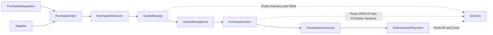

# Procure-to-Pay Process

**Audience:** Students, instructors, and analysts who want the purchasing cycle explained in business language.  
**Purpose:** Show how Greenfield moves from internal demand to supplier payment.  
**What you will learn:** The business storyline, the main P2P tables, when accounting happens, and what questions the P2P data can answer.

> **Implemented in current generator:** Requisitions, batched purchase orders, partial goods receipts across periods, matched supplier invoices, and split disbursement settlement.

> **Planned future extension:** Manufacturing-driven purchasing demand and broader production-linked inventory behavior.

## Business Storyline

Greenfield does not buy inventory randomly. Employees identify a need, purchasing groups that demand into supplier orders, warehouse staff receive the goods over time, suppliers send invoices, and finance pays those invoices when approved.

That gives students a realistic three-way-match style environment where ordering, receiving, invoicing, and payment do not always happen on the same day or even in the same month.

## Process Diagram

Requisitions and purchase orders do not post to the ledger. Receiving, supplier invoicing, and payment do.

## Step-by-Step Walkthrough

1. An employee requests an item through `PurchaseRequisition`.
2. Purchasing batches compatible requisitions into `PurchaseOrder` and `PurchaseOrderLine`.
3. The warehouse receives inventory over one or more dates, creating `GoodsReceipt` and `GoodsReceiptLine`.
4. The supplier sends one or more invoices that match the received lines, recorded in `PurchaseInvoice` and `PurchaseInvoiceLine`.
5. Treasury or AP issues one or more `DisbursementPayment` records against approved supplier invoices.
6. Posted activity lands in `GLEntry` for AP, inventory, GRNI, and cash analysis.

## Main Tables in This Process

| Business step | Main tables | Why they matter |
|---|---|---|
| Internal demand | `PurchaseRequisition` | Shows who requested the item and for which cost center |
| Supplier order | `PurchaseOrder`, `PurchaseOrderLine` | Shows what was ordered, from whom, and at what expected cost |
| Receiving | `GoodsReceipt`, `GoodsReceiptLine` | Shows what physically arrived and when |
| Supplier billing | `PurchaseInvoice`, `PurchaseInvoiceLine` | Shows what the supplier billed and which receipt lines were matched |
| Payment | `DisbursementPayment` | Shows how and when the invoice was settled |

## When Accounting Happens

| Event | Accounting effect |
|---|---|
| Goods receipt | Debit inventory, credit GRNI |
| Purchase invoice | Debit GRNI, debit or credit purchase variance, credit AP |
| Disbursement | Debit AP, credit cash |

## Common Student Questions

- Which requisitions were combined into one purchase order?
- Which PO lines were only partially received or invoiced?
- Which supplier invoices matched which receipt lines?
- Which invoices remained unpaid or were settled over several payments?
- How much spend and receiving activity occurred by supplier, item group, or cost center?

## Current Implementation Notes

- `PurchaseOrderLine.RequisitionID` is the authoritative requisition link when POs batch several requisitions.
- `PurchaseInvoiceLine.GoodsReceiptLineID` is the authoritative clean-match link for receipt-to-invoice analysis.
- P2P flow is multi-period in the current generator. Receiving, invoicing, and payment do not need to occur in the same month.

## Where to Go Next

- Read [../database-guide.md](../database-guide.md) for navigation patterns.
- Read [../reference/posting.md](../reference/posting.md) for the technical posting rules.
