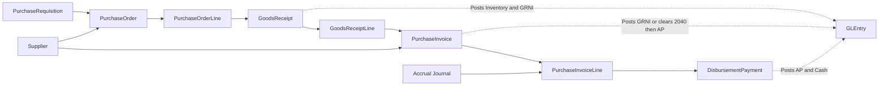
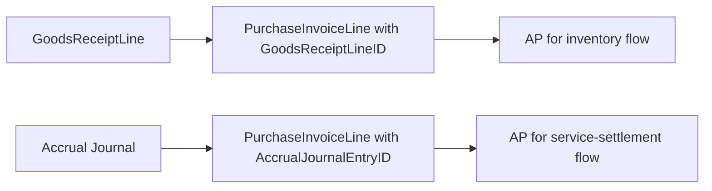

# Procure-to-Pay Process

## Business Storyline

Greenfield does not buy inventory at random. A department identifies a need, purchasing turns that need into supplier orders, warehouse staff receive the goods when they arrive, accounts payable records the supplier invoice, and treasury pays it when approved. Some demand comes from routine replenishment, while some comes from manufacturing's need for raw materials and packaging.

The normal replenishment path is planned first. Weekly demand forecasts and inventory policies feed `SupplyPlanRecommendation`, and those planning rows become the primary support for new requisitions.

That sequence gives students a realistic three-way-match environment where ordering, receiving, invoicing, and payment do not always happen on the same day or even in the same month.

The AP side also includes a second path for certain operating expenses. Finance may estimate the expense first through an accrual, then later clear that estimate through a direct supplier service invoice that has no goods receipt behind it.

## Process Diagram

Read the diagram as internal demand, supplier commitment, physical receipt, supplier billing, and payment. Requisitions and purchase orders are operational commitments; receiving, supplier invoicing, and payment are the stages that reach the ledger.

## Step-by-Step Walkthrough

1. Weekly planning evaluates forecast, backlog, on-hand supply, scheduled receipts, and safety stock. When purchased supply is needed, it creates `SupplyPlanRecommendation` rows with `RecommendationType = 'Purchase'`.
2. Purchasing converts eligible recommendations into `PurchaseRequisition` rows. Manufacturing can still create residual requisitions when execution consumes more materials than planned supply can cover.
3. Purchasing groups compatible demand into `PurchaseOrder` and `PurchaseOrderLine`.
4. Warehouse staff receive the goods over one or more dates, and those receipts appear in `GoodsReceipt` and `GoodsReceiptLine`.
5. Accounts payable records the supplier bill in `PurchaseInvoice` and `PurchaseInvoiceLine`.
6. For inventory-style purchases, the invoice lines point back to the exact receipt lines. For certain service expenses, the invoice clears a prior accrual instead and intentionally has no receipt link.
7. Treasury or AP settles approved invoices through `DisbursementPayment`.
8. Students can then analyze `GLEntry` for inventory, GRNI, AP, accrued-expense clearing, and cash timing.

## Main Tables in This Process

| Business step | Main tables | Why they matter |
|---|---|---|
| Planning support | `DemandForecast`, `InventoryPolicy`, `SupplyPlanRecommendation` | Shows why replenishment was planned, by week, item, warehouse, and planner |
| Internal demand | `PurchaseRequisition` | Shows who requested the item and for which cost center |
| Supplier order | `PurchaseOrder`, `PurchaseOrderLine` | Shows what was ordered, from whom, and at what expected cost |
| Receiving | `GoodsReceipt`, `GoodsReceiptLine` | Shows what physically arrived and when |
| Supplier billing | `PurchaseInvoice`, `PurchaseInvoiceLine` | Shows what the supplier billed, whether the line matched a receipt, and whether it cleared a prior accrual |
| Payment | `DisbursementPayment` | Shows how and when the invoice was settled |

## When Accounting Happens

| Event | Accounting effect |
|---|---|
| Goods receipt | Debit inventory, credit GRNI |
| Purchase invoice | For inventory lines: debit GRNI, debit or credit purchase variance, credit AP. For accrued-service lines: debit `2040` up to the estimate, book any excess to expense, and credit AP |
| Disbursement | Debit AP, credit cash |

## Common Student Questions

- Which requisitions were combined into one purchase order?
- Which PO lines were only partially received or invoiced?
- Which supplier invoices matched which receipt lines?
- Which invoices remained unpaid or were settled over several payments?
- How much spend and receiving activity occurred by supplier, item group, or cost center?

## What to Notice in the Data

- `PurchaseOrderLine.RequisitionID` is the authoritative requisition link when POs batch several requisitions.
- `PurchaseRequisition.SupplyPlanRecommendationID` is the authoritative planning-support link for normal replenishment demand.
- `PurchaseInvoiceLine.GoodsReceiptLineID` is the authoritative receipt-match link for inventory invoicing.
- `PurchaseInvoiceLine.AccrualJournalEntryID` is the authoritative link for direct accrued-service invoice settlement.
- P2P flow is multi-period in the current generator. Receiving, invoicing, and payment do not need to occur in the same month.

## Subprocess Spotlight: Receipt-Matched AP vs Accrued-Service Settlement

This branch is one of the most important teaching details in P2P:

- inventory and material invoices follow the receipt-matched path
- accrued-service invoices intentionally clear prior accruals without receipt linkage

Students should treat both as valid AP behavior, but not as the same control path.

## Where to Go Next

- Read [Manufacturing](manufacturing.md) to see how purchasing supports work orders and material availability.
- Read [Dataset Guide](../start-here/dataset-overview.md) for navigation patterns.
- Read [GLEntry Posting Reference](../reference/posting.md) for the technical posting rules.
