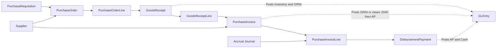
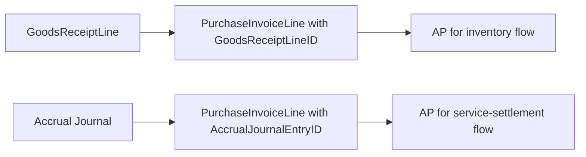

# Procure-to-Pay Process

## Business Storyline

Greenfield does not buy inventory randomly. Employees identify a need, purchasing groups that demand into supplier orders, warehouse staff receive the goods over time, suppliers send invoices, and finance pays those invoices when approved. That demand now comes from both normal business replenishment and manufacturing-driven raw-material and packaging needs.

That gives students a realistic three-way-match style environment where ordering, receiving, invoicing, and payment do not always happen on the same day or even in the same month.

The AP side also includes a second path for certain operating expenses. Finance records month-end accrued expenses, then later clears those estimates through direct supplier service invoices that do not rely on goods receipts.

## Process Diagram

Requisitions and purchase orders do not post to the ledger. Receiving, supplier invoicing, and payment do.

## Step-by-Step Walkthrough

1. An employee requests an item through `PurchaseRequisition`.
2. Manufacturing can add additional requisitions when raw materials or packaging are needed for planned work orders.
3. Purchasing batches compatible requisitions into `PurchaseOrder` and `PurchaseOrderLine`.
4. The warehouse receives inventory over one or more dates, creating `GoodsReceipt` and `GoodsReceiptLine`.
5. The supplier sends one or more invoices that match the received lines, recorded in `PurchaseInvoice` and `PurchaseInvoiceLine`.
6. Some service invoices settle prior accrued expenses directly, so those `PurchaseInvoiceLine` rows intentionally have no receipt linkage.
7. Treasury or AP issues one or more `DisbursementPayment` records against approved supplier invoices.
8. Posted activity lands in `GLEntry` for AP, inventory, GRNI, accrued-expense clearing, and cash analysis.

## Main Tables in This Process

| Business step | Main tables | Why they matter |
|---|---|---|
| Internal demand | `PurchaseRequisition` | Shows who requested the item and for which cost center |
| Supplier order | `PurchaseOrder`, `PurchaseOrderLine` | Shows what was ordered, from whom, and at what expected cost |
| Receiving | `GoodsReceipt`, `GoodsReceiptLine` | Shows what physically arrived and when |
| Supplier billing | `PurchaseInvoice`, `PurchaseInvoiceLine` | Shows what the supplier billed, whether the line matched a receipt, and whether it cleared a prior accrual |
| Payment | `DisbursementPayment` | Shows how and when the invoice was settled |

## When Accounting Happens

| Event | Accounting effect |
|---|---|
| Goods receipt | Debit inventory, credit GRNI |
| Purchase invoice | For inventory lines: debit GRNI, debit or credit purchase variance, credit AP. For accrued-service lines: debit `2040` up to the estimate, book any excess to expense, and credit AP |
| Disbursement | Debit AP, credit cash |

## Common Student Questions

- Which requisitions were combined into one purchase order?
- Which PO lines were only partially received or invoiced?
- Which supplier invoices matched which receipt lines?
- Which invoices remained unpaid or were settled over several payments?
- How much spend and receiving activity occurred by supplier, item group, or cost center?

## Current Implementation Notes

- `PurchaseOrderLine.RequisitionID` is the authoritative requisition link when POs batch several requisitions.
- `PurchaseInvoiceLine.GoodsReceiptLineID` is the authoritative clean-match link for receipt-based inventory invoicing.
- `PurchaseInvoiceLine.AccrualJournalEntryID` is the authoritative link for direct accrued-service invoice settlement.
- P2P flow is multi-period in the current generator. Receiving, invoicing, and payment do not need to occur in the same month.

## Subprocess Spotlight: Receipt-Matched AP vs Accrued-Service Settlement

This branch is one of the most important teaching details in P2P:

- inventory and material invoices follow the receipt-matched path
- accrued-service invoices intentionally clear prior accruals without receipt linkage

Students should treat both as valid AP behavior, but not as the same control path.

## Where to Go Next

- Read [Dataset Guide](../dataset-overview.md) for navigation patterns.
- Read [Posting Reference](../reference/posting.md) for the technical posting rules.
