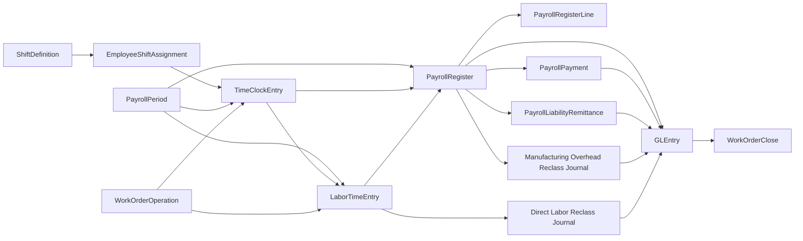
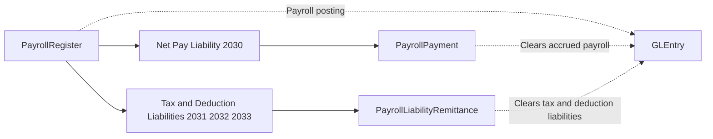

# Payroll Process

**Audience:** Students, instructors, analysts, and contributors who need to understand how payroll now works in the dataset.  
**Purpose:** Explain the payroll cycle, how labor time connects to manufacturing, and how payroll liabilities clear.  
**What you will learn:** How pay periods, labor time, payroll registers, payments, remittances, and manufacturing labor reclasses work together.

> **Implemented in current generator:** Biweekly payroll periods, shift assignments, approved daily time clocks for hourly employees, labor-time capture, payroll registers, payroll payments, liability remittances, operation-level direct-labor assignment, schedule-aware manufacturing labor timing, and direct-labor / manufacturing-overhead integration.

> **Planned future extension:** Raw punch-event detail, rotating shift rosters, and richer workforce-planning detail below the current daily time-clock model.

## Business Storyline

Greenfield now runs payroll as an operational process instead of only a journal simulation.

Every pay period:

- employees earn salary or wages
- manufacturing workers record direct or indirect labor time
- payroll calculates gross pay, withholdings, employer taxes, and benefits
- treasury pays employees
- payroll liabilities are later remitted to agencies or benefit providers
- direct labor and manufacturing overhead are reclassified into manufacturing cost clearing

That makes payroll useful for:

- financial accounting
- manufacturing costing
- managerial cost analysis
- payroll-control and audit work

## Process Diagram

In plain language:

- `PayrollPeriod` organizes the pay calendar
- `ShiftDefinition` and `EmployeeShiftAssignment` define where hourly employees are expected to work
- `TimeClockEntry` supplies approved regular and overtime hours for hourly payroll
- `LaborTimeEntry` captures work effort, especially direct labor tied to work orders and work-order operations
- `PayrollRegister` and `PayrollRegisterLine` calculate gross-to-net payroll
- `PayrollPayment` clears net-pay liability
- `PayrollLiabilityRemittance` clears tax and deduction liabilities
- manufacturing journals reclass payroll-derived labor and overhead into product-costing flows

## Step-by-Step Walkthrough

### 1. Open a pay period

The generator creates continuous biweekly payroll periods across the fiscal range.

Main table:

- `PayrollPeriod`

### 2. Assign shifts and record approved time clocks

Hourly employees now receive a primary shift assignment. For each worked day, the generator creates one approved `TimeClockEntry` row with clock-in time, clock-out time, break minutes, regular hours, and overtime hours.

Direct manufacturing time clocks can also point to the specific `WorkOrderOperationID` where labor was consumed.

Main tables:

- `ShiftDefinition`
- `EmployeeShiftAssignment`
- `TimeClockEntry`

### 3. Capture labor time

Approved time clocks then feed `LaborTimeEntry`. Direct manufacturing time is tied to both `WorkOrderID` and `WorkOrderOperationID`. Manufacturing-side capacity scheduling provides the operation window that payroll-linked labor can be compared against. Indirect manufacturing and nonmanufacturing time remain untied to production orders.

Main table:

- `LaborTimeEntry`

Related planning and production tables:

- `WorkOrder`
- `WorkOrderOperation`

Important labor types:

- `Direct Manufacturing`
- `Indirect Manufacturing`
- `NonManufacturing`

### 4. Build the payroll register

For each employee in the period, the generator creates payroll-register lines for earnings and payroll deductions or burdens. Hourly earnings come from approved clock hours. Salaried earnings remain salary-based.

Main tables:

- `PayrollRegister`
- `PayrollRegisterLine`

Typical line types:

- `Regular Earnings`
- `Overtime Earnings`
- `Salary Earnings`
- `Employee Tax Withholding`
- `Benefits Deduction`
- `Employer Payroll Tax`
- `Employer Benefits`

### 5. Post payroll accounting

The payroll register creates the main payroll accounting entry.

Accounting effects:

- salary and wage expense by cost center
- `6060` Payroll Taxes and Benefits for nonmanufacturing burden
- `6270` Factory Overhead Expense for manufacturing-indirect burden
- credits to:
  - `2030` Accrued Payroll
  - `2031` Payroll Tax Withholdings Payable
  - `2032` Employer Payroll Taxes Payable
  - `2033` Employee Benefits and Other Deductions Payable

### 6. Pay employees

Treasury clears employee net pay through payroll payments.

Main table:

- `PayrollPayment`

Accounting effect:

- debit `2030`
- credit cash

### 7. Remit payroll liabilities

The company later clears withholding, employer-tax, and deduction liabilities.

Main table:

- `PayrollLiabilityRemittance`

Accounting effect:

- debit `2031`, `2032`, or `2033`
- credit cash

### 8. Reclass manufacturing labor and overhead

Payroll is also part of manufacturing costing.

Direct labor tied to work-order operations is reclassed from manufacturing wage expense into `1090` Manufacturing Cost Clearing. Manufacturing overhead is reclassed separately from the factory-overhead pool.

This is how payroll integrates with product cost for manufactured items.

## Main Tables Involved

| Table | Role |
|---|---|
| `PayrollPeriod` | Biweekly payroll calendar |
| `ShiftDefinition` | Standard shift structure for hourly work |
| `EmployeeShiftAssignment` | Primary shift assignment by employee |
| `TimeClockEntry` | Approved daily attendance row that drives hourly payroll hours |
| `LaborTimeEntry` | Operational labor-time detail, including operation-linked direct labor |
| `WorkCenterCalendar` | Capacity calendar used to stage production timing before labor is consumed |
| `WorkOrderOperationSchedule` | Daily operation schedule that payroll-linked direct labor can be compared against analytically |
| `WorkOrderOperation` | Production operation record used for routing-aware labor analysis |
| `PayrollRegister` | Employee payroll header |
| `PayrollRegisterLine` | Earnings, withholding, and burden detail |
| `PayrollPayment` | Employee net-pay settlement |
| `PayrollLiabilityRemittance` | Clearance of payroll liabilities |
| `JournalEntry` | Direct labor and manufacturing-overhead reclass journals |
| `GLEntry` | Posted payroll, settlement, remittance, and reclass accounting |

## When Accounting Happens

Payroll creates several accounting events:

- `PayrollRegister`
- `PayrollPayment`
- `PayrollLiabilityRemittance`
- `JournalEntry` entries of type:
  - `Direct Labor Reclass`
  - `Manufacturing Overhead Reclass`

## Common Student Questions

- How does gross pay turn into net pay?
- Which liabilities remain open after payroll is posted?
- Which employees contribute direct labor to each work-order operation?
- Which hourly payroll earnings were supported by approved time-clock hours?
- Which work centers are generating the most overtime?
- How much direct labor cost is tied to each manufactured item, work order, or work center?
- How do payroll payments differ from payroll liability remittances?
- How does payroll feed product costing without switching the dataset to full actual-cost inventory?

## Current Implementation Notes

- Payroll is now an operational subledger, not only a recurring journal pattern.
- The clean build no longer uses payroll accrual or payroll settlement journals.
- Hourly payroll hours are sourced from approved `TimeClockEntry` rows.
- Direct labor affects manufacturing through reclass journals and work-order close, not through a separate job-cost ledger.
- Direct labor is now assigned at the routing-operation level for manufactured work orders.
- Manufacturing operations are now scheduled against daily work-center capacity, which gives payroll and labor analytics a schedule baseline.
- The clean model uses one approved time-clock row per worked day rather than a separate punch-event table.
- The manufacturing model remains standard-cost based even though payroll provides actual labor detail.

## Subprocess Spotlight: Gross-to-Net and Liability Remittance

This subflow helps students split payroll into two separate settlement paths:

- employees are paid through `PayrollPayment`
- agencies and benefit vendors are cleared later through `PayrollLiabilityRemittance`

That distinction is essential for both financial accounting and payroll-control analytics.

## Where to Go Next

- Read [manufacturing.md](manufacturing.md) for the production side of labor integration.
- Read [time-clocks.md](time-clocks.md) for the shift and attendance process that feeds hourly payroll.
- Read [../reference/posting.md](../reference/posting.md) for exact payroll posting rules.
- Read [../analytics/financial.md](../analytics/financial.md), [../analytics/managerial.md](../analytics/managerial.md), and [../analytics/audit.md](../analytics/audit.md) for starter analytics.
