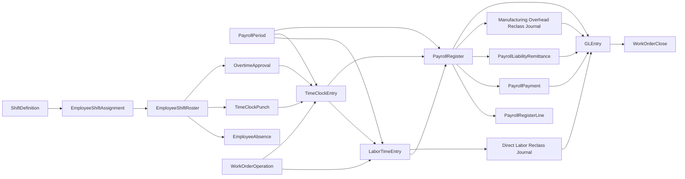
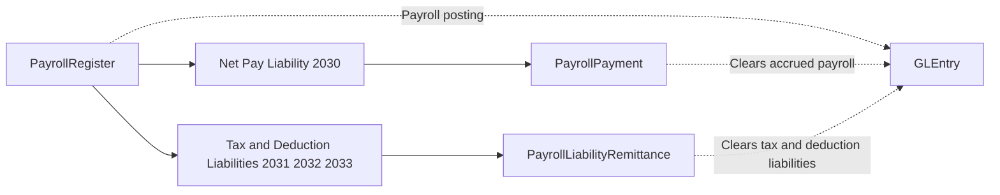

# Payroll Process

## Business Storyline

Greenfield runs payroll as an operating cycle. Every pay period, payroll gathers approved support, calculates gross pay, records withholdings and employer burden, pays employees, and later remits the related liabilities. For manufacturing employees, payroll also helps move labor and overhead into the product-cost story.

This page is about the pay cycle and its accounting. Students should use [Time Clocks](time-clocks.md) for the upstream attendance and shift story, then use this page to understand how those approved hours become expense, liabilities, cash payments, and manufacturing reclass activity.

## Process Diagram

Read the diagram as pay-period setup, payroll support, gross-to-net calculation, settlement, remittance, and manufacturing reclass. The important student lesson is that payroll is both a cash process and an accounting process, and it affects more than one part of the ledger.

## Step-by-Step Walkthrough

### 1. Open a pay period

Payroll begins with the pay calendar. Greenfield uses continuous biweekly payroll periods so students can compare labor activity, payroll postings, and cash settlement across months and years.

Main table:

- `PayrollPeriod`

### 2. Gather payroll support

Before payroll can calculate wages, it needs support. Hourly employees contribute approved time-clock hours, salaried employees continue through salary-based logic, and manufacturing labor can also be linked to work orders and operations for later costing analysis.

Main supporting tables:

- `EmployeeShiftRoster`
- `EmployeeAbsence`
- `TimeClockPunch`
- `OvertimeApproval`
- `TimeClockEntry`
- `LaborTimeEntry`
- `WorkOrder`
- `WorkOrderOperation`

For the shift and attendance side of that support, use [Time Clocks](time-clocks.md).

### 3. Build the payroll register

For each employee in the period, payroll builds the gross-to-net record. Hourly earnings come from approved clock hours, while salaried earnings remain salary-based. The register also captures employee withholdings, benefits deductions, employer payroll taxes, and employer-paid benefits.

Main tables:

- `PayrollRegister`
- `PayrollRegisterLine`

Typical line types:

- `Regular Earnings`
- `Overtime Earnings`
- `Salary Earnings`
- `Employee Tax Withholding`
- `Benefits Deduction`
- `Employer Payroll Tax`
- `Employer Benefits`

### 4. Post payroll accounting

The payroll register is the main accounting event in the payroll cycle. It creates the expense and liability picture for the period.

Accounting effects:

- salary and wage expense by cost center
- `6060` Payroll Taxes and Benefits for nonmanufacturing burden
- `6270` Factory Overhead Expense for manufacturing-indirect burden
- credits to:
  - `2030` Accrued Payroll
  - `2031` Payroll Tax Withholdings Payable
  - `2032` Employer Payroll Taxes Payable
  - `2033` Employee Benefits and Other Deductions Payable

### 5. Pay employees

After payroll is posted, treasury clears employee net pay through payroll payments.

Main table:

- `PayrollPayment`

Accounting effect:

- debit `2030`
- credit cash

### 6. Remit payroll liabilities

The company later clears the withholding, employer-tax, and deduction liabilities that were created at payroll posting.

Main table:

- `PayrollLiabilityRemittance`

Accounting effect:

- debit `2031`, `2032`, or `2033`
- credit cash

### 7. Reclass manufacturing labor and overhead

Payroll is also part of manufacturing costing. Direct labor tied to work-order operations is reclassed from manufacturing wage expense into `1090` Manufacturing Cost Clearing. Manufacturing overhead is reclassed separately from the factory-overhead pool.

This is how payroll integrates with product cost for manufactured items without turning the whole model into a full actual-cost inventory system.

## Main Tables in This Process

| Table | Role |
|---|---|
| `PayrollPeriod` | Biweekly payroll calendar |
| `EmployeeShiftRoster` | Daily planned shift row for hourly employees |
| `EmployeeAbsence` | Planned absence record tied to the roster |
| `TimeClockPunch` | Raw punch-event detail beneath the approved daily summary |
| `OvertimeApproval` | Approved overtime support tied to the roster and worked day |
| `TimeClockEntry` | Approved daily attendance support for hourly payroll |
| `LaborTimeEntry` | Operational labor detail used for costing and payroll traceability |
| `WorkOrderOperation` | Production operation record used for routing-aware direct labor analysis |
| `PayrollRegister` | Employee payroll header |
| `PayrollRegisterLine` | Earnings, withholding, and burden detail |
| `PayrollPayment` | Employee net-pay settlement |
| `PayrollLiabilityRemittance` | Clearance of payroll liabilities |
| `JournalEntry` | Direct labor and manufacturing-overhead reclass journals |
| `GLEntry` | Posted payroll, settlement, remittance, and reclass accounting |

## When Accounting Happens

Payroll creates several accounting events:

- `PayrollRegister`
- `PayrollPayment`
- `PayrollLiabilityRemittance`
- `JournalEntry` entries of type:
  - `Direct Labor Reclass`
  - `Manufacturing Overhead Reclass`

## Common Student Questions

- How does gross pay turn into net pay?
- Which liabilities remain open after payroll is posted?
- Which employees contribute direct labor to each work-order operation?
- Which hourly payroll earnings were supported by approved time-clock hours?
- Which work centers are generating the most overtime?
- How much direct labor cost is tied to each manufactured item, work order, or work center?
- How do payroll payments differ from payroll liability remittances?
- How does payroll feed product costing without switching the dataset to full actual-cost inventory?

## What to Notice in the Data

- Payroll operates as an operational subledger with dedicated tables and ledger postings.
- The dataset records payroll through payroll tables and related settlement activity. It does not use payroll accrual and settlement journals.
- Hourly payroll hours are sourced from approved `TimeClockEntry` rows.
- Approved `TimeClockEntry` rows are now derived from raw punches plus roster context.
- Direct labor affects manufacturing through reclass journals and work-order close, not through a separate job-cost ledger.
- Direct labor is assigned at the routing-operation level for manufactured work orders.
- The dataset separates planned roster rows, raw punches, absences, overtime approvals, and approved daily time summaries.
- The manufacturing model remains standard-cost based even though payroll provides actual labor detail.

## Subprocess Spotlight: Gross-to-Net and Liability Remittance

This subflow helps students split payroll into two separate settlement paths:

- employees are paid through `PayrollPayment`
- agencies and benefit vendors are cleared later through `PayrollLiabilityRemittance`

That distinction is essential for both financial accounting and payroll-control analytics.

## Where to Go Next

- Read [Time Clocks](time-clocks.md) for the attendance and shift structure that supports hourly payroll.
- Read [Manufacturing](manufacturing.md) to see how payroll connects to work orders, labor, and variance.
- Read [GLEntry Posting Reference](../reference/posting.md) for the detailed posting logic.
- Read [Financial Analytics](../analytics/financial.md), [Managerial Analytics](../analytics/managerial.md), and [Audit Analytics](../analytics/audit.md) for starter analytics.
