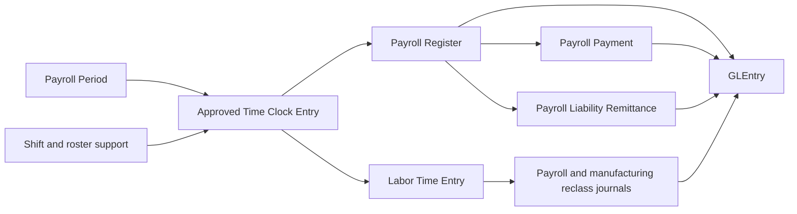
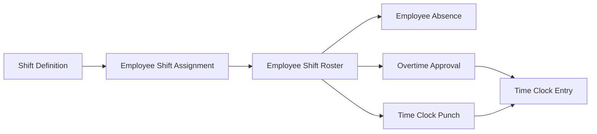
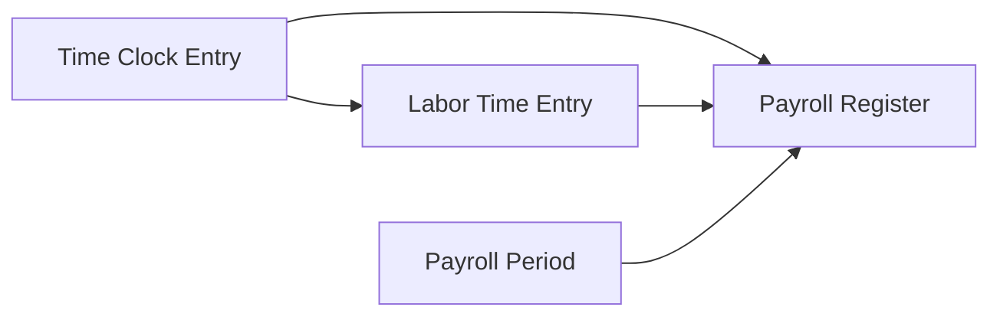
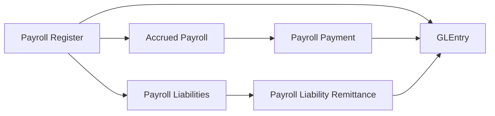
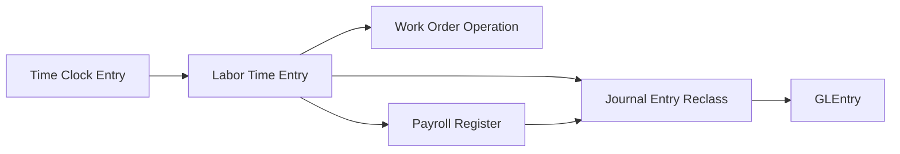
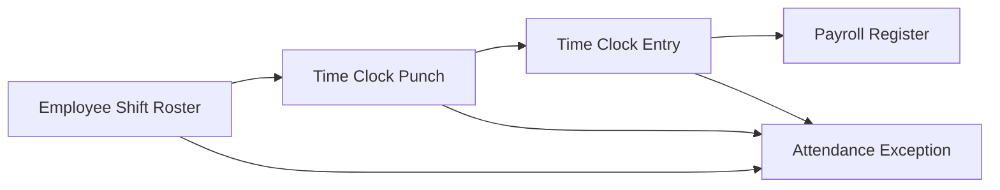

# Payroll Process

## What Students Should Learn

- Distinguish time and attendance support from the payroll accounting events that create payables, expense, and cash settlement.
- Trace hourly payroll from shift expectations and approved time into `PayrollRegister`, `PayrollPayment`, and `GLEntry`.
- Identify the core tables used for approved hours, labor traceability, payroll settlement, and manufacturing reclass.
- Recognize timing differences that matter for payroll controls, open liabilities, overtime review, and manufacturing labor analysis.

## Business Storyline

In this dataset, payroll is an operating cycle with its own support, accounting, and settlement stages. Supervisors define shift expectations, the company records rostered workdays and raw punches, approved daily attendance becomes payroll support for hourly employees, payroll builds a gross-to-net register, treasury pays employees, and liabilities are remitted later to agencies and benefit providers.

That distinction matters. Raw punches are not the same thing as approved hours. Approved hours are not the same thing as payroll posting. Payroll posting is not the same thing as employee payment. Students can see each stage separately in the data and use that separation for accounting, analytics, and controls work.

Payroll also connects to manufacturing. Approved time can flow into `LaborTimeEntry`, direct labor can be tied to a work-order operation, and payroll later supports direct-labor and manufacturing-overhead reclass activity without switching the dataset to full actual-cost inventory.

Payroll now also connects to the customer-facing design-services line. Design employees still move through normal payroll registers, payments, and liabilities, but their engagement margin is analyzed through `ServiceTimeEntry` cost snapshots instead of through manufacturing costing.

## Normal Process Overview



Read the main diagram as payroll support, approved hours, gross-to-net calculation, settlement, remittance, and manufacturing reclass. The key student lesson is that payroll uses operational support first, then creates accounting and cash effects later.

## How to Read This Process in the Data

This page is organized around business flow first and data navigation second. The main diagram shows the normal payroll path. The smaller diagrams below show one analytical task at a time, such as approved attendance, gross-to-net payroll, liability settlement, or manufacturing labor traceability. The fuller relationship map belongs on [Schema Reference](../reference/schema.md), not on this process page.

:::tip
Start with approved time and labor support, then move into payroll posting, cash payment, remittance, and manufacturing reclass so the support layer and the accounting layer stay distinct.
:::

## Core Tables and What They Represent

| Process stage | Main tables | Grain or event represented | Why students use them |
|---|---|---|---|
| Shift and attendance setup | `ShiftDefinition`, `EmployeeShiftAssignment`, `EmployeeShiftRoster`, `EmployeeAbsence`, `OvertimeApproval` | Expected shift pattern, planned workday, absence support, and approved overtime support | Review workforce expectations before payroll is calculated |
| Raw attendance evidence | `TimeClockPunch` | Individual punch events under the approved daily summary | Compare raw attendance evidence to approved time and exception review |
| Approved daily attendance | `TimeClockEntry` | One approved worked-day row for hourly payroll support | Measure authoritative regular and overtime hours for hourly employees |
| Labor traceability | `LaborTimeEntry`, `WorkOrderOperation` | Labor allocation row tied to costing and sometimes to a routing operation | Trace approved time into payroll support and manufacturing labor |
| Gross-to-net payroll | `PayrollPeriod`, `PayrollRegister`, `PayrollRegisterLine` | One employee payroll header with earnings, deductions, and employer burden detail | Analyze payroll posting, gross-to-net logic, and liability creation |
| Employee settlement | `PayrollPayment` | Net-pay settlement event | Review when accrued payroll clears in cash |
| Liability remittance | `PayrollLiabilityRemittance` | Payment of payroll withholding, tax, and deduction liabilities | Separate employee payment from agency and vendor settlement |
| Control review | `AttendanceException`, `GLEntry`, `JournalEntry` | Exception log and posted accounting records | Support audit, payroll control, and manufacturing reclass analysis |

## When Accounting Happens

| Event | Business meaning | Accounting effect |
|---|---|---|
| Approved time entry | Daily attendance is approved for payroll and labor support | No direct posting by itself |
| Payroll register | Payroll calculates gross pay, employee deductions, and employer burden | Debits salary and wage expense plus payroll burden accounts, credits accrued payroll and payroll-related liabilities |
| Payroll payment | Treasury clears employee net pay | Debit `2030` Accrued Payroll and credit cash |
| Payroll liability remittance | Treasury clears withholding, employer-tax, and deduction liabilities | Debit `2031`, `2032`, or `2033` and credit cash |
| Direct labor or overhead reclass | Payroll-supported manufacturing labor and burden move into costing flows | Journal-driven reclass from payroll expense pools into manufacturing clearing or overhead paths |

## Key Traceability and Data Notes

- `TimeClockEntry` is the approved daily attendance source for hourly payroll. It is the main worked-hours record for payroll support.
- `TimeClockPunch` is raw support beneath that approved layer and should be treated as evidence, not as the authoritative payroll-hours source.
- `LaborTimeEntry` is the bridge from approved time into costing and payroll traceability, especially when direct manufacturing labor is tied to `WorkOrderOperationID`.
- `PayrollRegister` is the main payroll accounting event. It creates the expense and liability picture for the period.
- `PayrollPayment` and `PayrollLiabilityRemittance` are separate settlement paths. One clears employee net pay, and the other clears withholding and deduction liabilities later.
- `AttendanceException` sits beside the normal flow as a control-review table rather than as a posting event.
- Design-service labor stays in payroll expense under the `Design Services` cost center. Customer-engagement margin is analyzed through `ServiceTimeEntry`, not capitalized into inventory or manufacturing clearing.

## Analytical Subsections

### Time, Attendance, and Approved Hours

This is the upstream support layer for hourly payroll. Students should read it as expectation, evidence, and approval: shifts define the expected pattern, rosters define who was scheduled, punches capture raw activity, and `TimeClockEntry` stores the approved daily result that payroll actually uses.



**Tables involved**

| Table | Role in the flow |
|---|---|
| `ShiftDefinition`, `EmployeeShiftAssignment` | Define the expected shift pattern for hourly workers |
| `EmployeeShiftRoster` | Shows who was scheduled to work, where, and for how many hours |
| `EmployeeAbsence`, `OvertimeApproval` | Capture planned absences and approved extra hours |
| `TimeClockPunch` | Stores raw punch evidence beneath the approved summary |
| `TimeClockEntry` | Stores the approved worked day that payroll uses | 

:::warning
`TimeClockPunch` is raw evidence, not the authoritative payroll-hours source. Use `TimeClockEntry` when the question is about approved hours, regular pay, overtime pay, or payroll support.
:::

**Starter analytical question:** Which work centers show the biggest gap between rostered hours, approved hours, and approved overtime?

```sql
-- Teaching objective: Compare expected hours, raw attendance evidence, and approved daily time.
-- Main join path: EmployeeShiftRoster -> TimeClockPunch -> TimeClockEntry, plus EmployeeAbsence and OvertimeApproval.
-- Suggested analysis: Group by work center, shift, or payroll period.
```

### Approved Hours to Gross Pay

Once daily time is approved, payroll turns that support into gross pay. Hourly earnings use approved `TimeClockEntry` hours, while `LaborTimeEntry` adds the labor-traceability layer that helps students connect approved time to payroll lines and direct manufacturing support.



**Tables involved**

| Table | Role in the flow |
|---|---|
| `TimeClockEntry` | Supplies approved regular and overtime hours for hourly payroll |
| `LaborTimeEntry` | Carries the costing and payroll-support bridge at the labor-entry level |
| `PayrollPeriod` | Anchors the biweekly payroll calendar |
| `PayrollRegister`, `PayrollRegisterLine` | Store gross-to-net payroll and the supporting detail lines | 

**Key joins**

- `TimeClockEntry.PayrollPeriodID -> PayrollPeriod.PayrollPeriodID`
- `LaborTimeEntry.TimeClockEntryID -> TimeClockEntry.TimeClockEntryID`
- `PayrollRegisterLine.LaborTimeEntryID -> LaborTimeEntry.LaborTimeEntryID`
- `PayrollRegister.PayrollRegisterID -> PayrollRegisterLine.PayrollRegisterID`

```sql
-- Teaching objective: Trace approved hourly support into earnings lines on the payroll register.
-- Main join path: TimeClockEntry -> LaborTimeEntry -> PayrollRegisterLine, plus PayrollRegister.
-- Suggested analysis: Compare regular and overtime hours to regular and overtime earnings by employee or period.
```

### Gross-to-Net, Payment, and Remittance

This is the core payroll accounting path. The payroll register creates gross pay, deductions, and employer burden. Treasury later clears employee net pay through `PayrollPayment`, while agencies and benefit providers are settled later through `PayrollLiabilityRemittance`.



**Tables involved**

| Table | Role in the flow |
|---|---|
| `PayrollRegister`, `PayrollRegisterLine` | Create the gross-to-net and liability detail for each employee |
| `PayrollPayment` | Clears employee net pay |
| `PayrollLiabilityRemittance` | Clears tax and deduction liabilities later |
| `GLEntry` | Shows the posted expense, liability, and cash effects | 

**Starter analytical question:** Which payroll liabilities remain open after employees are paid, and how long do those remittance balances stay outstanding?

```sql
-- Teaching objective: Separate payroll posting from employee payment and later remittance.
-- Main join path: PayrollRegister -> PayrollPayment and PayrollLiabilityRemittance, with GLEntry for posted effect.
-- Suggested analysis: Compare approved payroll date, payment date, and remittance date by payroll period.
```

### Direct Labor and Manufacturing Reclass

Payroll also feeds manufacturing. When approved time and labor support are tied to work-order operations, the dataset can trace direct labor into production analysis and then reclass payroll-supported amounts through direct-labor and manufacturing-overhead journals.



**Tables involved**

| Table | Role in the flow |
|---|---|
| `TimeClockEntry`, `LaborTimeEntry` | Carry approved time and labor allocation into costing analysis |
| `WorkOrderOperation` | Shows which routing operation consumed the direct labor |
| `PayrollRegister` | Provides the payroll-side source for the later reclass logic |
| `JournalEntry`, `GLEntry` | Show the accounting effect of direct-labor and overhead reclass | 

**Key joins**

- `LaborTimeEntry.WorkOrderOperationID -> WorkOrderOperation.WorkOrderOperationID`
- `PayrollRegisterLine.LaborTimeEntryID -> LaborTimeEntry.LaborTimeEntryID`
- `GLEntry.SourceDocumentType` plus `SourceDocumentID` for reclass trace

```sql
-- Teaching objective: Trace direct manufacturing labor from approved time into payroll support and reclass accounting.
-- Main join path: TimeClockEntry -> LaborTimeEntry -> WorkOrderOperation, plus PayrollRegisterLine and reclass journals.
-- Suggested analysis: Group by work order, work center, item, or payroll period.
```

### Design-Service Labor Support

Not every labor-support question in the dataset ends in manufacturing. Design employees can support customer engagements directly. In that path, payroll still records the wages and liabilities in the normal way, but `ServiceTimeEntry` carries the approved billable and non-billable hours plus the labor-cost snapshot used for customer-engagement margin analysis.

Students should keep the distinction clear. Manufacturing labor can be reclassed into production flows. Design-service labor remains period expense in payroll and becomes customer-margin analysis only through the service-time bridge.

### Attendance Exceptions and Control Review

Attendance control work sits beside the normal payroll flow. Students should use `AttendanceException` to review where roster expectations, punches, approved time, or downstream payroll support do not line up cleanly.



**Tables involved**

| Table | Role in the flow |
|---|---|
| `EmployeeShiftRoster` | Defines the planned shift baseline |
| `TimeClockPunch` | Shows raw evidence when attendance is questioned |
| `TimeClockEntry` | Shows the approved time that payroll used |
| `AttendanceException` | Stores the logged control-review issue |
| `PayrollRegister` | Helps students see whether the exception still affected paid payroll | 

**Starter analytical question:** Which exception types are most common by work center, and how often do they still end up supporting paid hourly payroll?

```sql
-- Teaching objective: Compare planned shifts, raw attendance evidence, approved time, and logged exceptions.
-- Main join path: AttendanceException -> EmployeeShiftRoster and TimeClockEntry, with TimeClockPunch for evidence.
-- Suggested analysis: Group by exception type, work center, supervisor, or payroll period.
```

## Common Student Questions

- Which employees are hourly and expected to have approved time-clock support?
- How do approved regular and overtime hours turn into gross pay?
- Which liabilities remain open after payroll is posted?
- How do payroll payments differ from payroll liability remittances?
- Which work centers generate the most approved overtime?
- Which direct labor entries are tied to specific work-order operations?
- Which attendance exceptions still appear alongside approved or paid payroll activity?
- How does payroll support manufacturing labor analysis without changing the dataset to full actual-cost inventory?

## Next Steps

- Read [Payroll and Workforce](../analytics/reports/payroll-perspective.md) when you want the guided business perspective that ties people cost, approved time, payroll cash, liabilities, and payroll-control review together.
- Read [Financial Reports](../analytics/reports/financial.md), [Managerial Reports](../analytics/reports/managerial.md), and [Audit Reports](../analytics/reports/audit.md) when you want the broader payroll and workforce report inventory by area.
- Read [Workforce Cost and Org-Control Case](../analytics/cases/workforce-cost-and-org-control-case.md) or [Attendance Control Audit Case](../analytics/cases/attendance-control-audit-case.md) when you want a guided payroll or time-control investigation.
- Jump to [Time, Attendance, and Approved Hours](#time-attendance-and-approved-hours) when you want the upstream support layer for hourly payroll.
- Read [Manufacturing](manufacturing.md) when you want the production side of direct labor and work-order traceability.
- Read [GLEntry Posting Reference](../reference/posting.md) and [Schema Reference](../reference/schema.md) when you need the detailed payroll posting or join logic.
