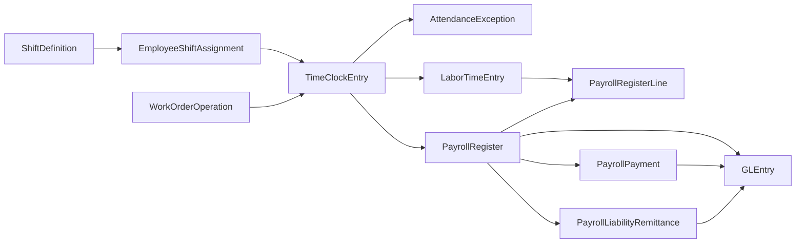
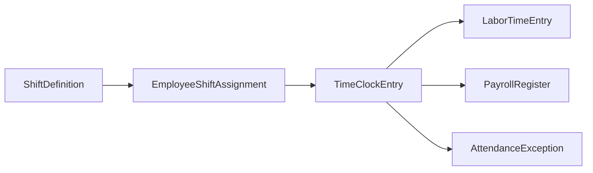

# Time Clocks and Shift Labor

## Business Storyline

Greenfield models time and attendance as the bridge between workforce planning and payroll. Supervisors define the expected shift pattern, hourly employees work against those expectations, and the approved daily clock becomes the support for both payroll hours and labor analysis.

This page is about the workforce side of the story: when employees were expected to work, when they actually worked, how overtime appears, how direct manufacturing time can be tied to a work-order operation, and where attendance exceptions show up. The actual pay cycle is covered on the separate [Payroll](payroll.md) page.

## Process Diagram

Read the diagram from workforce planning to approved attendance and then to downstream use. The important teaching idea is that time clocks do not exist only for payroll. They also support labor tracing, overtime analysis, manufacturing support, and control testing.

## Step-by-Step Walkthrough

### 1. Define the shift structure

Greenfield starts by defining standard shifts for areas such as manufacturing, warehouse, and customer service. Those shift definitions tell students what "on time" and "normal hours" are supposed to look like.

Main table:

- `ShiftDefinition`

### 2. Assign hourly employees to a primary shift

Each hourly employee receives one primary active assignment. In some cases the assignment also ties the employee to a work center, which matters later for manufacturing and overtime analysis.

Main table:

- `EmployeeShiftAssignment`

### 3. Record approved daily time clocks

For each worked day, the dataset records one approved `TimeClockEntry` row that captures the daily attendance summary:

- `ClockInTime`
- `ClockOutTime`
- `BreakMinutes`
- `RegularHours`
- `OvertimeHours`

For direct manufacturing workers, the same daily clock can also point to:

- `WorkOrderID`
- `WorkOrderOperationID`

Main table:

- `TimeClockEntry`

### 4. Link approved attendance to labor support

Approved attendance does not stay isolated in the time-clock table. It feeds `LaborTimeEntry`, where direct manufacturing labor can be tied back to the work order, the routing operation, and the supporting time-clock row.

Main table:

- `LaborTimeEntry`

### 5. Use attendance for payroll and costing

Payroll uses approved clock hours as the source for hourly earnings, while manufacturing uses the same support to trace labor into product-cost analysis. Salaried employees remain outside the routine time-clock flow.

Main downstream tables:

- `PayrollRegister`
- `PayrollRegisterLine`

### 6. Review exceptions

The clean build keeps attendance exceptions limited, but anomaly mode can add issues such as:

- missing clock-out
- duplicate time-clock day
- off-shift clocking
- paid without approved clock support
- labor booked after operation close

Main table:

- `AttendanceException`

## Main Tables in This Process

| Table | Role |
|---|---|
| `ShiftDefinition` | Standard shift template |
| `EmployeeShiftAssignment` | Employee-to-shift assignment |
| `TimeClockEntry` | Approved daily attendance row for hourly employees |
| `AttendanceException` | Logged time-and-attendance issues, mainly in anomaly mode |
| `LaborTimeEntry` | Labor allocation record used for costing and payroll traceability |
| `WorkOrderOperation` | Operation-level production link for direct labor |
| `PayrollRegister` | Downstream payroll header that uses approved clock hours for hourly pay |
| `PayrollRegisterLine` | Downstream earnings and deduction detail |

## When Accounting Happens

Time clocks and shift assignments do **not** post directly to the ledger.

They affect accounting indirectly by driving:

- hourly earnings on `PayrollRegister`
- direct labor and overtime analysis
- payroll-control validation
- manufacturing labor reclass logic through `LaborTimeEntry`

The posting events happen later in the payroll process:

- `PayrollRegister`
- related payroll settlements and remittances described on [Payroll](payroll.md)

## Common Student Questions

- Which employees are hourly and therefore expected to have time clocks?
- How close are actual clock-in times to the assigned shift start?
- How much overtime is concentrated in each work center and month?
- Which time-clock rows support direct manufacturing labor?
- How do approved clock hours relate to paid hourly earnings?
- Which attendance issues should be treated as control exceptions?

## What to Notice in the Data

- The clean build uses one approved `TimeClockEntry` row per worked day, not separate punch-in and punch-out event tables.
- Salaried employees do not receive routine time-clock rows in the clean build.
- Hourly payroll earnings use approved time-clock hours as the source for regular and overtime pay.
- Direct manufacturing time clocks can link to `WorkOrderOperationID`, which makes operation-level labor analytics possible.
- Attendance exceptions are most useful in anomaly-enabled builds.

## Subprocess Spotlight: Shift Expectation to Approved Hours

This view highlights the main learning path on this page:

- shifts define the expected work pattern
- approved time clocks show what happened on the day worked
- labor support carries that attendance into costing
- payroll later uses the approved hours for hourly earnings
- exception analysis sits beside the normal flow as a control lens

## Where to Go Next

- Read [Payroll](payroll.md) for the pay-cycle view of the same labor support.
- Read [Manufacturing](manufacturing.md) for the production side of direct labor.
- Read [Managerial Analytics](../analytics/managerial.md) and [Audit Analytics](../analytics/audit.md) for starter time-clock analysis.
