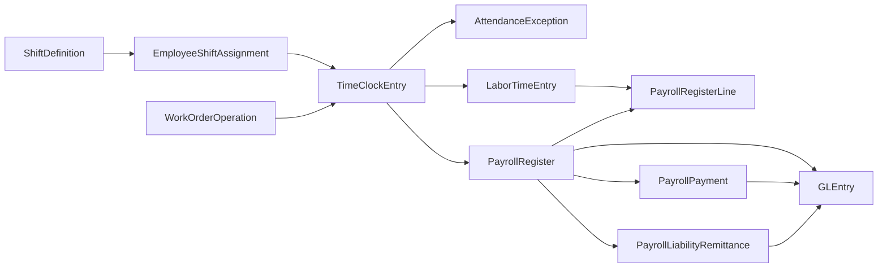

# Time Clocks and Shift Labor

**Audience:** Students, instructors, analysts, and contributors who need to understand how time and attendance now work in the dataset.  
**Purpose:** Explain shift assignment, daily time-clock capture, approval, and how approved hours feed payroll and manufacturing labor analysis.  
**What you will learn:** How Greenfield assigns hourly employees to shifts, records approved daily time clocks, turns those clocks into payroll hours, and links direct manufacturing labor to work-order operations.

## Business Storyline

Greenfield now models time and attendance as an operational layer between workforce planning and payroll.

Hourly employees are assigned to a primary shift. On each worked day, the generator creates one approved `TimeClockEntry` row that captures the employee's clock-in time, clock-out time, break minutes, regular hours, and overtime hours. For direct manufacturing workers, that daily clock also ties back to the specific work-order operation where labor was consumed.

That gives students a realistic bridge between:

- employee attendance
- payroll earnings
- direct-labor costing
- work-center activity
- payroll-control and audit testing

## Process Diagram

In plain language:

- `ShiftDefinition` stores the standard work pattern
- `EmployeeShiftAssignment` gives each hourly employee a primary shift
- `TimeClockEntry` stores the approved daily attendance record
- direct manufacturing clocks can point to a specific `WorkOrderOperation`
- `LaborTimeEntry` carries the approved labor-allocation record used for costing
- payroll reads approved clock hours for hourly earnings
- anomaly mode can record attendance issues in `AttendanceException`

## Step-by-Step Walkthrough

### 1. Define the shift structure

The generator creates a small set of reusable shift templates for manufacturing, warehouse, and customer-service work.

Main table:

- `ShiftDefinition`

### 2. Assign hourly employees to a primary shift

Each hourly employee receives one primary active assignment tied to a shift and work center when applicable.

Main table:

- `EmployeeShiftAssignment`

### 3. Record approved daily time clocks

For each worked day in a payroll period, the generator creates one normalized `TimeClockEntry` row with:

- `ClockInTime`
- `ClockOutTime`
- `BreakMinutes`
- `RegularHours`
- `OvertimeHours`

For direct manufacturing workers, the daily clock can also point to:

- `WorkOrderID`
- `WorkOrderOperationID`

Main table:

- `TimeClockEntry`

### 4. Turn approved clock hours into labor allocation

Hourly manufacturing labor is then represented in `LaborTimeEntry`. Direct labor ties back to the work order, the routing operation, and the supporting time-clock row.

Main table:

- `LaborTimeEntry`

### 5. Build payroll earnings from approved hours

Hourly payroll earnings now come from approved time-clock hours instead of synthetic payroll-hour generation. Salaried employees still use salary-based payroll logic.

Main tables:

- `PayrollRegister`
- `PayrollRegisterLine`

### 6. Clear cash and liabilities

Net pay is cleared through payroll payments. Taxes and deductions are cleared later through liability remittances.

Main tables:

- `PayrollPayment`
- `PayrollLiabilityRemittance`

### 7. Review exceptions

The clean build keeps attendance exceptions minimal. In anomaly mode, the dataset can add issues such as:

- missing clock-out
- duplicate time-clock day
- off-shift clocking
- paid without approved clock support
- labor booked after operation close

Main table:

- `AttendanceException`

## Main Tables Involved

| Table | Role |
|---|---|
| `ShiftDefinition` | Standard shift template |
| `EmployeeShiftAssignment` | Employee-to-shift assignment |
| `TimeClockEntry` | Approved daily attendance row for hourly employees |
| `AttendanceException` | Logged time-and-attendance issues, mainly in anomaly mode |
| `LaborTimeEntry` | Labor allocation record used for costing and payroll traceability |
| `WorkOrderOperation` | Operation-level production link for direct labor |
| `PayrollRegister` | Employee payroll header |
| `PayrollRegisterLine` | Earnings and deduction detail |
| `PayrollPayment` | Net-pay settlement |
| `PayrollLiabilityRemittance` | Tax and deduction settlement |

## When Accounting Happens

Time clocks and shift assignments do **not** post directly to the ledger.

They affect accounting indirectly by driving:

- hourly earnings on `PayrollRegister`
- direct labor and overtime analysis
- payroll-control validation
- manufacturing labor reclass logic through `LaborTimeEntry`

The posting events still happen at:

- `PayrollRegister`
- `PayrollPayment`
- `PayrollLiabilityRemittance`

## Common Student Questions

- Which employees are hourly and therefore expected to have time clocks?
- How close are actual clock-in times to the assigned shift start?
- How much overtime is concentrated in each work center and month?
- Which time-clock rows support direct manufacturing labor?
- How do approved clock hours relate to paid hourly earnings?
- Which attendance issues should be treated as control exceptions?

## Current Implementation Notes

- The clean build uses one approved `TimeClockEntry` row per worked day, not separate punch-in and punch-out event tables.
- Salaried employees do not receive routine time-clock rows in the clean build.
- Hourly payroll earnings use approved time-clock hours as the source for regular and overtime pay.
- Direct manufacturing time clocks can link to `WorkOrderOperationID`, which makes operation-level labor analytics possible.
- Attendance exceptions are most useful in anomaly-enabled builds.

## Where to Go Next

- Read [payroll.md](payroll.md) for the payroll-cycle view of the same data.
- Read [manufacturing.md](manufacturing.md) for the production side of direct labor.
- Read [../analytics/managerial.md](../analytics/managerial.md) and [../analytics/audit.md](../analytics/audit.md) for starter time-clock analysis.
