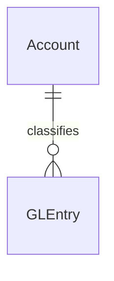
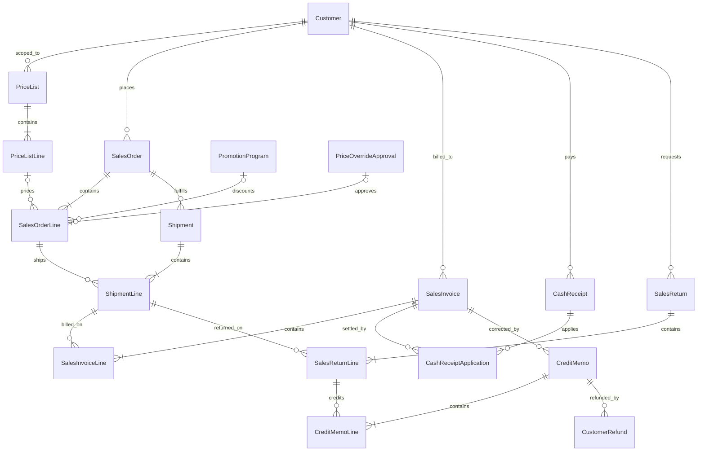
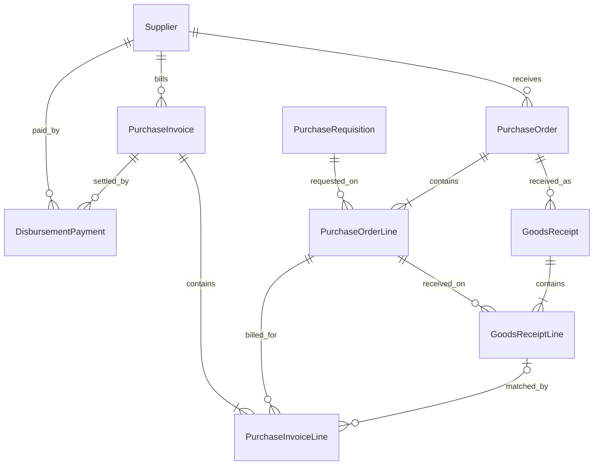
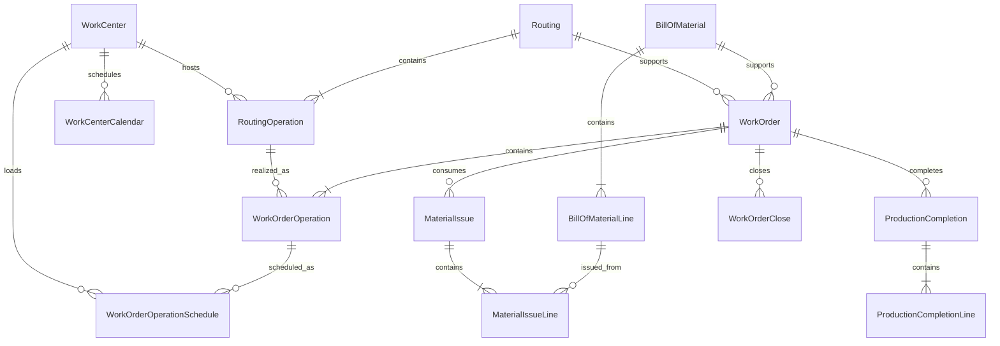
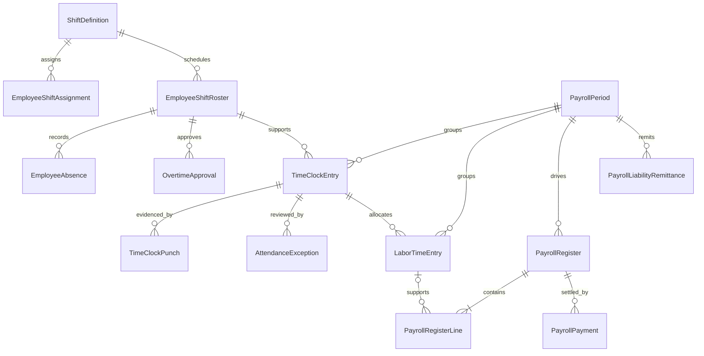
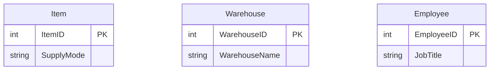
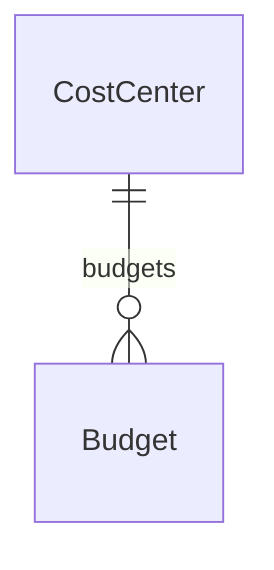
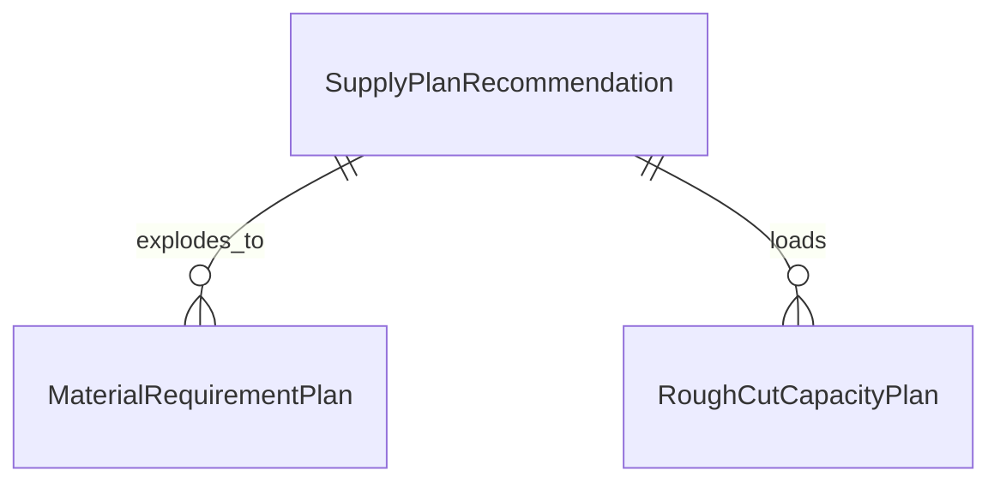

# Schema Reference

This reference is the table map for the dataset: which tables belong together, how the main relationships work, which keys matter most, and where the bridges between groups live.

If you need the big-picture business story first, start with [Dataset Guide](../start-here/dataset-overview.md) and [Process Flows](../learn-the-business/process-flows.md).

## SQLite Physical Schema

- The generated SQLite file now includes a physical primary key on each table's main surrogate ID column.
- The SQLite file also includes a curated index set for high-value joins and stable business identifiers, but it does not index every relationship column in the model.
- Some business identifiers remain intentionally non-unique in anomaly scenarios, so fields such as supplier invoice numbers or payment references are not universally enforced as unique in SQLite.

## How the Reference Is Organized

- Start with **Table Groups** to see how the model is divided.
- Use **How to Read the ER Diagrams** before you treat any one group diagram as a complete process story.
- Use **Cross-Group Bridge Keys** when you need to move from one table family to another.
- Use each group section when you need the main tables, the highest-value fields, and the local join paths.

## Table Groups

| Group | What belongs here | Count |
|---|---|---:|
| Accounting core | Accounts, journals, and posted ledger detail | 3 |
| Order-to-cash | Customers, commercial pricing, orders, shipments, invoices, cash, returns, credits, and refunds | 18 |
| Procure-to-pay | Requisitions, purchase orders, receipts, supplier invoices, and disbursements | 9 |
| Manufacturing | BOMs, routings, work centers, work orders, issues, completions, and close | 14 |
| Payroll and time | Shifts, rosters, absences, overtime approvals, punches, approved daily time, payroll, and remittances | 14 |
| Master data | Item, warehouse, and employee records | 3 |
| Organizational planning | Cost centers and budgets | 2 |
| Demand planning and MRP | Forecasting, inventory policy, recommendations, MRP, and rough-cut capacity | 5 |
| Total |  | 68 |

## How to Read the ER Diagrams

- Each diagram shows the **main local relationships** inside one table group, not every possible key in the database.
- These ERs are **schema-direct** diagrams. An edge appears only when a stored key supports it, or when a polymorphic source-document trace is called out explicitly in prose.
- The diagrams are intentionally simplified. The compact tables below each diagram carry the highest-value fields students usually need first.
- Cross-group bridges such as `ItemID`, `SupplyPlanRecommendationID`, and `AccrualJournalEntryID` are summarized separately so the group diagrams stay readable.
- The process pages explain business flow. This reference explains table structure and join logic.

## Cross-Group Bridge Keys

These are the main keys students use to move across groups.

| Bridge key | Main bridge | How it connects |
|---|---|---|
| `ItemID` | Master data into O2C, P2P, manufacturing, and planning | Product-level analysis across the whole dataset |
| `SupplyPlanRecommendationID` | Demand planning into requisitions, work orders, MRP, and rough-cut capacity | Connects planning pressure to later purchasing or manufacturing execution |
| `WorkOrderID` | Manufacturing into issues, completions, close, and labor support | Main manufacturing execution anchor |
| `WorkOrderOperationID` | Manufacturing into operation schedules and labor traceability | Connects scheduling and labor detail to one operation |
| `TimeClockEntryID` | Payroll and time into labor, attendance exceptions, and payroll support | Approved time bridge |
| `PayrollRegisterID` | Payroll header into line detail and payment | Main payroll posting anchor |
| `AccrualJournalEntryID` | Accounting core into accrued-service AP settlement | Bridges finance estimates to later AP activity |
| `AccountID` | Accounting core into budgets and reporting | Chart-of-accounts bridge |
| `SourceDocumentType`, `SourceDocumentID`, `SourceLineID` | Operational groups into `GLEntry` | Main path back from posted accounting to source activity |

## Accounting Core

This group provides the posting anchor for every process. `JournalEntry` is the finance-controlled header, `GLEntry` is the posted detail, and `Account` gives the reporting and control-account meaning.

| Table | Use it for | Highest-value keys or fields |
|---|---|---|
| `Account` | Chart of accounts and hierarchy | `AccountID`, `AccountNumber`, `AccountType`, `AccountSubType`, `ParentAccountID` |
| `JournalEntry` | Finance-controlled journal header lookup | `JournalEntryID`, `EntryNumber`, `PostingDate`, `EntryType`, `ApprovedByEmployeeID`, `ReversesJournalEntryID` |
| `GLEntry` | Posted ledger detail and traceability | `GLEntryID`, `PostingDate`, `AccountID`, `VoucherType`, `VoucherNumber`, `SourceDocumentType`, `SourceDocumentID`, `SourceLineID`, `FiscalYear`, `FiscalPeriod` |

### Join and Traceability Cues

- `GLEntry.AccountID -> Account.AccountID`
- When `GLEntry.SourceDocumentType = 'JournalEntry'`, `GLEntry.SourceDocumentID -> JournalEntry.JournalEntryID`
- For journal-origin rows, `GLEntry.VoucherNumber` typically matches `JournalEntry.EntryNumber`
- `GLEntry.SourceDocumentType`, `SourceDocumentID`, and `SourceLineID` are the main operational trace fields

## Order-to-Cash

This group holds the full customer-side relationship map: pricing setup, order capture, fulfillment, billing, cash settlement, and the return-credit-refund branch.

| Table | Use it for | Highest-value keys or fields |
|---|---|---|
| `Customer` | Customer master and segmentation | `CustomerID`, `CustomerName`, `CustomerSegment`, `Region`, `SalesRepEmployeeID` |
| `PriceList` | Pricing scope header | `PriceListID`, `ScopeType`, `CustomerID`, `CustomerSegment`, `EffectiveStartDate`, `EffectiveEndDate` |
| `PriceListLine` | Item-level pricing rule | `PriceListLineID`, `PriceListID`, `ItemID`, `UnitPrice`, `MinimumUnitPrice` |
| `PromotionProgram` | Promotion definition | `PromotionID`, `PromotionCode`, `ScopeType`, `DiscountPct`, `EffectiveStartDate`, `EffectiveEndDate` |
| `PriceOverrideApproval` | Manual below-floor approval | `PriceOverrideApprovalID`, `SalesOrderLineID`, `RequestedByEmployeeID`, `ApprovedByEmployeeID`, `ApprovedUnitPrice`, `Status` |
| `SalesOrder` | Order header | `SalesOrderID`, `OrderNumber`, `CustomerID`, `OrderDate`, `RequestedDeliveryDate`, `FreightTerms`, `Status` |
| `SalesOrderLine` | Ordered line with pricing lineage | `SalesOrderLineID`, `SalesOrderID`, `ItemID`, `PriceListLineID`, `PromotionID`, `PriceOverrideApprovalID`, `PricingMethod` |
| `Shipment` | Shipment header | `ShipmentID`, `SalesOrderID`, `ShipmentDate`, `WarehouseID`, `FreightCost`, `BillableFreightAmount`, `Status` |
| `ShipmentLine` | Shipped line | `ShipmentLineID`, `ShipmentID`, `SalesOrderLineID`, `ItemID`, `QuantityShipped` |
| `SalesInvoice` | Invoice header | `SalesInvoiceID`, `InvoiceNumber`, `CustomerID`, `InvoiceDate`, `DueDate`, `FreightAmount`, `Status` |
| `SalesInvoiceLine` | Billed line | `SalesInvoiceLineID`, `SalesInvoiceID`, `SalesOrderLineID`, `ShipmentLineID`, `ItemID`, `PricingMethod` |
| `CashReceipt` | Customer cash event | `CashReceiptID`, `ReceiptNumber`, `CustomerID`, `ReceiptDate`, `Amount` |
| `CashReceiptApplication` | Invoice settlement detail | `CashReceiptApplicationID`, `CashReceiptID`, `SalesInvoiceID`, `ApplicationDate`, `AppliedAmount` |
| `SalesReturn` | Return header | `SalesReturnID`, `ReturnNumber`, `CustomerID`, `ReturnDate`, `Status` |
| `SalesReturnLine` | Returned line | `SalesReturnLineID`, `SalesReturnID`, `ShipmentLineID`, `ItemID`, `QuantityReturned` |
| `CreditMemo` | Credit header | `CreditMemoID`, `CreditMemoNumber`, `SalesReturnID`, `OriginalSalesInvoiceID`, `CreditMemoDate`, `FreightCreditAmount`, `Status` |
| `CreditMemoLine` | Credit detail with inherited pricing lineage | `CreditMemoLineID`, `CreditMemoID`, `SalesReturnLineID`, `ItemID`, `PricingMethod`, `PriceListLineID` |
| `CustomerRefund` | Refund against customer credit | `CustomerRefundID`, `CreditMemoID`, `CustomerID`, `RefundDate`, `Amount` |

### Join and Traceability Cues

- `PriceListLine.PriceListID -> PriceList.PriceListID`
- `SalesOrderLine.PriceListLineID -> PriceListLine.PriceListLineID`
- `SalesOrderLine.PromotionID -> PromotionProgram.PromotionID`
- `SalesOrderLine.PriceOverrideApprovalID -> PriceOverrideApproval.PriceOverrideApprovalID`
- `PriceOverrideApproval.SalesOrderLineID -> SalesOrderLine.SalesOrderLineID`
- `ShipmentLine.SalesOrderLineID -> SalesOrderLine.SalesOrderLineID`
- `SalesInvoiceLine.ShipmentLineID -> ShipmentLine.ShipmentLineID`
- `CashReceiptApplication.SalesInvoiceID -> SalesInvoice.SalesInvoiceID`
- `SalesReturnLine.ShipmentLineID -> ShipmentLine.ShipmentLineID`
- `CreditMemo.OriginalSalesInvoiceID -> SalesInvoice.SalesInvoiceID`
- `CustomerRefund.CreditMemoID -> CreditMemo.CreditMemoID`

## Procure-to-Pay

This group holds the supplier-side relationship map: requisition, PO, receipt, invoice, and payment. The main cross-group bridge here is the accrued-service path through `AccrualJournalEntryID`.

| Table | Use it for | Highest-value keys or fields |
|---|---|---|
| `Supplier` | Supplier master and payment context | `SupplierID`, `SupplierName`, `PaymentTerms`, `SupplierCategory`, `SupplierRiskRating` |
| `PurchaseRequisition` | Internal purchase demand | `RequisitionID`, `RequisitionNumber`, `RequestDate`, `ItemID`, `CostCenterID`, `SupplyPlanRecommendationID`, `Status` |
| `PurchaseOrder` | PO header | `PurchaseOrderID`, `PONumber`, `SupplierID`, `OrderDate`, `ExpectedDeliveryDate`, `Status` |
| `PurchaseOrderLine` | Ordered line | `POLineID`, `PurchaseOrderID`, `RequisitionID`, `ItemID`, `Quantity`, `UnitCost` |
| `GoodsReceipt` | Receipt header | `GoodsReceiptID`, `ReceiptNumber`, `PurchaseOrderID`, `ReceiptDate`, `WarehouseID` |
| `GoodsReceiptLine` | Received line | `GoodsReceiptLineID`, `GoodsReceiptID`, `POLineID`, `ItemID`, `QuantityReceived`, `ExtendedStandardCost` |
| `PurchaseInvoice` | Supplier invoice header | `PurchaseInvoiceID`, `InvoiceNumber`, `SupplierID`, `PurchaseOrderID`, `InvoiceDate`, `Status` |
| `PurchaseInvoiceLine` | Supplier invoice line | `PILineID`, `PurchaseInvoiceID`, `POLineID`, `GoodsReceiptLineID`, `AccrualJournalEntryID`, `ItemID` |
| `DisbursementPayment` | Supplier payment | `DisbursementID`, `PurchaseInvoiceID`, `SupplierID`, `PaymentDate`, `Amount` |

### Join and Traceability Cues

- `PurchaseOrderLine.RequisitionID -> PurchaseRequisition.RequisitionID`
- `GoodsReceipt.PurchaseOrderID -> PurchaseOrder.PurchaseOrderID`
- `GoodsReceiptLine.POLineID -> PurchaseOrderLine.POLineID`
- `PurchaseInvoiceLine.GoodsReceiptLineID -> GoodsReceiptLine.GoodsReceiptLineID`
- `PurchaseInvoiceLine.AccrualJournalEntryID -> JournalEntry.JournalEntryID`
- `DisbursementPayment.PurchaseInvoiceID -> PurchaseInvoice.PurchaseInvoiceID`

## Manufacturing

This group covers the local manufacturing structure: recipe, routing, work center, work order, issue, completion, and close. Planning and payroll bridges are summarized separately above.

| Table | Use it for | Highest-value keys or fields |
|---|---|---|
| `BillOfMaterial` | BOM header | `BOMID`, `ParentItemID`, `VersionNumber`, `Status`, `StandardBatchQuantity` |
| `BillOfMaterialLine` | BOM component detail | `BOMLineID`, `BOMID`, `ComponentItemID`, `QuantityPerUnit`, `ScrapFactorPct` |
| `WorkCenter` | Work-center master | `WorkCenterID`, `WorkCenterCode`, `Department`, `WarehouseID`, `NominalDailyCapacityHours` |
| `WorkCenterCalendar` | Daily available-hours calendar | `WorkCenterCalendarID`, `WorkCenterID`, `CalendarDate`, `IsWorkingDay`, `AvailableHours` |
| `Routing` | Routing header | `RoutingID`, `ParentItemID`, `VersionNumber`, `Status` |
| `RoutingOperation` | Ordered routing step | `RoutingOperationID`, `RoutingID`, `OperationSequence`, `OperationCode`, `WorkCenterID` |
| `WorkOrder` | Work-order header | `WorkOrderID`, `WorkOrderNumber`, `ItemID`, `BOMID`, `RoutingID`, `SupplyPlanRecommendationID`, `Status` |
| `WorkOrderOperation` | Operation-level work-order activity | `WorkOrderOperationID`, `WorkOrderID`, `RoutingOperationID`, `OperationSequence`, `WorkCenterID`, `Status` |
| `WorkOrderOperationSchedule` | Daily scheduled hours | `WorkOrderOperationScheduleID`, `WorkOrderOperationID`, `WorkCenterID`, `ScheduleDate`, `ScheduledHours` |
| `MaterialIssue` | Material issue header | `MaterialIssueID`, `WorkOrderID`, `IssueDate`, `WarehouseID` |
| `MaterialIssueLine` | Material issue line | `MaterialIssueLineID`, `MaterialIssueID`, `BOMLineID`, `ItemID`, `QuantityIssued` |
| `ProductionCompletion` | Completion header | `ProductionCompletionID`, `WorkOrderID`, `CompletionDate`, `WarehouseID` |
| `ProductionCompletionLine` | Completion cost detail | `ProductionCompletionLineID`, `ProductionCompletionID`, `ItemID`, `QuantityCompleted`, `ExtendedStandardTotalCost` |
| `WorkOrderClose` | Work-order close and variance record | `WorkOrderCloseID`, `WorkOrderID`, `CloseDate`, `TotalVarianceAmount`, `Status` |

### Join and Traceability Cues

- `WorkOrder.BOMID -> BillOfMaterial.BOMID`
- `WorkOrder.RoutingID -> Routing.RoutingID`
- `WorkOrderOperation.RoutingOperationID -> RoutingOperation.RoutingOperationID`
- `WorkOrderOperationSchedule.WorkOrderOperationID -> WorkOrderOperation.WorkOrderOperationID`
- `MaterialIssue.WorkOrderID -> WorkOrder.WorkOrderID`
- `MaterialIssueLine.BOMLineID -> BillOfMaterialLine.BOMLineID`
- `ProductionCompletion.WorkOrderID -> WorkOrder.WorkOrderID`
- `WorkOrderClose.WorkOrderID -> WorkOrder.WorkOrderID`

## Payroll and Time

This group holds the workforce-side relationship map: shifts, rosters, raw punches, approved time, labor detail, payroll registers, payments, and remittances.

| Table | Use it for | Highest-value keys or fields |
|---|---|---|
| `ShiftDefinition` | Shift template | `ShiftDefinitionID`, `ShiftCode`, `Department`, `WorkCenterID`, `StartTime`, `EndTime` |
| `EmployeeShiftAssignment` | Employee-to-shift assignment | `EmployeeShiftAssignmentID`, `EmployeeID`, `ShiftDefinitionID`, `WorkCenterID`, `IsPrimary` |
| `EmployeeShiftRoster` | Daily planned roster row | `EmployeeShiftRosterID`, `EmployeeID`, `RosterDate`, `ShiftDefinitionID`, `WorkCenterID`, `ScheduledHours` |
| `EmployeeAbsence` | Absence support | `EmployeeAbsenceID`, `EmployeeShiftRosterID`, `AbsenceDate`, `AbsenceType`, `HoursAbsent` |
| `OvertimeApproval` | Approved overtime support | `OvertimeApprovalID`, `EmployeeShiftRosterID`, `WorkDate`, `ApprovedHours`, `ReasonCode` |
| `TimeClockEntry` | Approved daily time | `TimeClockEntryID`, `EmployeeID`, `PayrollPeriodID`, `EmployeeShiftRosterID`, `RegularHours`, `OvertimeHours`, `ClockStatus` |
| `TimeClockPunch` | Raw punch events | `TimeClockPunchID`, `EmployeeShiftRosterID`, `TimeClockEntryID`, `PunchTimestamp`, `PunchType` |
| `AttendanceException` | Attendance-control exception | `AttendanceExceptionID`, `EmployeeShiftRosterID`, `TimeClockEntryID`, `ExceptionType`, `Severity`, `Status` |
| `PayrollPeriod` | Payroll calendar | `PayrollPeriodID`, `PeriodNumber`, `PeriodStartDate`, `PeriodEndDate`, `PayDate`, `FiscalPeriod` |
| `LaborTimeEntry` | Labor detail used for costing and payroll support | `LaborTimeEntryID`, `PayrollPeriodID`, `TimeClockEntryID`, `WorkOrderID`, `WorkOrderOperationID`, `LaborType` |
| `PayrollRegister` | Payroll header | `PayrollRegisterID`, `PayrollPeriodID`, `EmployeeID`, `CostCenterID`, `GrossPay`, `NetPay`, `Status` |
| `PayrollRegisterLine` | Payroll line detail | `PayrollRegisterLineID`, `PayrollRegisterID`, `LineType`, `Hours`, `Rate`, `LaborTimeEntryID` |
| `PayrollPayment` | Net-pay settlement | `PayrollPaymentID`, `PayrollRegisterID`, `PaymentDate`, `PaymentMethod`, `ReferenceNumber` |
| `PayrollLiabilityRemittance` | Liability clearance | `PayrollLiabilityRemittanceID`, `PayrollPeriodID`, `LiabilityType`, `RemittanceDate`, `Amount` |

### Join and Traceability Cues

- `EmployeeShiftAssignment.ShiftDefinitionID -> ShiftDefinition.ShiftDefinitionID`
- `EmployeeShiftRoster.ShiftDefinitionID -> ShiftDefinition.ShiftDefinitionID`
- `EmployeeAbsence.EmployeeShiftRosterID -> EmployeeShiftRoster.EmployeeShiftRosterID`
- `OvertimeApproval.EmployeeShiftRosterID -> EmployeeShiftRoster.EmployeeShiftRosterID`
- `TimeClockEntry.EmployeeShiftRosterID -> EmployeeShiftRoster.EmployeeShiftRosterID`
- `TimeClockEntry.OvertimeApprovalID -> OvertimeApproval.OvertimeApprovalID`
- `TimeClockPunch.TimeClockEntryID -> TimeClockEntry.TimeClockEntryID`
- `AttendanceException.TimeClockEntryID -> TimeClockEntry.TimeClockEntryID`
- `LaborTimeEntry.TimeClockEntryID -> TimeClockEntry.TimeClockEntryID`
- `PayrollRegister.PayrollPeriodID -> PayrollPeriod.PayrollPeriodID`
- `PayrollRegisterLine.LaborTimeEntryID -> LaborTimeEntry.LaborTimeEntryID`
- `PayrollPayment.PayrollRegisterID -> PayrollRegister.PayrollRegisterID`
- `PayrollLiabilityRemittance.PayrollPeriodID -> PayrollPeriod.PayrollPeriodID`

## Master Data

This group holds the anchor entities reused across the rest of the model. These tables are intentionally simple, but they matter because most other groups attach to them.

| Table | Use it for | Highest-value keys or fields |
|---|---|---|
| `Item` | Product master and account mapping | `ItemID`, `ItemCode`, `ItemGroup`, `CollectionName`, `LifecycleStatus`, `SupplyMode`, `InventoryAccountID`, `RevenueAccountID`, `COGSAccountID` |
| `Warehouse` | Warehouse master | `WarehouseID`, `WarehouseName`, `ManagerID` |
| `Employee` | Employee master and approvals | `EmployeeID`, `EmployeeNumber`, `JobTitle`, `JobFamily`, `AuthorizationLevel`, `PayClass`, `OvertimeEligible` |

### Join and Traceability Cues

- `ItemID` is the main product bridge across O2C, P2P, manufacturing, and planning
- `WarehouseID` connects fulfillment, receipt, manufacturing, and planning location context
- `EmployeeID` appears across approvals, rosters, payroll, journals, and organizational reporting

## Organizational Planning

This group is small, but it gives the model its reporting structure. `CostCenter` organizes responsibility, and `Budget` gives a planning benchmark by month and account.

| Table | Use it for | Highest-value keys or fields |
|---|---|---|
| `CostCenter` | Organizational reporting structure | `CostCenterID`, `CostCenterName`, `ParentCostCenterID`, `ManagerID`, `IsActive` |
| `Budget` | Monthly budget by cost center and account | `BudgetID`, `FiscalYear`, `Month`, `CostCenterID`, `AccountID`, `BudgetAmount` |

### Join and Traceability Cues

- `Budget.CostCenterID -> CostCenter.CostCenterID`
- `Budget.AccountID -> Account.AccountID`

## Demand Planning and MRP

This group covers the planning layer that sits ahead of later purchasing and manufacturing execution. It explains why replenishment pressure existed before a requisition or work order appeared.

| Table | Use it for | Highest-value keys or fields |
|---|---|---|
| `DemandForecast` | Weekly demand-planning input | `DemandForecastID`, `ForecastWeekStartDate`, `ItemID`, `WarehouseID`, `ForecastQuantity`, `ForecastMethod`, `IsCurrent` |
| `InventoryPolicy` | Active replenishment policy | `InventoryPolicyID`, `ItemID`, `WarehouseID`, `PolicyType`, `SafetyStockQuantity`, `ReorderPointQuantity`, `TargetDaysSupply`, `IsActive` |
| `SupplyPlanRecommendation` | Weekly replenishment recommendation | `SupplyPlanRecommendationID`, `RecommendationDate`, `BucketWeekStartDate`, `ItemID`, `WarehouseID`, `RecommendationType`, `SupplyMode`, `RecommendationStatus`, `ConvertedDocumentType`, `ConvertedDocumentID` |
| `MaterialRequirementPlan` | Component-demand explosion | `MaterialRequirementPlanID`, `BucketWeekStartDate`, `ParentItemID`, `ComponentItemID`, `SupplyPlanRecommendationID`, `NetRequirementQuantity` |
| `RoughCutCapacityPlan` | Weekly load-versus-capacity tieout | `RoughCutCapacityPlanID`, `BucketWeekStartDate`, `WorkCenterID`, `SupplyPlanRecommendationID`, `PlannedLoadHours`, `AvailableHours`, `UtilizationPct`, `CapacityStatus` |

### Join and Traceability Cues

- `DemandForecast` and `InventoryPolicy` inform recommendations through shared `ItemID`, `WarehouseID`, planning buckets, and recommendation `DriverType`; there is no direct stored forecast or policy ID on `SupplyPlanRecommendation`
- `PurchaseRequisition.SupplyPlanRecommendationID -> SupplyPlanRecommendation.SupplyPlanRecommendationID`
- `WorkOrder.SupplyPlanRecommendationID -> SupplyPlanRecommendation.SupplyPlanRecommendationID`
- `MaterialRequirementPlan.SupplyPlanRecommendationID -> SupplyPlanRecommendation.SupplyPlanRecommendationID`
- `RoughCutCapacityPlan.SupplyPlanRecommendationID -> SupplyPlanRecommendation.SupplyPlanRecommendationID`

## Important Schema Notes

- `CashReceipt.SalesInvoiceID` is compatibility metadata only. The authoritative O2C settlement link is `CashReceiptApplication`.
- O2C freight remains header-level. `SalesOrder.FreightTerms` sets the policy, `Shipment.FreightCost` and `Shipment.BillableFreightAmount` capture the fulfillment result, `SalesInvoice.FreightAmount` carries billed freight, and `CreditMemo.FreightCreditAmount` shows any freight credit.
- Price-list and promotion lineage live directly on `SalesOrderLine`, `SalesInvoiceLine`, and `CreditMemoLine`. Postings remain net revenue.
- `PurchaseOrder.RequisitionID` is compatibility metadata when one PO batches multiple requisitions. Use `PurchaseOrderLine.RequisitionID` as the authoritative trace.
- `PurchaseInvoiceLine.GoodsReceiptLineID` is the main match key for receipt-based inventory invoicing.
- `PurchaseInvoiceLine.AccrualJournalEntryID` links direct service invoices back to accrual journals.
- `GoodsReceiptLine.ExtendedStandardCost` stores the receipt posting basis used for inventory and GRNI.
- `EmployeeShiftRoster`, `EmployeeAbsence`, `TimeClockPunch`, and `OvertimeApproval` sit beneath the approved `TimeClockEntry` layer.
- Manufacturing uses single-level BOMs plus one active routing per manufactured item.
- Manufacturing remains standard-cost based even though payroll and time provide operational labor detail.

## Next Steps

- Read [Dataset Guide](../start-here/dataset-overview.md) when you need the mental model, navigation paths, and posting overview.
- Read [Process Flows](../learn-the-business/process-flows.md) when you want the business-cycle story behind the tables.
- Read [GLEntry Posting Reference](posting.md) when you want the exact event-to-ledger rules.
