# Technical Guide

**Audience:** Contributors, advanced users, teaching assistants, and instructors who need a durable technical description of the dataset and generator.  
**Purpose:** Replace the old long-form blueprint with a current, implementation-aligned guide to how the database and code work.  
**What you will learn:** The system architecture, data-model layers, build flow, posting model, validation model, outputs, and extension points.

> **Implemented in current generator:** A 31-table dataset with O2C, P2P, recurring journals, year-end close, posting, validation, anomaly injection, and export logic.

> **Planned future extension:** Manufacturing-related tables, generation logic, and postings.

## What This Guide Covers

This page is the system-level technical overview for the repository. Use it when you need the current design view of:

- what the dataset contains
- how the generator builds it
- how processes map to postings
- how validations and exports fit together

Use [code-architecture.md](code-architecture.md) for a more code-centric, module-by-module explanation.

## Current System at a Glance

The current implementation has five layers:

| Layer | Main content |
|---|---|
| Business context | Greenfield Home Furnishings, business processes, and company story |
| Operational tables | O2C and P2P documents plus master data |
| Accounting layer | `JournalEntry`, `GLEntry`, and the chart of accounts |
| Control layer | validations, anomaly injection, and reporting |
| Delivery layer | SQLite, Excel, JSON, and generation log outputs |

## Table Families

The implemented schema is organized into five groups:

| Group | Coverage |
|---|---|
| Accounting core | `Account`, `JournalEntry`, `GLEntry` |
| O2C | customer orders, shipments, billing, receipt applications, returns, credits, refunds |
| P2P | requisitions, purchase orders, receipts, supplier invoices, disbursements |
| Master data | customers, suppliers, items, employees, warehouses |
| Organizational planning | cost centers and budgets |

The canonical column definitions live in `src/greenfield_dataset/schema.py`.

## End-to-End Build Flow

```mermaid
flowchart LR
    S[Load Settings]
    C[Initialize Context]
    E[Create Empty Tables]
    M[Generate Master Data]
    B[Generate Opening Balances and Budgets]
    T[Generate Monthly O2C and P2P Activity]
    J[Generate Recurring Manual Journals]
    P[Post Operational Events]
    Y[Generate Year-End Close]
    V[Validate]
    A[Inject Anomalies]
    X[Export]

    S --> C --> E --> M --> B --> T --> J --> P --> Y --> V --> A --> X
```

In plain language, the build works like this:

1. load settings and initialize the shared generation context
2. create empty DataFrames for all implemented tables
3. generate master data such as accounts, cost centers, employees, customers, suppliers, items, and warehouses
4. generate opening balances and budget rows
5. generate monthly O2C and P2P activity across the configured fiscal range
6. generate recurring manual journals and accrual reversals
7. post operational events into `GLEntry`
8. generate year-end close journals after operational posting is complete
9. validate the clean dataset
10. inject anomalies when configured
11. export SQLite, Excel, JSON, and log artifacts

## Module Responsibilities

| Module | Current role |
|---|---|
| `settings.py` | Load YAML configuration and initialize the shared runtime context |
| `calendar.py` | Build the fiscal calendar |
| `schema.py` | Define `TABLE_COLUMNS` and create empty tables |
| `master_data.py` | Generate accounts, cost centers, employees, warehouses, items, customers, and suppliers |
| `budgets.py` | Generate opening balances and budgets |
| `o2c.py` | Generate orders, shipments, invoices, receipts, applications, returns, credits, and refunds |
| `p2p.py` | Generate requisitions, purchase orders, receipts, supplier invoices, and payments |
| `journals.py` | Generate recurring journals, reversals, and year-end close |
| `posting_engine.py` | Convert source events into balanced GL entries |
| `validations.py` | Run document, accounting, and roll-forward checks |
| `anomalies.py` | Inject configured anomalies and log them |
| `exporters.py` | Write SQLite, Excel, and JSON outputs |
| `main.py` | Orchestrate the full build and write the generation log |

## Process and Posting Design

The generator uses event-based accounting.

Major posting triggers:

- `Shipment`: COGS and inventory relief
- `SalesInvoice`: AR, revenue, and sales tax
- `CashReceipt`: cash and customer deposits / unapplied cash
- `CashReceiptApplication`: customer deposits / unapplied cash to AR settlement
- `SalesReturn`: inventory restoration and COGS reversal
- `CreditMemo`: contra revenue, tax reversal, and AR or customer-credit reduction
- `CustomerRefund`: customer credit and cash
- `GoodsReceipt`: inventory and GRNI
- `PurchaseInvoice`: GRNI clearing, AP, and purchase variance
- `DisbursementPayment`: AP and cash
- `JournalEntry`: opening, recurring manual, reversal, and close-cycle activity

The technical posting reference lives in [reference/posting.md](reference/posting.md).

## Validation and Control Model

The generator is designed to be useful for both clean analysis and anomaly-driven analysis.

Clean-build validations cover:

- schema consistency
- header-to-line totals
- orphan-row detection
- over-shipment, over-receipt, over-invoicing, and overpayment checks
- receipt-application and credit/refund integrity
- status consistency checks
- voucher balance and trial balance
- control-account roll-forwards for AR, AP, inventory, GRNI, sales tax, customer deposits, and related balances
- journal header-to-GL agreement and close-cycle coverage

Anomaly behavior is layered on top of that clean base so users can teach exception-oriented analytics without changing the core schema.

## Outputs

The current generator writes:

- SQLite database for SQL work
- Excel workbook with one worksheet per table plus anomaly and validation summary sheets
- JSON validation report
- text generation log

Most course users should start with those generated files rather than the Python code.

## How the Docs Fit Together

The documentation set now has three roles:

- business-facing docs for company context and process understanding
- analytics docs for SQL and Excel use
- technical docs for generator, schema, posting, and roadmap detail

Recommended technical reading order:

1. this guide
2. [code-architecture.md](code-architecture.md)
3. [reference/schema.md](reference/schema.md)
4. [reference/posting.md](reference/posting.md)
5. [reference/row-volume.md](reference/row-volume.md)

## Extension Point for Phase 12

Manufacturing should extend the same design pattern already used for O2C and P2P:

1. add manufacturing master and transaction tables
2. generate production activity in its own module
3. extend posting logic for WIP, completion, and variance behavior
4. extend validations for manufacturing controls
5. update process, analytics, and technical docs together

Manufacturing is not implemented yet. The current dataset remains a distributor-style environment with richer returns, purchasing, and close-cycle behavior.
