# Technical Guide

Use this page when you need the codebase-level view of how Charles River is generated.

For table structure and join fields, use [Schema Reference](../reference/schema.md). For event-to-ledger behavior, use [GLEntry Posting Reference](../reference/posting.md). For current scope and planned improvements, use [Roadmap](roadmap.md).

The current system includes demand forecasts, inventory policies, supply recommendations, component-demand planning, rough-cut capacity tieout, and explicit O2C pricing lineage through price lists, promotions, and override approvals. It also includes the workforce-planning layer that supports the approved daily time-clock model.

## Current System at a Glance

The current implementation has six layers:

| Layer | Main content |
|---|---|
| Business and process layer | Charles River Home Furnishings, operating processes, and source documents |
| Operational data layer | O2C, P2P, manufacturing, payroll, time, and master-data tables |
| Accounting layer | `JournalEntry`, `GLEntry`, and the chart of accounts |
| Control layer | Validations, anomaly injection, validation reporting, and generation logging |
| Delivery layer | SQLite, Excel, support-workbook, CSV zip, and text-log exports |
| Configuration layer | settings, runtime context, fiscal calendar, and validation scopes |

The implemented schema is defined in `src/CharlesRiver_dataset/schema.py` through `TABLE_COLUMNS`.

## Entrypoints and Runtime Objects

- `generate_dataset.py` is the simplest repository-root entrypoint.
- `src/CharlesRiver_dataset/main.py` orchestrates the full run.
- `src/CharlesRiver_dataset/settings.py` defines the runtime settings and the shared generation context.

The two runtime objects that matter most are:

- `Settings`, which holds fiscal range, scale parameters, export paths, anomaly mode, and logging choices.
- `GenerationContext`, which carries loaded settings, the random generator, fiscal calendar, generated tables, ID counters, anomaly log, and validation results.

## End-to-End Build Flow

```mermaid
flowchart LR
    S[Load Settings]
    C[Initialize GenerationContext]
    E[Create Empty Tables]
    M[Generate Master Data, BOMs, Routings, and Calendar]
    B[Generate Opening Balances and Budgets]
    O[Generate O2C, P2P, Manufacturing, Payroll, and Labor Activity]
    J[Generate Recurring Journals and Accrual Activity]
    P[Post Events to GLEntry]
    Y[Generate Year-End Close Journals]
    V[Run Validations]
    A[Inject Anomalies]
    X[Export SQLite, Excel, Support Workbook, CSV Zip, and Log]

    S --> C --> E --> M --> B --> O --> J --> P --> Y --> V --> A --> X
```

In plain language, the build:

1. loads settings and initializes the shared context
2. creates empty tables from the schema definition
3. generates master, planning, operational, payroll, and journal activity
4. posts accounting events into `GLEntry`
5. runs validations, injects anomalies when configured, and exports outputs

## Module Responsibilities

| Module | Current role |
|---|---|
| `settings.py` | Load YAML configuration and initialize the runtime context |
| `calendar.py` | Build the fiscal calendar |
| `schema.py` | Define `TABLE_COLUMNS` and create empty DataFrames |
| `master_data.py` | Generate accounts, cost centers, employees, warehouses, items, customers, and suppliers, including employee lifecycle and richer item-catalog attributes |
| `manufacturing.py` | Generate BOMs, work centers, capacity calendars, routings, work orders, schedules, issues, completions, and work-order close activity |
| `planning.py` | Generate inventory policies, weekly demand forecasts, supply recommendations, component-demand plans, rough-cut capacity rows, and recommendation conversion helpers |
| `payroll.py` | Generate shifts, assignments, daily rosters, absences, raw punches, approved time clocks, overtime approvals, payroll periods, labor time, payroll registers, payments, remittances, and manufacturing labor helpers |
| `budgets.py` | Generate opening balances and budgets |
| `o2c.py` | Generate price lists, promotions, pricing resolution, orders, shipments, invoices, receipts, applications, returns, credits, and refunds |
| `p2p.py` | Generate requisitions, purchase orders, receipts, supplier invoices, and disbursements |
| `journals.py` | Generate recurring journals, accrued-expense activity, reclasses, and year-end close journals |
| `posting_engine.py` | Convert operational and payroll events into balanced GL entries |
| `validations.py` | Run document, accounting, payroll, manufacturing, and roll-forward checks |
| `anomalies.py` | Inject configured anomalies and record them in the anomaly log |
| `state_cache.py` | Provide shared cache helpers used by generation and validation |
| `exporters.py` | Write SQLite, dataset Excel, support workbook, and CSV zip outputs |
| `utils.py` | Support numbering, rounding, and shared helper logic |
| `main.py` | Orchestrate the full run and write the generation log |

## Current Teaching and Analytics Layer

The current teaching and analytics layer includes:

- broader starter SQL coverage across financial, managerial, and audit topics
- case-based walkthroughs under `docs/analytics/cases/`
- a documentation set that centers the published teaching dataset as the classroom artifact
- workforce-planning detail for rosters, absences, punches, and overtime approvals that supports new attendance and staffing analytics
- weekly planning support for forecast, policy, recommendation, MRP, and rough-cut capacity analysis
- commercial-pricing support for segment and customer price lists, promotions, override approvals, and price-realization analysis

Planning outputs support normal replenishment activity. The O2C layer also includes formal commercial-pricing resolution and explicit pricing lineage.

## Posting, Validation, and Outputs

The posting model is event-based. Operational and payroll events are generated first, then converted into balanced `GLEntry` rows through `posting_engine.py`. Use [GLEntry Posting Reference](../reference/posting.md) when you need the detailed event-to-account mapping.

The validation layer checks:

- schema consistency and orphan-row integrity
- header-to-line totals and status consistency
- O2C, P2P, manufacturing, payroll, and time-clock controls
- planning controls for forecast coverage, policy validity, recommendation conversion, MRP reconciliation, and rough-cut capacity availability
- pricing controls for price-list coverage, promotion validity, price-floor compliance, and invoice or credit pricing-lineage consistency
- master-data controls for employee roles, employment validity, item catalog completeness, and launch-date usage
- voucher balance, trial balance, and control-account roll-forwards
- journal-header-to-GL agreement and close-cycle completeness

Local generation commonly uses these configuration files:

- `config/settings.yaml` for the released five-year teaching dataset
- `config/settings_validation.yaml` for one-year fast validation
- `config/settings_perf.yaml` for short-horizon performance profiling

The main entrypoint also supports validation scopes:

- `core`
- `operational`
- `full`

The current generator exports:

- SQLite database
- Excel workbook with dataset table sheets only
- support workbook for anomaly and validation content
- CSV zip package with one CSV per dataset table
- text generation log

Most course users should start with those generated files and the documentation site.
